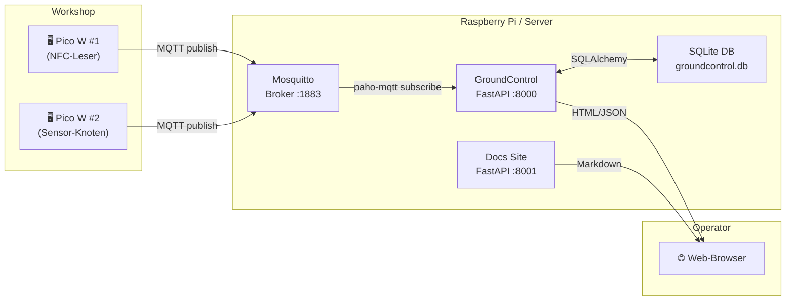
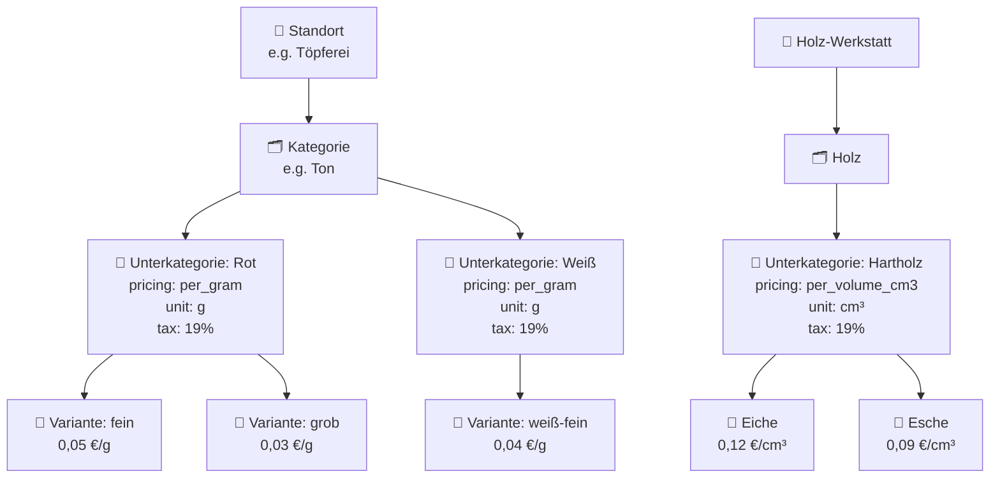
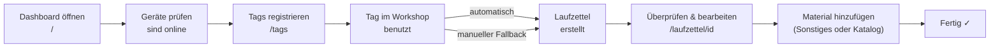

# GroundControl Übersicht

MakerPi GroundControl ist das zentrale Web- und Datenbanksystem für die Verwaltung von MQTT-verbundenen Werkstattgeräten, RFID-Tags, Laufzettel (Nutzungsaufzeichnungen) und Materialverfolgung.

## Wie das System zusammenhängt

## Wichtige benutzerseitige Konzepte

### Geräte

Ein Gerät ist ein Pico W oder jeder MQTT-sprechende Knoten, der Status- oder Sensordaten veröffentlicht. Geräte werden automatisch aus MQTT-Topics entdeckt und im Dashboard angezeigt.

### RFID-Tags

Ein registrierter NFC-Tag, optional mit einem Mitglied (Mitglied) über `member_id` verknüpft.

| Feld | Beschreibung |
|---|---|
| `uid` | Hardware-UID vom NFC-Tag |
| `member_id` | Soft-Referenz zu `mitglieder.member_id` |
| `owner_name` | Name des Karteninhabers |
| `owner_email` | E-Mail-Adresse |
| `active` | Ob Scans akzeptiert werden |
| `is_admin` | Wenn true, gewährt Admin-Zugriff via RFID-Login |
| `notes` | Freitext-Notizen |

### Laufzettel

Ein **Laufzettel** ist ein tagesspezifischer Nutzungsaufzeichnung. Er wird automatisch erstellt, wenn ein bekannter Tag oder Mitglied an einem bestimmten Tag zum ersten Mal scannt. Nicht-Mitglieder können auch einen Laufzettel erstellen, indem sie einen QR-Code scannen.

| Feld | Beschreibung |
|---|---|
| `uid` | Tag-UID (Legacy-Verknüpfung) |
| `date` | Nutzungsdatum |
| `start` | Erste Scan-Zeit |
| `owner_name` | Zum Zeitpunkt des Scans aus Tag kopiert |
| `member_id` | Zum Zeitpunkt des Scans aus Tag kopiert (Legacy) |
| `mitglied_id` | FK zu `mitglieder.id` — bevorzugte Verknüpfung |
| `guest_id` | UUID für Gast-Sitzungen (Nicht-Mitglieder) |
| `guest_email` | Optionale E-Mail für Gäste |
| `nodes` | Liste der besuchten Geräte/Stationen |

### Materialeinträge

Material wird auf einem Laufzettel in zwei Modi erfasst:

| Modus | Wann verwenden |
|---|---|
| **Sonstiges** | Schnelle einmalige Eingabe, kein Katalog benötigt |
| **Aus Katalog** | Katalog-basierte Eingabe mit automatischer Preisberechnung |

### Materialkatalog

## Typischer Operator-Workflow

## Wichtige Seiten

| URL | Zweck |
|---|---|
| `/` | Dashboard — Geräte-Status, aktuelle Nachrichten, System-Health |
| `/database` | Nachrichtenverlauf und DB-Statistiken |
| `/tags` | RFID-Tag-Administration |
| `/laufzettel` | Laufzettel-Liste und manuelle Erstellung |
| `/laufzettel/{id}` | Laufzettel-Details und Material-Bearbeitung |
| `/katalog` | Materialkatalog-Verwaltung |
| `/register` | Öffentliches Mitglied-Registrierungsformular |
| `/guest/laufzettel` | Gast-Eingabeformular für Nicht-Mitglieder (QR-Code) |
| `/buchhaltung` | Umsatz-Übersicht nach Steuersatz und Spenden |
| `/kasse` | Kassenseite für Kartenzahlung und RFID-Login |
| `/admin/device-pairings` | Gerätekopplungen verwalten |

## Ports auf einen Blick

| Service | Port | URL |
|---|---|---|
| Haupt-App | 8000 | `http://localhost:8000` |
| Docs-Site | 8001 | `http://localhost:8001` |
| MQTT-Broker | 1883 | `localhost:1883` |
| Zigbee2MQTT (nur Pi) | 8090 | `http://localhost:8090` |

## Wohin als Nächstes

- [Schnellstart](./01-quickstart.de.md) — In 2 Minuten zum Laufen bringen
- [Web-UI Guide](./02-web-ui.de.md) — Was jede Seite tut
- [Tags und Laufzettel](./03-tags-and-laufzettel.de.md) — Kern-User-Workflow im Detail
- [Gast-Laufzettel](./17-guest-laufzettel.de.md) — Nicht-Mitglied-Nutzung über QR-Code
- [Mitglied-Registrierung](./19-member-registration.de.md) — Öffentliche Mitglied-Anmeldung und easyVerein-Integration
- [Konfigurationsreferenz](./18-configuration-reference.de.md) — Alle Konfigurationsschlüssel, wo man API-Zugangsdaten bekommt
- [Gerätekopplung](./20-device-pairing.de.md) — NFC-Lesegeräte koppeln und Rollen zuweisen
- [Shopify-Gutscheine](./21-shopify-gift-cards.de.md) — Gutschein-Verwaltung und Laufzettel-Zahlung
- [Buchhaltung](./22-accounting.de.md) — Umsatz nach Steuersatz, Spenden
- [Kasse & RFID-Login](./24-kasse.de.md) — Kassenseite und kartenbasierter Login
- [Changelog](./CHANGELOG.md) — Änderungen und neue Funktionen
