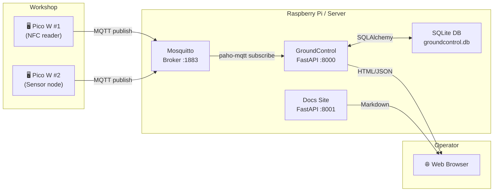
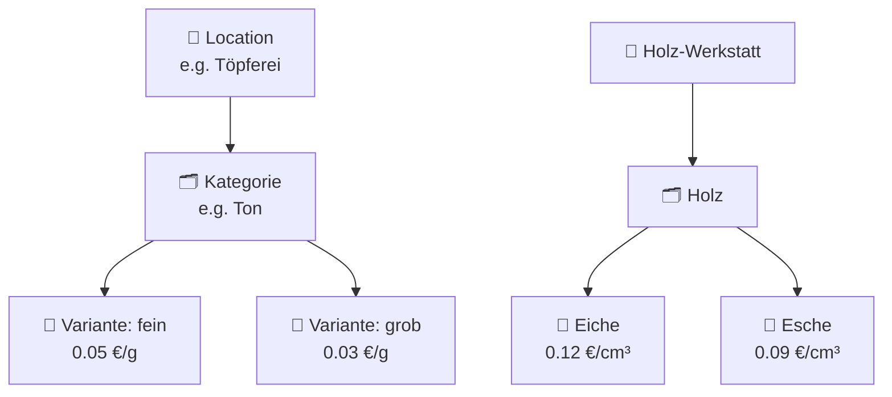
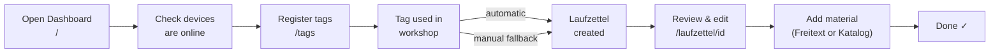

# GroundControl Overview

MakerPi GroundControl is the central web and database system for managing MQTT-connected workshop devices, RFID tags, Laufzettel (usage records), and material tracking.

## How the system fits together

## Main user-facing concepts

### Devices

A device is a Pico W or any MQTT-speaking node that publishes status or sensor data. Devices are discovered automatically from MQTT topics and shown in the dashboard.

### RFID Tags

A registered NFC card, optionally linked to a Mitglied (member).

| Field | Description |
|---|---|
| `uid` | Hardware UID from the NFC card |
| `member_id` | Soft reference to `mitglieder.member_id` |
| `owner_name` | Human name of the card holder |
| `owner_email` | Email address |
| `active` | Whether scans are accepted |
| `is_admin` | If true, grants admin access via RFID login |
| `notes` | Free-text notes |

### Laufzettel

A **Laufzettel** is a day-specific usage record. One is created automatically the first time a known tag or Mitglied scans in on a given day.

| Field | Description |
|---|---|
| `uid` | Tag UID (legacy link) |
| `date` | Usage date |
| `start` | First scan time |
| `owner_name` | Copied from tag at time of scan |
| `member_id` | Copied from tag at time of scan (legacy) |
| `mitglied_id` | FK to `mitglieder.id` — preferred link |
| `nodes` | List of devices/stations visited |

### Material entries

Material is recorded on a Laufzettel in two modes:

| Mode | When to use |
|---|---|
| **Freitext** | Quick one-off entry, no catalog needed |
| **Aus Katalog** | Catalog-backed entry with automatic price calculation |

### Material catalog

## Typical operator workflow

## Important pages

| URL | Purpose |
|---|---|
| `/` | Dashboard — device status, recent messages |
| `/database` | Message history and DB statistics |
| `/tags` | RFID tag administration |
| `/laufzettel` | Laufzettel list and manual creation |
| `/laufzettel/{id}` | Laufzettel detail and material editing |
| `/katalog` | Material catalog management |

## Ports at a glance

| Service | Port | URL |
|---|---|---|
| Main app | 8000 | `http://localhost:8000` |
| Docs site | 8001 | `http://localhost:8001` |
| MQTT broker | 1883 | `localhost:1883` |
| Zigbee2MQTT (Pi only) | 8090 | `http://localhost:8090` |

## Where to go next

- [Quickstart](./01-quickstart.md) — get running in 2 minutes
- [Web UI Guide](./02-web-ui.md) — what each page does
- [Tags and Laufzettel](./03-tags-and-laufzettel.md) — core user workflow in detail
