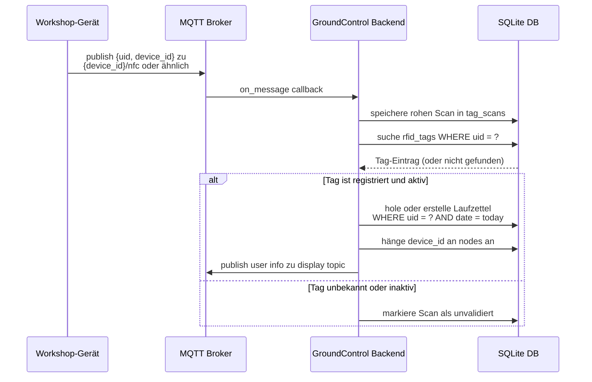
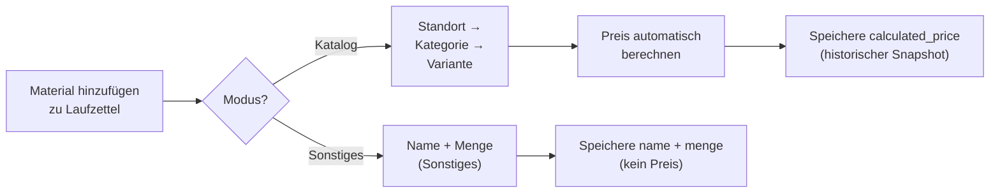

# Tags und Laufzettel

Diese Seite erklärt, wie RFID-Tags und Laufzettel zusammenarbeiten — das Herzstück des täglichen Workshop-Workflows.

## Registrierte Tags

Ein registrierter RFID-Tag lebt in der `rfid_tags`-Tabelle und repräsentiert eine bekannte NFC-Karte. Tags können über `member_id` mit einem Mitglied (Mitglied) verknüpft werden.

| Feld | Typ | Beschreibung |
|---|---|---|
| `uid` | string | Hardware-UID vom NFC-Tag (z.B. `04AABBCCDD`) |
| `member_id` | string | Soft-Referenz zu `mitglieder.member_id` |
| `owner_name` | string | Name des Karteninhabers |
| `owner_email` | string | E-Mail-Adresse |
| `notes` | text | Freitext-Notizen |
| `active` | boolean | Wenn false, werden Scans protokolliert aber nicht verarbeitet |
| `is_admin` | boolean | Wenn true, gewährt Admin-Zugriff bei RFID-Login |
| `created_at` | datetime | Wann der Tag registriert wurde |

> **Hinweis:** Tags werden nicht automatisch erstellt. Ein Operator muss einen Tag über die `/tags`-Seite registrieren, bevor er Laufzettel-Erstellung auslöst. Mitglieder, die aus easyVerein synchronisiert wurden und `nfc_uid` gesetzt haben, können sich auch direkt ohne separaten Tag-Eintrag einloggen.

## Automatische Laufzettel-Erstellung (NFC-Scan-Flow)

Wenn ein Gerät einen NFC-Payload über MQTT sendet, durchläuft das Backend diese Sequenz:

### Wichtige Verhaltensweisen

- Es wird nur **ein** Laufzettel pro `uid + date` Kombination erstellt
- Der erste Scan des Tages setzt die `start`-Zeit
- `owner_name` und `member_id` werden **zum Zeitpunkt der Erstellung aus dem Tag in den Laufzettel kopiert**
- Wenn der Name des Tag-Besitzers später aktualisiert wird, behält der historische Laufzettel den alten Wert — by Design

## Manuelle Laufzettel-Erstellung

Die `/laufzettel`-Seite hat einen **Neuer Laufzettel**-Button. Nützlich, wenn:

- Ein Scan nicht stattgefunden hat, aber die Nutzung dennoch aufgezeichnet werden muss
- Ein Operator einen Eintrag nachträglich erfassen muss
- Zu Test- oder administrativen Korrekturen

Bei manueller Erstellung und wenn die eingegebene UID bereits registriert ist, füllt das Formular `owner_name` und `member_id` automatisch aus dem Tag-Eintrag.

## Laufzettel-Felder-Referenz

| Feld | Typ | Gesetzt durch |
|---|---|---|
| `uid` | string | Scan-Ereignis oder manueller Eintrag (Legacy) |
| `date` | date | Auto: heute / Manuell: Operator wählt |
| `start` | datetime | Erste Scan-Zeit (UTC) |
| `owner_name` | string | Zum Zeitpunkt der Erstellung aus Tag kopiert |
| `member_id` | string | Zum Zeitpunkt der Erstellung aus Tag kopiert (Legacy) |
| `mitglied_id` | integer | FK zu `mitglieder.id` — bevorzugte Verknüpfung |
| `nodes` | JSON-Liste | Pro Scan-Gerät angehängt |
| `payment_method` | string | Bei Zahlung gesetzt (`bar` / `paypal` / `karte`) |
| `paid_at` | datetime | Bei Zahlung gesetzt (UTC) |
| `created_at` | datetime | Auto (UTC) |

## Material auf einem Laufzettel

Ein Laufzettel kann viele Materialeinträge tragen. Jeder Eintrag hat zwei mögliche Ursprünge:

### Materialeintrag-Felder

| Feld | Sonstiges | Katalog-basiert |
|---|---|---|
| `name` | Erforderlich | Von Varianten-Name |
| `menge` | Optional | Vom Operator gesetzt |
| `unit` | Optional | Von Kategorie-Einheit |
| `variante_id` | — | Erforderlich (FK) |
| `laenge_cm` | — | Für Volumen-Preis |
| `breite_cm` | — | Für Volumen-Preis |
| `hoehe_cm` | — | Für Volumen-Preis |
| `calculated_price` | — | Auto-berechnet |
| `tax_rate` | — | Von Kategorie übernommen (Standard 19%) |

## Zahlungs-Flow

Sobald das gesamte Material hinzugefügt wurde, zeigt die Detailseite drei Zahlungs-Buttons:

- **Bar bezahlen** — zeigt den Gesamtbetrag in einem großen Pop-up. Bestätigen zum Sperren.
- **mit PayPal bezahlen** — zeigt einen QR-Code, der auf Ihre PayPal.me-URL + Betrag verlinkt. Bestätigen, nachdem der Kunde gescannt hat.
- **mit Karte bezahlen** — sendet eine Checkout-Anfrage an den gekoppelten SumUp-Kartenleser. Sperrt bei Erfolg.

Nach jeder erfolgreichen Zahlung:
- `payment_method` und `paid_at` werden in den Laufzettel geschrieben.
- Die Detailseite zeigt ein grünes gesperrtes Banner mit Methode und Zeitstempel.
- Alle Bearbeitungsaktionen (Info, Material hinzufügen/bearbeiten/löschen) werden im UI deaktiviert und von der API abgelehnt (`409 Conflict`).

> Die Sperre ist permanent — es gibt keinen Entsperren-Flow by Design.

## Warum Daten in den Laufzettel kopiert werden

Das System kopiert absichtlich `owner_name` und `member_id` zum Zeitpunkt des Scans aus dem Tag, anstatt nur die UID-Referenz zu speichern. Dies erhält **historische Wahrheit** — selbst wenn eine Karte später neu zugewiesen wird, bleiben vergangene Aufzeichnungen genau und prüfbar.

Das gleiche Prinzip gilt für `calculated_price` auf Materialeinträgen: Der Preis wird zum Zeitpunkt des Eintrags gespeichert, nicht bei jeder Ansicht neu berechnet.
