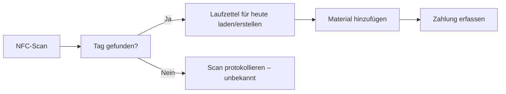
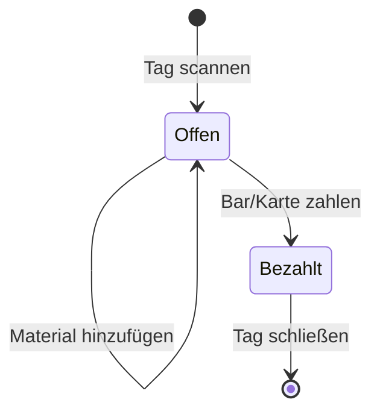

# Tags und Laufzettel

Das Herzstück von MakerPi GroundControl ist das **Laufzettel-System** – eine einfache Methode zur Erfassung von Workshopeinträgen und Materialverbrauch über NFC/RFID-Karten.

## Übersicht

## Tags (NFC-Karten)

### Was ist ein Tag?

Ein **Tag** ist eine NFC/RFID-Karte mit einer eindeutigen UID (z.B. `A4:5F:12:9C`). Tags werden **Workshop-Mitgliedern zugewiesen** und dienen zur schnellen Identifikation.

### Tag-Verwaltung

| Aktion | Wo | Beschreibung |
|--------|-----|--------------|
| Tag hinzufügen | `/tags` | Neue Karte registrieren, Inhaber zuweisen |
| Tag bearbeiten | `/tags` | Inhaber oder Notizen ändern |
| Tag deaktivieren | `/tags` | Karte sperren (ohne Löschen) |

### Tag-Scanning

Wenn ein Tag gescannt wird:

1. Das System sucht die UID in der Datenbank
2. Wenn gefunden → aktueller Laufzettel des Inhabers wird geladen
3. Wenn nicht gefunden → Scan wird als "unbekannt" protokolliert

## Laufzettel

### Was ist ein Laufzettel?

Ein **Laufzettel** ist ein **einzelner Datensatz pro Person pro Tag**, der enthält:

- **Metadaten:** Datum, Startzeit, Inhabername, Mitgliedsnummer
- **Geräte:** Welche Maschinen wurden benutzt (automatisch über MQTT)
- **Materialien:** Was wurde verbraucht (manuell erfasst)
- **Zahlung:** Status (offen, bar, Karte)

### Laufzettel-Lebenszyklus

### Material hinzufügen

Material kann auf zwei Arten hinzugefügt werden:

1. **Aus dem Katalog:** Preis wird automatisch berechnet
   - Wähle Standort → Kategorie → Variante
   - Menge eingeben
   - Preis wird übernommen

2. **Freitext:** Manuelle Eingabe
   - Name eingeben
   - Menge und Einheit
   - Preis manuell berechnen

### Zahlungserfassung

| Methode | Flow | Hinweis |
|---------|------|---------|
| **Bar** | Admin bestätigt Bareingang | Sofort im System verbucht |
| **Karte** | SumUp-Terminal-Integration | Optional, falls konfiguriert |

Ein bezahlter Laufzettel ist **gesperrt** – keine weiteren Materialien können hinzugefügt werden.

## Seitenreferenz

| Seite | URL | Zweck |
|-------|-----|-------|
| **Tags** | `/tags` | Alle NFC-Karten verwalten |
| **Laufzettel-Liste** | `/laufzettel` | Alle Einträge durchsuchen/filtern |
| **Laufzettel-Detail** | `/laufzettel/{id}` | Einzelnen Eintrag bearbeiten/bezahlen |

## MQTT-Integration

Geräte können Laufzettel-Einträge automatisch aktualisieren:

- Topic: `makerpi/devices/{device_id}/status`
- Payload mit `uid` → Laufzettel wird mit diesem Gerät verknüpft

Siehe [MQTT-Datenfluss](./06-mqtt-data-flow) für Details.
