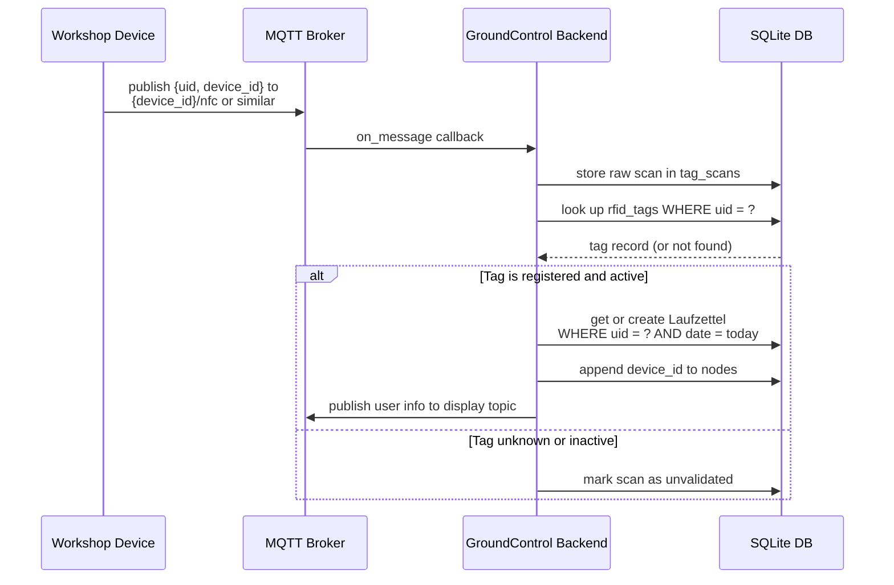
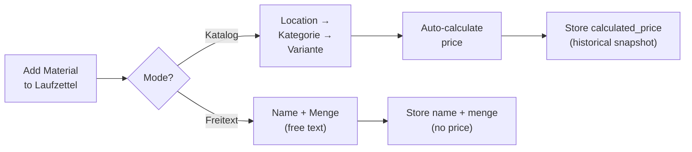

# Tags and Laufzettel

This page explains how RFID tags and Laufzettel work together — the core of the daily workshop workflow.

## Registered tags

A registered RFID tag lives in the `rfid_tags` table and represents a known NFC card. Tags can be linked to a Mitglied (member) via `member_id`.

| Field | Type | Description |
|---|---|---|
| `uid` | string | Hardware UID from the NFC card (e.g. `04AABBCCDD`) |
| `member_id` | string | Soft reference to `mitglieder.member_id` |
| `owner_name` | string | Human name of the cardholder |
| `owner_email` | string | Email address |
| `notes` | text | Free-text notes |
| `active` | boolean | If false, scans are logged but not acted on |
| `is_admin` | boolean | If true, grants admin access when used for RFID login |
| `created_at` | datetime | When the tag was registered |

> **Note:** Tags are not created automatically. An operator must register a tag via the `/tags` page before it triggers Laufzettel creation. Members synced from easyVerein with `nfc_uid` set can also log in directly without a separate tag record.

## Automatic Laufzettel creation (NFC scan flow)

When a device sends an NFC payload via MQTT, the backend runs through this sequence:

### Important behaviors

- Only **one** Laufzettel per `uid + date` combination is ever created
- The first scan of the day sets the `start` time
- `owner_name` and `member_id` are **copied from the tag** into the Laufzettel at creation time
- If the tag's owner name is updated later, the historical Laufzettel keeps the old value — by design

## Manual Laufzettel creation

The `/laufzettel` page has a **Neuer Laufzettel** button. Useful when:

- A scan did not happen but usage must still be recorded
- An operator needs to backfill an entry
- Testing or administrative corrections

When creating manually and the entered UID is already registered, the form auto-fills `owner_name` and `member_id` from the tag record.

## Laufzettel fields reference

| Field | Type | Set by |
|---|---|---|
| `uid` | string | Scan event or manual entry (legacy) |
| `date` | date | Auto: today / Manual: operator picks |
| `start` | datetime | First scan time (UTC) |
| `owner_name` | string | Copied from tag at creation |
| `member_id` | string | Copied from tag at creation (legacy) |
| `mitglied_id` | integer | FK to `mitglieder.id` — preferred link |
| `nodes` | JSON list | Appended per scan device |
| `payment_method` | string | Set on payment (`bar` / `paypal` / `karte`) |
| `paid_at` | datetime | Set on payment (UTC) |
| `created_at` | datetime | Auto (UTC) |

## Material on a Laufzettel

A Laufzettel can carry many material entries. Each entry has two possible origins:

### Material entry fields

| Field | Free-text | Catalog-based |
|---|---|---|
| `name` | Required | From variant name |
| `menge` | Optional | Set by operator |
| `unit` | Optional | From category unit |
| `variante_id` | — | Required (FK) |
| `laenge_cm` | — | For volume pricing |
| `breite_cm` | — | For volume pricing |
| `hoehe_cm` | — | For volume pricing |
| `calculated_price` | — | Auto-computed |
| `tax_rate` | — | Snapshotted from category (default 19%) |

## Payment flow

Once all material has been added, the detail page shows payment buttons:

- **Bar bezahlen** — displays the total amount in a large pop-up. Confirm to lock.
- **mit Wero bezahlen** — shows a Wero QR code for the amount. Confirm after the customer scans. Requires `wero_enabled: true` in config.
- **mit Karte bezahlen** — sends a checkout request to the paired SumUp card reader (Solo Cloud API) or generates a `sumupmerchant://` deep-link for the SumUp app (Payment Switch). Locks on success.

After any successful payment:
- `payment_method` and `paid_at` are written to the Laufzettel.
- The detail page shows a green locked banner with method and timestamp.
- All edit actions (info, add/edit/delete material) are disabled in the UI and rejected by the API (`409 Conflict`).

> The lock is permanent — there is no unlock flow by design. An admin reset endpoint exists for corrections (`DELETE /api/laufzettel/{id}/pay`).

## Why data is copied into the Laufzettel

The system intentionally copies `owner_name` and `member_id` from the tag at scan time rather than storing only the UID reference. This preserves **historical truth** — even if a card is reassigned later, past records remain accurate and auditable.

The same principle applies to `calculated_price` on material entries: the price is stored at the time of entry, not recalculated on every view.
