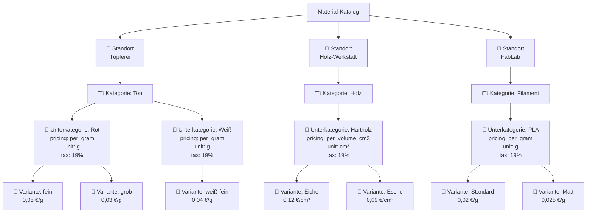
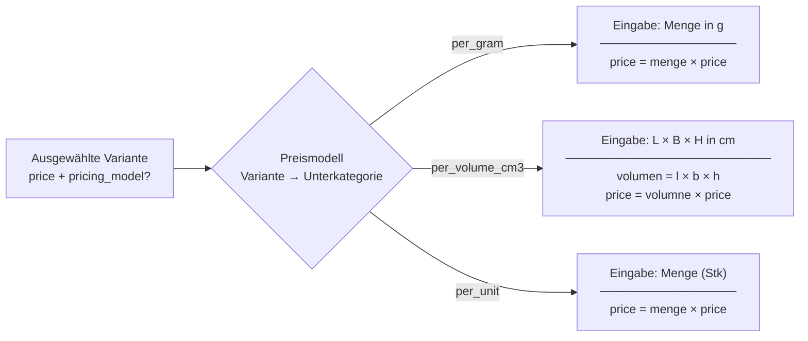

# Material-Katalog

Der **Katalog** speichert Materialpreise und ermöglicht automatische Preisberechnung beim Hinzufügen zu Laufzetteln. Er ist als vierstufige Hierarchie organisiert.

## Hierarchie



## Datenmodell

### Standort

Oberste Gruppierung nach Workshop-Bereich.

| Feld | Typ | Beschreibung |
|---|---|---|
| `id` | int | Primärschlüssel |
| `name` | string | Standortname (eindeutig) |

### Kategorie

Logische Gruppierung von Materialien innerhalb eines Standorts.

| Feld | Typ | Beschreibung |
|---|---|---|
| `id` | int | Primärschlüssel |
| `location_id` | int | FK → Standort |
| `name` | string | Kategoriename |

### Unterkategorie

Gruppiert Materialien unter einer Kategorie. Trägt den Steuersatz und ein Spende-Flag; Preismodell und Einheit liegen auf der jeweiligen Variante, nicht hier.

| Feld | Typ | Beschreibung |
|---|---|---|
| `id` | int | Primärschlüssel |
| `kategorie_id` | int | FK → Kategorie |
| `name` | string | Unterkategoriename |
| `tax_rate` | float | Steuersatz: `0`, `7` oder `19` |
| `is_spende` | bool | Alle Varianten dieser Unterkategorie als Spenden zählen |

### Variante

Eine konkrete auswählbare Option mit einem Einheitspreis. Jede Variante trägt ihr eigenes Preismodell, ihre Einheit, ihren Steuersatz und ihr Spende-Flag.

| Feld | Typ | Beschreibung |
|---|---|---|
| `id` | int | Primärschlüssel |
| `kategorie_id` | int | FK → Kategorie (aus Kompatibilitätsgründen beibehalten) |
| `unterkategorie_id` | int | FK → Unterkategorie |
| `name` | string | Variantenname, z.B. `fein` |
| `price` | float | Preis pro Einheit (€) |
| `pricing_model` | string | `per_unit` (Standard), `per_gram`, `per_kilogram`, `per_volume_cm3`, `per_volume_l`, `per_minute` |
| `unit` | string | Anzeigeeinheit, z.B. `g`, `cm³`, `Stk` |
| `tax_rate` | float | Steuersatz 0/7/19 (Standard 19) |
| `is_spende` | bool | Standard false. Als Spende zählen |

## Preismodelle



> **Hinweis:** Jede Variante trägt ihr eigenes `pricing_model`, ihre `unit`, ihren `tax_rate` und ihr `is_spende`. Preismodell und Einheit Standard `per_unit`, wenn nicht gesetzt; Steuersatz Standard `19`.

### Modell-Vergleichstabelle

| Modell | Erforderliche Eingaben | Formel | Verwendung |
|---|---|---|---|
| `per_gram` | Menge (g) | `menge × price` | Ton, Filament, Pulver, Harz |
| `per_volume_cm3` | Länge, Breite, Höhe (cm) | `l × b × h × price` | Holz, Schaumstoff, Plattenmaterial |
| `per_volume_l` | Länge, Breite, Höhe (cm) | `l × b × h / 1000 × price` | Flüssigkeiten (Harzbäder, Öle) |
| `per_unit` | Anzahl | `menge × price` | Kleinteile, Hardware, Kits |

## Praktische Beispiele

### Beispiel 1 — Ton (per_gram)

- Standort: `Töpferei`
- Kategorie: `Ton`
- Unterkategorie: `Rot` · model: `per_gram` · unit: `g` · tax: 19%
- Variante: `fein` · price: `0,05 €/g`
- Operator eingibt: `800 g`
- Berechneter Preis: **0,05 × 800 = 40,00 €**

### Beispiel 2 — Holz (per_volume_cm3)

- Standort: `Holz-Werkstatt`
- Kategorie: `Holz`
- Unterkategorie: `Hartholz` · model: `per_volume_cm3` · unit: `cm³` · tax: 19%
- Variante: `Eiche` · price: `0,12 €/cm³`
- Operator eingibt: `30 cm × 10 cm × 4 cm`
- Volumen: `30 × 10 × 4 = 1200 cm³`
- Berechneter Preis: **0,12 × 1200 = 144,00 €**

### Beispiel 3 — Filament (per_gram)

- Standort: `FabLab`
- Kategorie: `Filament`
- Unterkategorie: `PLA` · model: `per_gram` · unit: `g` · tax: 19%
- Variante: `Standard` · price: `0,02 €/g`
- Operator eingibt: `65 g`
- Berechneter Preis: **0,02 × 65 = 1,30 €**

## Historische Preis-Erhaltung

Wenn ein katalogbasierter Materialeintrag in einem Laufzettel gespeichert wird, wird der `calculated_price` zum Zeitpunkt des Speicherns **eingefroren**. Wenn Sie später den Preis einer Variante ändern, werden vorhandene Laufzettel-Einträge nicht beeinflusst.

## Seite: Katalog

Zugriff über `/katalog`.

### Oberfläche

```
┌─────────────────────────────────────────┐
│ 📍 3D-Druck              [+ Kategorie]  │  ← Standort
│ ─────────────────────────────────────── │
│ 🗂 PLA                                     │  ← Kategorie
│ ─────────────────────────────────────── │
│ 📁 Standard [+ Unterkategorie]          │  ← Unterkategorien
│ ─────────────────────────────────────── │
│ Variante              Preis      Akt.  │  ← Varianten
│ ─────────────────────────────────────── │
│ Weiß, 1kg            0.04 €/g   [E][L] │
│ Schwarz, 1kg         0.04 €/g   [E][L] │
└─────────────────────────────────────────┘
```

### Aktionen

| Aktion | Button | Beschreibung |
|--------|--------|--------------|
| Standort hinzufügen | `+ Standort` | Neuen Bereich erstellen |
| Kategorie hinzufügen | `+ Kategorie` | Preisgruppe erstellen |
| Unterkategorie hinzufügen | `+ Unterkategorie` | Preisuntergruppe erstellen |
| Variante hinzufügen | `+ Variante` | Konkrete Option erstellen |
| Bearbeiten | `Bearbeiten` | Name/Preis ändern |
| Löschen | `Löschen` | Element entfernen |
| **Bulk Import** | **`⬆ Bulk Import`** | **Viele Einträge auf einmal hinzufügen** |

> **Tipp:** Erstellen Sie zuerst den Standort, dann die Kategorie, dann die Unterkategorie (mit Preismodell), dann die Varianten. Sie können keine Variante ohne übergeordnete Unterkategorie erstellen.

## Bulk Import

Der **„⬆ Bulk Import"**-Button (oben rechts auf der Katalog-Seite) erlaubt es, viele Einträge auf einmal anzulegen, ohne jeden Schritt einzeln durchklicken zu müssen. Es gibt zwei Modi.

### Browser-Eingabe

1. **⬆ Bulk Import** klicken → Modal öffnet sich auf dem Tab **Eingabe**.
2. Einen vorhandenen **Standort** aus der Dropdown-Liste wählen oder *„Neuen Standort erstellen"* auswählen und einen Namen eingeben.
3. **+ Kategorie hinzufügen** klicken und den Namen eingeben.
4. Innerhalb des Kategorie-Blocks **+ Unterkategorie hinzufügen** klicken. Für jede Unterkategorie ausfüllen:
   - Name
   - Preismodell (`per_unit`, `per_gram`, `per_volume_cm3`, `per_volume_l`, `per_minute`)
   - Einheit (optionale Anzeige-Einheit, z.B. `g`, `cm³`)
   - Steuersatz (0 / 7 / 19 %)
5. Innerhalb des Unterkategorie-Blocks **+ Variante** für jede Variante klicken (Name und Preis).
6. So viele Kategorien, Unterkategorien und Varianten hinzufügen wie nötig.
7. **Alles speichern** klicken – alle Einträge werden in einer einzigen atomaren Datenbank-Transaktion gespeichert.

> Existiert ein Standort mit dem eingegebenen Namen bereits, wird er wiederverwendet – nie doppelt angelegt.

### CSV-Import

1. **⬆ Bulk Import** klicken → Tab **CSV Import** auswählen.
2. Eine `.csv`-Datei vom Computer auswählen.
3. Die Datei wird **im Browser** geparst – es werden noch keine Daten übertragen.
4. Eine Vorschau-Tabelle zeigt die gruppierten Daten.
5. **CSV importieren** klicken, um alles in die Datenbank zu schreiben.

#### CSV-Format

Die Datei muss eine Kopfzeile mit diesen Spaltennamen haben (Reihenfolge fest):

```
standort,kategorie,unterkategorie,preismodell,einheit,steuersatz,variante,preis
```

Optional können pro Variante eigene Werte angegeben werden (überschreiben die Unterkategorie-Werte):

```
standort,kategorie,unterkategorie,preismodell,einheit,steuersatz,variante,preis,varianten_preismodell,varianten_einheit,varianten_steuersatz,varianten_spende
```

| Spalte | Pflicht | Werte / Hinweise |
|--------|---------|------------------|
| `standort` | ja | Name des Standorts |
| `kategorie` | ja | Name der Kategorie |
| `unterkategorie` | ja | Name der Unterkategorie |
| `preismodell` | ja | `per_unit` · `per_gram` · `per_volume_cm3` · `per_volume_l` · `per_minute` (Unterkategorie-Standard) |
| `einheit` | nein | Anzeige-Einheit, z.B. `g`, `cm³` – leer lassen wenn nicht benötigt |
| `steuersatz` | ja | `0`, `7` oder `19` (Unterkategorie-Standard) |
| `variante` | ja | Name der Variante |
| `preis` | ja | Preis pro Einheit, Dezimalpunkt (kein Komma), z.B. `0.05` |
| `varianten_preismodell` | nein | Pro-Variante Preismodell (überschreibt Unterkategorie) |
| `varianten_einheit` | nein | Pro-Variante Einheit (überschreibt Unterkategorie) |
| `varianten_steuersatz` | nein | Pro-Variante Steuersatz (überschreibt Unterkategorie) |
| `varianten_spende` | nein | `1`/`true`/`ja` für Pro-Variante Spende-Status (überschreibt Unterkategorie) |

Mehrere Zeilen mit demselben `standort + kategorie + unterkategorie + preismodell + einheit + steuersatz` werden zu einer Unterkategorie mit mehreren Varianten zusammengefasst. Wenn eine Variante eigene Werte hat (`varianten_*` Spalten), werden diese verwendet statt der Unterkategorie-Werte.

#### Beispiel

```csv
standort,kategorie,unterkategorie,preismodell,einheit,steuersatz,variante,preis
Töpferei,Ton,Rot,per_gram,g,19,fein,0.05
Töpferei,Ton,Rot,per_gram,g,19,grob,0.03
Töpferei,Ton,Weiß,per_gram,g,19,weiß-fein,0.04
Töpferei,Glasur,Transparent,per_unit,Stück,19,transparent,2.50
Holz-Werkstatt,Holz,Hartholz,per_volume_cm3,cm³,19,Eiche,0.0012
Holz-Werkstatt,Holz,Hartholz,per_volume_cm3,cm³,19,Esche,0.0009
Holz-Werkstatt,Holz,Altholz,per_volume_cm3,cm³,19,Altholz,0.0004
FabLab,Filament,PLA,per_gram,g,19,Standard,0.02
FabLab,Filament,PLA,per_gram,g,19,Matt,0.025
FabLab,Filament,PETG,Standard,per_gram,g,19,Transparent,0.025
```

Dieses Beispiel erstellt:
- **Töpferei** → Ton → Rot (per_gram, 2 Varianten) + Ton → Weiß (per_gram, 1 Variante) + Glasur → Transparent (per_unit, 1 Variante)
- **Holz-Werkstatt** → Holz → Hartholz (per_volume_cm3, 2 Varianten) + Holz → Altholz (per_volume_cm3, 1 Variante)
- **FabLab** → Filament → PLA (per_gram, 2 Varianten) + Filament → PETG → Standard (per_gram, 1 Variante)

Eine größere, direkt einsatzbare Beispieldatei liegt im Repository unter `examples/katalog-bulk-import.csv`.

#### Beispiel mit pro-Variante Preismodell

Im selben Unterkategorie können verschiedene Varianten unterschiedliche Preismodelle haben:

```csv
standort,kategorie,unterkategorie,preismodell,einheit,steuersatz,variante,preis,varianten_preismodell,varianten_einheit
Keramikwerkstatt,Verbrauchsmaterial,Ton,per_kilogram,kg,19,Drehton weiss,16,per_kilogram,kg
Keramikwerkstatt,Verbrauchsmaterial,Ton,per_kilogram,kg,19,Drehton rot,16,per_kilogram,kg
Keramikwerkstatt,Verbrauchsmaterial,Ton,per_kilogram,kg,19,Gießton recycling,10,per_volume_l,l
```

Dies erstellt eine Unterkategorie "Ton" mit drei Varianten. Die ersten beiden verwenden `per_kilogram`, die dritte (`Gießton recycling`) überschreibt mit `per_volume_l` und Einheit `l`.

## API-Endpunkte

| Methode | Endpunkt | Beschreibung |
|---------|----------|--------------|
| `GET` | `/api/katalog` | Vollständiger Katalog-Tree |
| `GET` | `/api/katalog/locations` | Alle Standorte |
| `POST` | `/api/katalog/locations` | Standort erstellen |
| `GET` | `/api/katalog/kategorien` | Alle Kategorien |
| `POST` | `/api/katalog/kategorien` | Kategorie erstellen |
| `GET` | `/api/katalog/unterkategorien` | Alle Unterkategorien |
| `POST` | `/api/katalog/unterkategorien` | Unterkategorie erstellen |
| `GET` | `/api/katalog/varianten` | Alle Varianten |
| `POST` | `/api/katalog/varianten` | Variante erstellen |
| `POST` | `/api/katalog/bulk-import` | Standort + Kategorien + Unterkategorien + Varianten auf einmal anlegen |

## Best Practices

1. **Klare Namen:** "PLA" statt "Filament Typ A"
2. **Konsistente Einheiten:** Immer Gramm für 3D-Druck, nicht gemischt
3. **Regelmäßige Updates:** Preise jährlich oder bei Lieferantenwechsel anpassen
4. **Kategorisierung:** Materialien am selben Standort gruppieren
5. **Unterkategorien nutzen:** Für unterschiedliche Preismodelle oder Steuersätze innerhalb einer Kategorie
