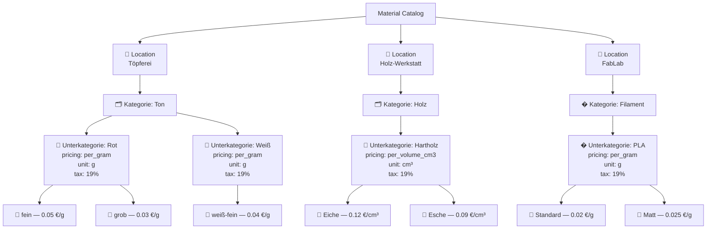
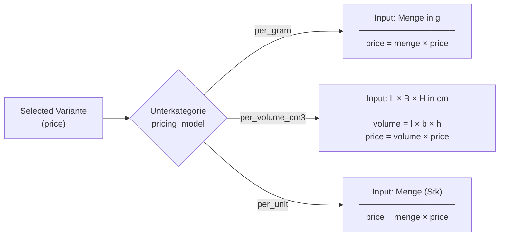
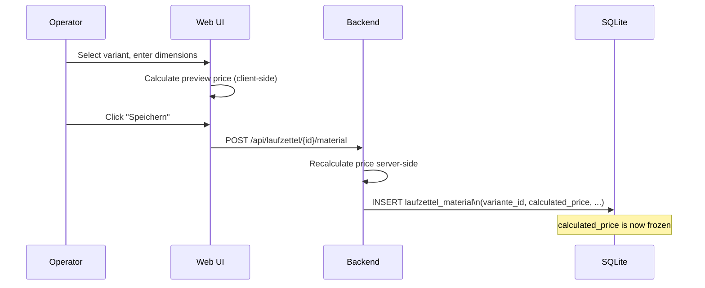

# Material Catalog

The material catalog defines reusable, priced material entries that can be attached to Laufzettel records. It is organized as a four-level hierarchy.

## Hierarchy



## Data model

### Location

Top-level grouping by workshop area.

| Field | Type | Description |
|---|---|---|
| `id` | int | Primary key |
| `name` | string | Location name (unique) |

### Kategorie

Logical grouping of materials within a location.

| Field | Type | Description |
|---|---|---|
| `id` | int | Primary key |
| `location_id` | int | FK → Location |
| `name` | string | Category name |

### Unterkategorie

Defines the pricing model, input unit, and tax rate for a group of materials. This is where pricing configuration lives.

| Field | Type | Description |
|---|---|---|
| `id` | int | Primary key |
| `kategorie_id` | int | FK → Kategorie |
| `name` | string | Subcategory name |
| `pricing_model` | string | `per_unit`, `per_gram`, `per_kilogram`, `per_volume_cm3`, `per_volume_l`, `per_minute` |
| `unit` | string | Display unit, e.g. `g`, `cm³`, `Stk` |
| `tax_rate` | float | Tax rate: `0`, `7`, or `19` |

### Variante

A concrete selectable option with a unit price.

| Field | Type | Description |
|---|---|---|
| `id` | int | Primary key |
| `kategorie_id` | int | FK → Kategorie (kept for backward compat) |
| `unterkategorie_id` | int | FK → Unterkategorie |
| `name` | string | Variant name, e.g. `fein` |
| `price` | float | Price per unit (€) |

## Pricing models



### Model comparison table

| Model | Inputs required | Formula | Use case |
|---|---|---|---|
| `per_gram` | Menge (g) | `menge × price` | Clay, filament, powder, resin |
| `per_volume_cm3` | Length, width, height (cm) | `l × b × h × price` | Wood, foam, sheet materials |
| `per_volume_l` | Length, width, height (cm) | `l × b × h / 1000 × price` | Liquids (resin baths, oils) |
| `per_unit` | Count | `menge × price` | Small parts, hardware, kits |

## Practical examples

### Example 1 — Ton (per_gram)

- Location: `Töpferei`
- Kategorie: `Ton`
- Unterkategorie: `Rot` · model: `per_gram` · unit: `g` · tax: 19%
- Variante: `fein` · price: `0.05 €/g`
- Operator enters: `800 g`
- Calculated price: **0.05 × 800 = 40.00 €**

### Example 2 — Holz (per_volume_cm3)

- Location: `Holz-Werkstatt`
- Kategorie: `Holz`
- Unterkategorie: `Hartholz` · model: `per_volume_cm3` · unit: `cm³` · tax: 19%
- Variante: `Eiche` · price: `0.12 €/cm³`
- Operator enters: `30 cm × 10 cm × 4 cm`
- Volume: `30 × 10 × 4 = 1200 cm³`
- Calculated price: **0.12 × 1200 = 144.00 €**

### Example 3 — Filament (per_gram)

- Location: `FabLab`
- Kategorie: `Filament`
- Unterkategorie: `PLA` · model: `per_gram` · unit: `g` · tax: 19%
- Variante: `Standard` · price: `0.02 €/g`
- Operator enters: `65 g`
- Calculated price: **0.02 × 65 = 1.30 €**

## Historical price preservation

When a catalog-based material entry is saved to a Laufzettel, the `calculated_price` is **frozen at save time**. If you later change a variant's price, existing Laufzettel entries are not affected.



## Using the Katalog page

The `/katalog` page lets you manage the entire catalog tree in one view.

Actions available:

| Action | How |
|---|---|
| Add location | "Neuer Standort" button |
| Add category | Expand location → "Neue Kategorie" |
| Add subcategory | Expand category → "Neue Unterkategorie" |
| Add variant | Expand subcategory → "Neue Variante" |
| Edit/delete | Inline buttons on each row |
| **Bulk import** | **"⬆ Bulk Import" button** |

> **Tip:** Create the Location first, then the Kategorie, then the Unterkategorie (with pricing model), then the Varianten. You can't create a variant without a parent subcategory.

## Bulk Import

The **"⬆ Bulk Import"** button (top-right of the Katalog page) lets you add many items at once without clicking through individual dialogs. It has two modes.

### Browser entry

1. Click **⬆ Bulk Import** → the modal opens on the **Eingabe** tab.
2. Pick an existing **Standort** from the dropdown, or choose *"Neuen Standort erstellen"* and type a name.
3. Click **+ Kategorie hinzufügen** to add a category block. Fill in the name.
4. Inside the category block, click **+ Unterkategorie hinzufügen** to add a subcategory block. Fill in:
   - Name
   - Preismodell (`per_unit`, `per_gram`, `per_volume_cm3`, `per_volume_l`, `per_minute`)
   - Einheit (optional display unit, e.g. `g`, `cm³`)
   - Steuersatz (0 / 7 / 19 %)
5. Inside the subcategory block, click **+ Variante** for each variant. Fill in Name and Preis.
6. Add as many categories, subcategories, and variants as you need.
7. Click **Alles speichern** — all items are written in one atomic database transaction.

> If a Location with the given name already exists it is reused; it is never duplicated.

### CSV import

1. Click **⬆ Bulk Import** → switch to the **CSV Import** tab.
2. Choose a `.csv` file from your computer.
3. The file is parsed **in the browser** — no data is sent yet.
4. A preview table appears showing the grouped data.
5. Click **CSV importieren** to write everything to the database.

#### CSV format

The file must have a header row with exactly these column names (order is fixed):

```
standort,kategorie,unterkategorie,preismodell,einheit,steuersatz,variante,preis
```

| Column | Required | Values / notes |
|---|---|---|
| `standort` | yes | Location name |
| `kategorie` | yes | Category name |
| `unterkategorie` | yes | Subcategory name |
| `preismodell` | yes | `per_unit` · `per_gram` · `per_volume_cm3` · `per_volume_l` · `per_minute` |
| `einheit` | no | Display unit, e.g. `g`, `cm³` — leave empty if not needed |
| `steuersatz` | yes | `0`, `7`, or `19` |
| `variante` | yes | Variant name |
| `preis` | yes | Price per unit, decimal point (not comma), e.g. `0.05` |

Multiple rows with the same `standort + kategorie + unterkategorie + preismodell + einheit + steuersatz` are grouped into one subcategory with multiple variants.

#### Example

```csv
standort,kategorie,unterkategorie,preismodell,einheit,steuersatz,variante,preis
Töpferei,Ton,Rot,per_gram,g,19,fein,0.05
Töpferei,Ton,Rot,per_gram,g,19,grob,0.03
Töpferei,Ton,Weiß,per_gram,g,19,weiß-fein,0.04
Töpferei,Glasur,Transparent,per_unit,Stück,19,transparent,2.50
Holz-Werkstatt,Holz,Hartholz,per_volume_cm3,cm³,19,Eiche,0.0012
Holz-Werkstatt,Holz,Hartholz,per_volume_cm3,cm³,19,Esche,0.0009
Holz-Werkstatt,Holz,Altholz,per_volume_cm3,cm³,19,Altholz,0.0004
FabLab,Filament,PLA,per_gram,g,19,Standard,0.02
FabLab,Filament,PLA,per_gram,g,19,Matt,0.025
FabLab,Filament,PETG,Standard,per_gram,g,19,Transparent,0.025
```

This creates:
- **Töpferei** → Ton → Rot (per_gram, 2 variants) + Ton → Weiß (per_gram, 1 variant) + Glasur → Transparent (per_unit, 1 variant)
- **Holz-Werkstatt** → Holz → Hartholz (per_volume_cm3, 2 variants) + Holz → Altholz (per_volume_cm3, 1 variant)
- **FabLab** → Filament → PLA (per_gram, 2 variants) + Filament → PETG → Standard (per_gram, 1 variant)

A larger ready-to-use example file is included in the repository at `examples/katalog-bulk-import.csv`.

#### Bulk import API endpoint

The browser form and the CSV import both call the same backend endpoint:

```
POST /api/katalog/bulk-import
Content-Type: application/json

{
  "location_name": "Töpferei",
  "kategorien": [
    {
      "name": "Ton",
      "unterkategorien": [
        {
          "name": "Rot",
          "pricing_model": "per_gram",
          "unit": "g",
          "tax_rate": 19,
          "varianten": [
            { "name": "fein", "price": 0.05 },
            { "name": "grob", "price": 0.03 }
          ]
        },
        {
          "name": "Weiß",
          "pricing_model": "per_gram",
          "unit": "g",
          "tax_rate": 19,
          "varianten": [
            { "name": "weiß-fein", "price": 0.04 }
          ]
        }
      ]
    }
  ]
}
```

Response:

```json
{
  "success": true,
  "location": { "id": 1, "name": "Töpferei" },
  "created_kategorien": 1,
  "created_unterkategorien": 2,
  "created_varianten": 3
}
```

The location is **found or created** by name. All categories, subcategories, and variants are written in a single atomic transaction — if anything fails, nothing is saved.
