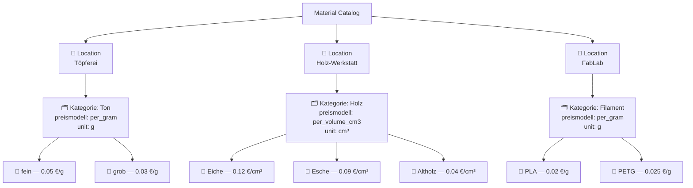
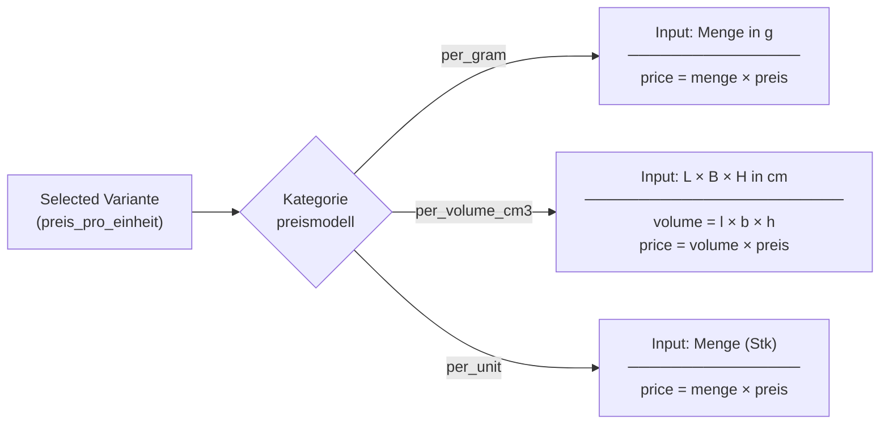
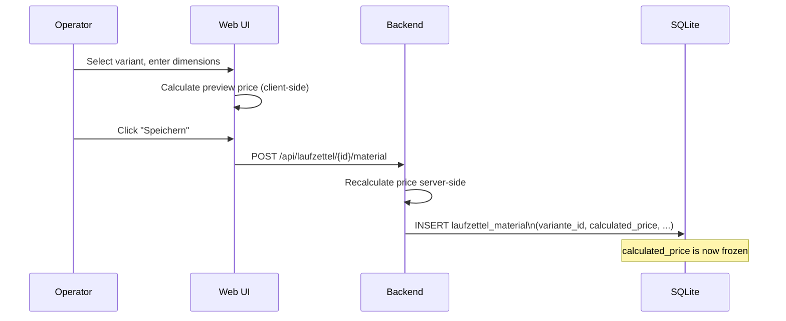

# Material Catalog

The material catalog defines reusable, priced material entries that can be attached to Laufzettel records. It is organized as a three-level hierarchy.

## Hierarchy

## Data model

### Location

Top-level grouping by workshop area.

| Field | Type | Description |
|---|---|---|
| `id` | int | Primary key |
| `name` | string | Location name (unique) |

### Kategorie

Defines the pricing model and input unit for a group of materials.

| Field | Type | Description |
|---|---|---|
| `id` | int | Primary key |
| `location_id` | int | FK → Location |
| `name` | string | Category name |
| `preismodell` | string | `per_gram`, `per_volume_cm3`, `per_unit` |
| `einheit` | string | Display unit, e.g. `g`, `cm³`, `Stk` |

### Variante

A concrete selectable option with a unit price.

| Field | Type | Description |
|---|---|---|
| `id` | int | Primary key |
| `kategorie_id` | int | FK → Kategorie |
| `name` | string | Variant name, e.g. `fein` |
| `preis_pro_einheit` | float | Price per unit (€) |

## Pricing models

### Model comparison table

| Model | Inputs required | Formula | Use case |
|---|---|---|---|
| `per_gram` | Menge (g) | `menge × price` | Clay, filament, powder, resin |
| `per_volume_cm3` | Length, width, height (cm) | `l × b × h × price` | Wood, foam, sheet materials |
| `per_volume_l` | Length, width, height (cm) | `l × b × h / 1000 × price` | Liquids (resin baths, oils) |
| `per_unit` | Count | `menge × price` | Small parts, hardware, kits |

## Practical examples

### Example 1 — Ton (per_gram)

- Location: `Töpferei`
- Kategorie: `Ton` · model: `per_gram` · unit: `g`
- Variante: `fein` · price: `0.05 €/g`
- Operator enters: `800 g`
- Calculated price: **0.05 × 800 = 40.00 €**

### Example 2 — Holz (per_volume_cm3)

- Location: `Holz-Werkstatt`
- Kategorie: `Holz` · model: `per_volume_cm3` · unit: `cm³`
- Variante: `Eiche` · price: `0.12 €/cm³`
- Operator enters: `30 cm × 10 cm × 4 cm`
- Volume: `30 × 10 × 4 = 1200 cm³`
- Calculated price: **0.12 × 1200 = 144.00 €**

### Example 3 — Filament (per_gram)

- Location: `FabLab`
- Kategorie: `Filament` · model: `per_gram` · unit: `g`
- Variante: `PLA` · price: `0.02 €/g`
- Operator enters: `65 g`
- Calculated price: **0.02 × 65 = 1.30 €**

## Historical price preservation

When a catalog-based material entry is saved to a Laufzettel, the `calculated_price` is **frozen at save time**. If you later change a variant's price, existing Laufzettel entries are not affected.

## Using the Katalog page

The `/katalog` page lets you manage the entire catalog tree in one view.

Actions available:

| Action | How |
|---|---|
| Add location | "Neuer Standort" button |
| Add category | Expand location → "Neue Kategorie" |
| Add variant | Expand category → "Neue Variante" |
| Edit/delete | Inline buttons on each row |

> **Tip:** Create the Location first, then the Kategorie (with pricing model), then the Varianten. You can't create a variant without a parent category.
