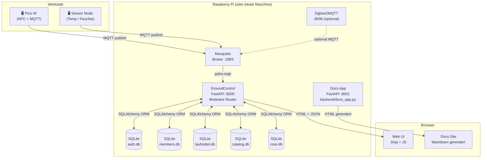
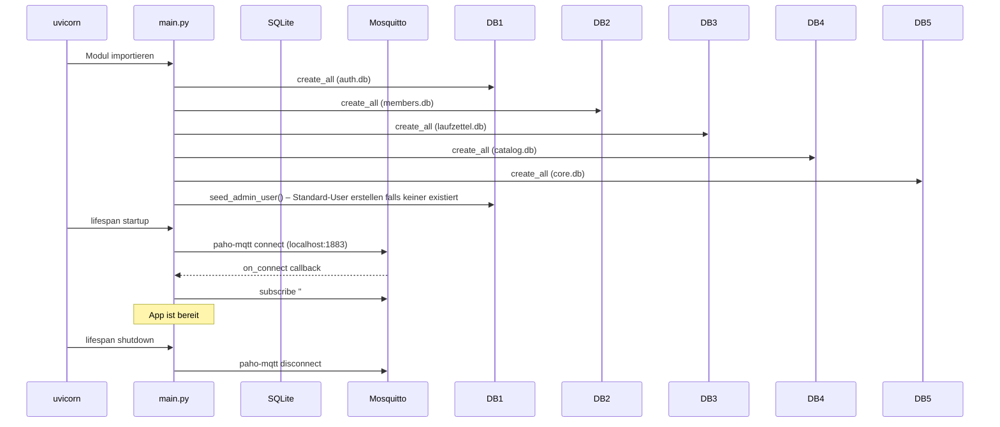

# System-Architektur

Diese Seite beschreibt die technische Struktur des Projekts – was läuft wo und wie die Komponenten verbunden sind.

## Komponenten-Übersicht



## Laufende Dienste

| Dienst | Port | Einstiegspunkt | Beschreibung |
|---|---|---|---|
| GroundControl Haupt-App | 8000 | `backend/main.py` + Module | Kern-App: MQTT, DB, API, UI |
| Docs Site | 8001 | `backend/docs_app.py` | Markdown-Docs-Renderer |
| Mosquitto MQTT Broker | 1883 | Systemdienst | Nachrichtenbus |
| Zigbee2MQTT (Pi only) | 8090 | Systemdienst | Zigbee-Bridge (optional) |
| sqlite-web (Pi only) | — | Systemdienst | DB-Browser (optional) |

## Code-Struktur

```
MakerPi_GroundControl/
│
├── backend/
│   ├── main.py           ← App-Factory, mounted alle Router
│   ├── config.py         ← Gemeinsame Konfiguration
│   ├── docs_app.py       ← Docs FastAPI-App
│   ├── auth/             ← Auth-Modul (Benutzer, Login)
│   │   ├── models.py
│   │   ├── db.py
│   │   ├── routes.py
│   │   └── dependencies.py
│   ├── members/          ← Members-Modul (Mitglieder, Tags)
│   │   ├── models.py
│   │   ├── db.py
│   │   └── routes.py
│   ├── laufzettel/       ← Laufzettel-Modul (Aufträge)
│   │   ├── models.py
│   │   ├── db.py
│   │   └── routes.py
│   ├── catalog/          ← Catalog-Modul (Materialkatalog)
│   │   ├── models.py
│   │   ├── db.py
│   │   └── routes.py
│   └── core/             ← Core-Modul (MQTT, Geräte, Scans)
│       ├── models.py
│       ├── db.py
│       ├── mqtt.py
│       └── routes.py
│
├── templates/
│   ├── login.html        ← Öffentliche Login-/Willkommensseite
│   ├── index.html        ← Dashboard (erfordert Login)
│   ├── database.html     ← Nachrichtenhistorie
│   ├── tags.html         ← RFID-Tag-Admin
│   ├── laufzettel.html   ← Laufzettel-Liste
│   ├── laufzettel-detail.html  ← Laufzettel-Editor + Material-Modal
│   ├── katalog.html      ← Materialkatalog-Manager
│   ├── mitglieder.html   ← Mitgliedsdatenbank
│   ├── admin-users.html  ← Benutzerverwaltung
│   └── docs-layout.html  ← Docs-Site-Shell-Template
│
├── static/
│   ├── css/
│   │   ├── style.css     ← Globale Variablen + gemeinsame Styles
│   │   ├── docs.css      ← Docs-Site-Styles
│   │   └── *.css         ← Seiten-spezifische Styles
│   └── js/
│       ├── docs.js       ← Docs-Suche, Mermaid-Init, Scrollspy
│       └── *.js          ← Seiten-spezifisches JS (fetch + DOM)
│
├── docs/
│   └── *.md              ← Dokumentations-Quelldateien
│
├── scripts/
│   ├── setup.sh          ← Pi-Setup + systemd-Service-Installer
│   └── deploy.sh         ← Deployment-Helfer
│
└── pyproject.toml        ← Python-Abhängigkeiten (uv)
```

## Start-Sequenz



## Technologie-Stack

| Ebene | Technologie | Version |
|---|---|---|
| Python-Runtime | CPython | 3.12 |
| Paketmanager | uv | latest |
| Web-Framework | FastAPI | latest |
| ASGI-Server | uvicorn | latest |
| ORM | SQLAlchemy | latest |
| Datenbank | SQLite | bundled |
| MQTT-Client | paho-mqtt | latest |
| Template-Engine | Jinja2 | latest |
| Docs-Rendering | markdown | 3.7 |
| Pydantic | pydantic | v2 |
| Passwort-Hashing | passlib + bcrypt | 1.7.4 / 3.x |
| Session-Signierung | itsdangerous | 2.x |

## Design-Prinzipien

> **Modulares Backend** — `backend/main.py` ist jetzt eine leichtgewichtige App-Factory. Jede Domäne (auth, members, laufzettel, catalog, core) hat ihr eigenes Modul mit dedizierter Datenbank, Models und Routes. Siehe [Extension Guide](./12-extension-guide).

> **Server-seitig gerenderte UI** — Seiten sind Jinja2-Templates. JavaScript erweitert sie, aber die HTML-Shell wird immer vom Backend ausgeliefert. Kein separater SPA-Build-Schritt.

> **Session-basierte Auth** — Login-Status wird in einem signierten Cookie via Starlettes `SessionMiddleware` gespeichert. Nur HTML-Seiten-Routen prüfen auf eine Session; `/api/` Endpunkte bleiben offen (Annahme: lokales Netzwerk). Benutzer werden in der `users`-Tabelle in `auth.db` mit bcrypt-gehashten Passwörtern gespeichert.

> **Nur SQLite** — Kein Postgres, kein Connection-Pooling nötig. Eine Datei, einfach zu sichern und zurückzusetzen. `check_same_thread=False` erlaubt die Nutzung vom async MQTT-Handler-Thread.

