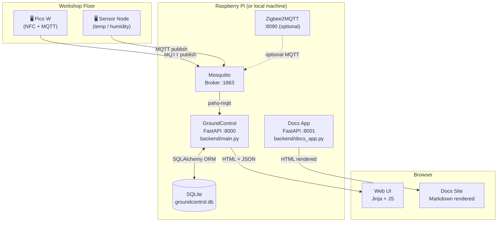
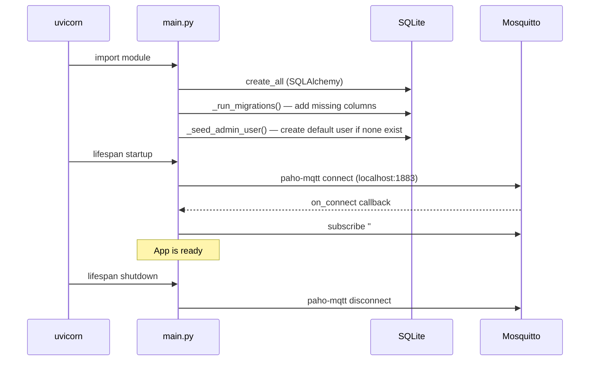

# System Architecture

This page describes the technical structure of the project — what runs where and how the pieces connect.

## Component overview



## Runtime services

| Service | Port | Entry point | Description |
|---|---|---|---|
| GroundControl main app | 8000 | `backend/main.py` | Core app: MQTT, DB, API, UI |
| Docs site | 8001 | `backend/docs_app.py` | Markdown docs renderer |
| Mosquitto MQTT broker | 1883 | system service | Message bus |
| Zigbee2MQTT (Pi only) | 8090 | system service | Zigbee bridge (optional) |
| sqlite-web (Pi only) | — | system service | DB browser (optional) |

## Code layout

```
MakerPi_GroundControl/
│
├── backend/
│   ├── main.py           ← Main FastAPI app (models, MQTT, routes, pages)
│   └── docs_app.py       ← Docs FastAPI app (Markdown rendering)
│
├── templates/
│   ├── login.html        ← Public login / welcome page
│   ├── index.html        ← Dashboard (requires login)
│   ├── database.html     ← Message history
│   ├── tags.html         ← RFID tag admin
│   ├── laufzettel.html   ← Laufzettel list
│   ├── laufzettel-detail.html  ← Laufzettel editor + material modal
│   ├── katalog.html      ← Material catalog manager
│   ├── mitglieder.html   ← Member database
│   ├── admin-users.html  ← User management
│   └── docs-layout.html  ← Docs site shell template
│
├── static/
│   ├── css/
│   │   ├── style.css     ← Global variables + shared styles
│   │   ├── docs.css      ← Docs site styles
│   │   └── *.css         ← Per-page styles
│   └── js/
│       ├── docs.js       ← Docs search, Mermaid init, scrollspy
│       └── *.js          ← Per-page JS (fetch + DOM)
│
├── docs/
│   └── *.md              ← Documentation source files
│
├── scripts/
│   ├── setup.sh          ← Pi setup + systemd service installer
│   └── deploy.sh         ← Deployment helper
│
└── pyproject.toml        ← Python dependencies (uv)
```

## Startup sequence



## Dependency chain

| Layer | Technology | Version |
|---|---|---|
| Python runtime | CPython | 3.12 |
| Package manager | uv | latest |
| Web framework | FastAPI | latest |
| ASGI server | uvicorn | latest |
| ORM | SQLAlchemy | latest |
| Database | SQLite | bundled |
| MQTT client | paho-mqtt | latest |
| Template engine | Jinja2 | latest |
| Docs rendering | markdown | 3.7 |
| Pydantic | pydantic | v2 |
| Password hashing | passlib + bcrypt | 1.7.4 / 3.x |
| Session signing | itsdangerous | 2.x |

## Design principles

> **Single-file backend** — `backend/main.py` is intentionally monolithic for now. It keeps the full domain model visible in one place and is well-suited to this project size. See [Extension Guide](./12-extension-guide.md) for when to split it.

> **Server-rendered UI** — Pages are Jinja2 templates. JavaScript enhances them but the HTML shell is always served from the backend. No separate SPA build step.

> **Session-based auth** — Login state is stored in a signed cookie via Starlette's `SessionMiddleware`. Only HTML page routes check for a session; `/api/` endpoints are left open (local network assumption). Users are stored in the `users` table in `groundcontrol.db` with bcrypt-hashed passwords.

> **SQLite only** — No Postgres, no connection pooling needed. One file, easy to back up and reset. `check_same_thread=False` allows use from the async MQTT handler thread.
