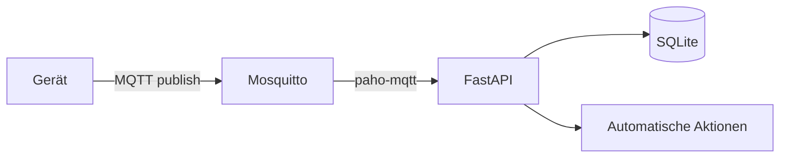
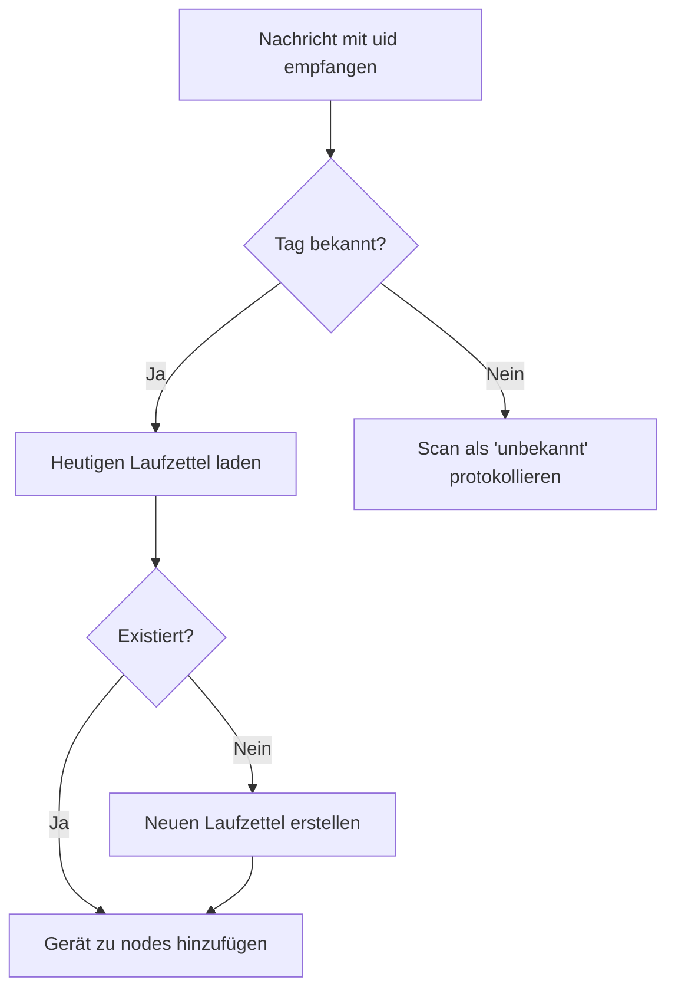

# MQTT-Datenfluss

Diese Seite beschreibt, wie MQTT-Nachrichten empfangen, verarbeitet und gespeichert werden.

## Übersicht



## Topic-Struktur

Alle Topics folgen dem Muster:

```
makerpi/devices/{device_id}/{type}
```

| Typ | Zweck | Beispiel-Payload |
|-----|-------|------------------|
| `status` | Geräte-Heartbeat | `{"uid":"A4B2...","state":"printing"}` |
| `event` | NFC-Scan-Ereignis | `{"uid":"A4B2...","action":"checkin"}` |
| `sensors` | Umgebungsdaten | `{"temp":22.5,"humidity":45}` |

## Nachrichtenverarbeitung

### 1. Empfang

```python
# backend/core/mqtt.py
def on_message(client, userdata, msg):
    topic = msg.topic
    payload = msg.payload.decode()
    # Weiterverarbeitung...
```

### 2. Parsen

Das System versucht, das Payload als JSON zu parsen:

- **JSON:** Gespeichert als strukturierte Daten
- **Plaintext:** Gespeichert als roher String

### 3. Speichern

Jede Nachricht wird in `core.db` → `mqtt_messages` gespeichert:

| Feld | Wert |
|------|------|
| `topic` | Vollständiger Topic-String |
| `payload` | Rohdaten (JSON oder Text) |
| `timestamp` | UTC-Zeitpunkt des Empfangs |
| `device_id` | Extrahiert aus Topic-Pfad |

**Nachrichten-Filterung:** Um die Datenbankbelastung durch routinemäßigen MQTT-Verkehr zu reduzieren, werden bestimmte Nachrichtstypen herausgefiltert und nicht gespeichert:

**Herausgefiltert (nicht gespeichert):**
- Heartbeat-Nachrichten: Topics mit `/heartbeat` oder `/availability`
- Status-Nachrichten: Topics mit `/status`, `/online` oder `/offline`
- zigbee2mqtt-Verfügbarkeitsnachrichten: `zigbee2mqtt/.../availability`
- zigbee2mqtt-Bridge-State-Nachrichten: Topics mit `/bridge`

**Gespeichert (für Audit-Trail behalten):**
- Scan-Nachrichten: Topics mit `/scan`, `/nfc` oder `/tag`
- Gerätedaten-Nachrichten: zigbee2mqtt-Sensormessungen, Geräte-Payloads
- Kommando/Konfigurations-Nachrichten: Gerätekonfiguration und Kommando-Topics
- Andere Gerätenachrichten: Jedes Topic, das nicht auf die Filtermuster passt

Diese Filterung reduziert die Wachstumsrate der `mqtt_messages`-Tabelle erheblich, während alle wichtigen operativen Daten für Debugging und Audit-Zwecke erhalten bleiben.

### 4. Geräte-Update

Für `status`-Nachrichten:

```python
# Device-Record aktualisieren
device.last_seen = now()
device.status = payload.get('state', 'unknown')
device.last_payload = payload
```

### 5. Laufzettel-Logik

Wenn eine Nachricht eine `uid` enthält:



## Datenbank-Schema

### mqtt_messages

```sql
CREATE TABLE mqtt_messages (
    id INTEGER PRIMARY KEY,
    topic TEXT,
    payload TEXT,
    timestamp DATETIME,
    device_id TEXT
);
```

### devices

```sql
CREATE TABLE devices (
    id INTEGER PRIMARY KEY,
    device_id TEXT UNIQUE,
    last_seen TEXT,
    status TEXT,
    last_payload TEXT
);
```

## Beispiel-Workflow

### Szenario: 3D-Drucker meldet Status

1. **Drucker sendet:**
   ```
   Topic: makerpi/devices/prusa_001/status
   Payload: {"uid":"A4B2C3D4","state":"printing","temp_nozzle":210}
   ```

2. **System speichert:**
   - Neue Zeile in `mqtt_messages`
   - Device-Record aktualisiert: `last_seen = now()`

3. **Laufzettel-Logik:**
   - Tag `A4B2C3D4` gefunden → Mitglied "Max Mustermann"
   - Heutiger Laufzettel geladen (oder erstellt)
   - `prusa_001` zur `nodes`-Liste hinzugefügt

4. **Ergebnis:**
   - Admin sieht im Dashboard: "Max nutzt Drucker prusa_001"
   - Gerät-Liste zeigt prusa_001 als "online"

## API-Endpunkte

| Methode | Endpunkt | Beschreibung |
|---------|----------|--------------|
| `GET` | `/api/messages` | Nachrichten mit Pagination |
| `GET` | `/api/devices` | Alle bekannten Geräte |
| `GET` | `/api/topics` | Alle gesehenen Topics |

## Fehlerbehandlung

| Problem | Reaktion |
|---------|----------|
| Ungültiges JSON | Als Plaintext speichern |
| Unbekanntes Topic | Trotzdem speichern (für Debugging) |
| Fehlende `uid` | Keine Laufzettel-Aktion |
| Datenbank-Timeout | Nachricht trotzdem im Log behalten |

## Performance

- **Buffer-Größe:** 1000 Nachrichten im Speicher
- **Flush-Intervall:** Alle 5 Sekunden zu SQLite
- **Retention:** Alte Nachrichten können manuell gelöscht werden

## Sicherheit

- MQTT-Broker läuft lokal (localhost:1883)
- Keine Authentifizierung erforderlich (Netzwerk-Annahme)
- Payloads werden nicht validiert – Admin-UI zeigt Rohdaten
