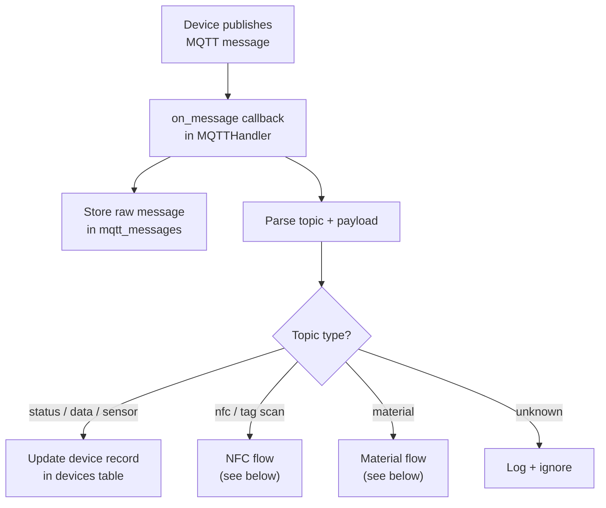
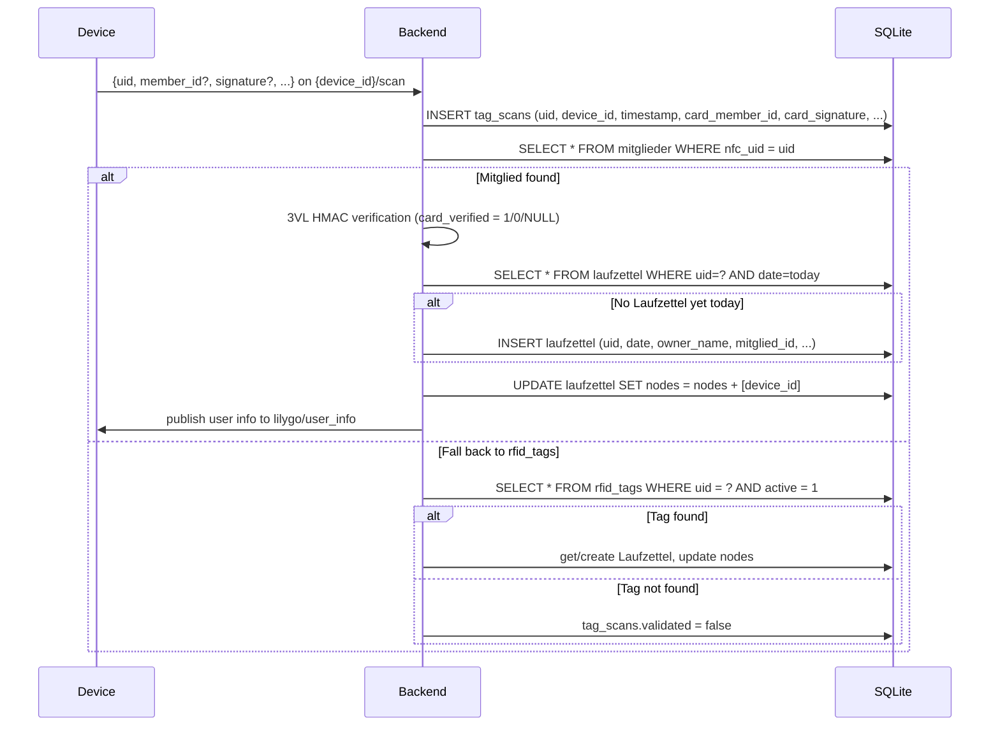

# MQTT Data Flow

This page explains how MQTT data enters and leaves GroundControl, and what the backend does with each message type.

## Topic conventions

Devices publish to topics with the following patterns:

| Pattern | Purpose |
|---|---|
| `{device_id}/status` | Online/offline heartbeat |
| `{device_id}/data` | Generic sensor payload |
| `{device_id}/temp` | Temperature reading |
| `{device_id}/humidity` | Humidity reading |
| `{device_id}/alert` | Alert or threshold trigger |
| `{device_id}/scan` | NFC / RFID scan event (primary) |
| `{device_id}/tag` | NFC / RFID scan event (alias) |
| `{device_id}/material` | Material usage report |

> All incoming topics are stored in `mqtt_messages` regardless of type. Topic-specific logic runs on top of that.

## Incoming message flow



## NFC scan sequence

Devices publish scan events on `{device_id}/scan` or `{device_id}/tag`. The payload may include card-side enrollment data (member_id, name, signature) if the PicoW firmware supports NFC security.



> **NFC security mode:** When the card carries an HMAC signature, the backend runs 3VL verification. `card_verified = 0` (rejected) always blocks access. In `nfc_signature_mode = "strict"`, cards without a signature (`card_verified = NULL`) are also blocked. See [NFC Tag Security](./16-nfc-tag-security.en.md).

## Material MQTT flow

Devices can report material usage directly over MQTT (alternative to manual UI entry).

**Expected topic:** `{device_id}/material`

**Expected payload:**

```json
{
  "uid": "04AABBCCDD",
  "name": "PLA",
  "menge": 65,
  "unit": "g"
}
```

The backend:

1. Extracts `uid` from the payload
2. Finds today's Laufzettel for that UID
3. Creates a free-text material entry attached to it

## Outgoing messages (backend → device)

The backend can publish to devices too:

| Topic | Trigger | Payload |
|---|---|---|
| `lilygo/user_info` | After NFC scan of known tag | `{owner_name, member_id, uid, validated}` |
| `{device_id}/command` | Card enrollment write command from UI | `{action: write_card, member_id, name, signature, sector_key, ...}` |
| `groundcontrol/nfc/config` | On MQTT broker connect (retained) | `{sector_key, sector, version}` — PicoW devices read this at startup |

## Message storage

Every incoming MQTT message is stored in `mqtt_messages`:

| Field | Description |
|---|---|
| `topic` | Full MQTT topic string |
| `payload` | Raw string payload |
| `timestamp` | Server receive time (UTC) |
| `device_id` | Extracted from topic prefix |

This gives a full audit trail for debugging and review.

## Error handling

| Situation | Behavior |
|---|---|
| Invalid JSON payload | Log error, skip processing |
| Unknown UID | Store scan, mark as unvalidated |
| Missing `uid` in material msg | Log warning, skip |
| MQTT broker unreachable | App starts, MQTT reconnects on retry |
| Duplicate Laufzettel | `UNIQUE(uid, date)` constraint prevents double-creation |

## Local debugging

Subscribe to all topics to watch live traffic:

```bash
mosquitto_sub -h localhost -t "#" -v
```

Subscribe to a specific device:

```bash
mosquitto_sub -h localhost -t "my-device/#" -v
```

Publish a test NFC scan manually:

```bash
mosquitto_pub -h localhost -t "my-device/nfc" \
  -m '{"uid":"04AABBCCDD","device_id":"my-device"}'
```
