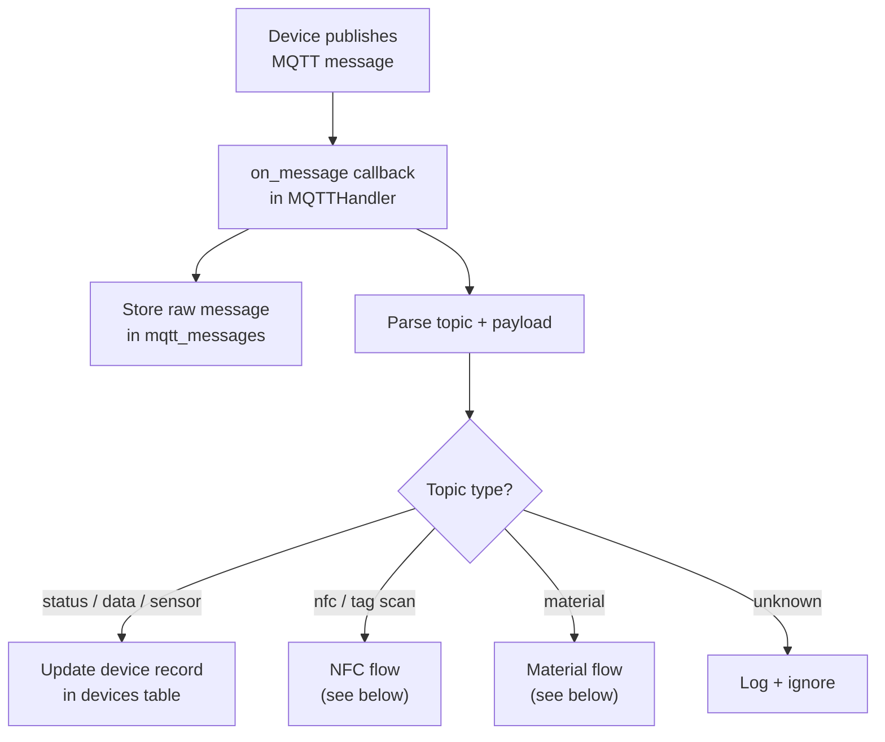
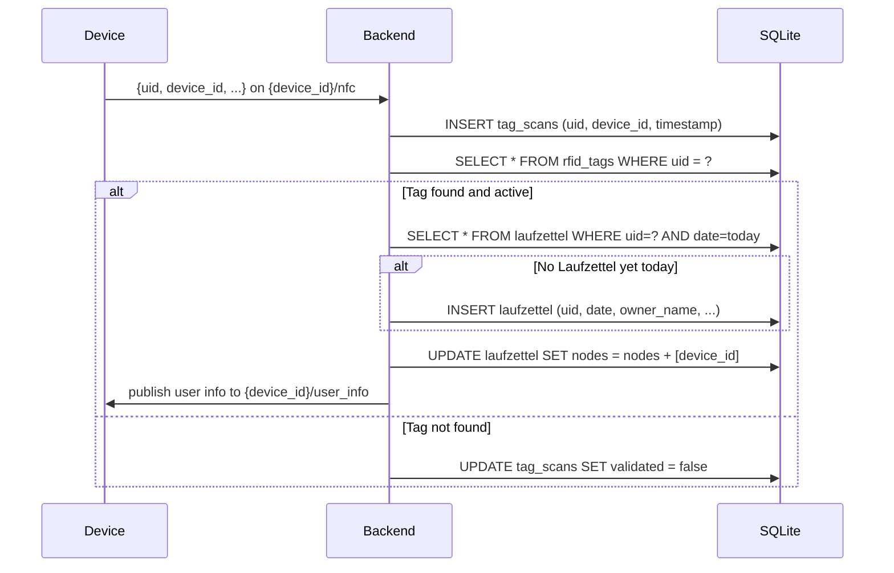

# MQTT Data Flow

This page explains how MQTT data enters and leaves GroundControl, and what the backend does with each message type.

## Topic conventions

Devices publish to topics with the following patterns:

| Pattern | Purpose |
|---|---|
| `{device_id}/status` | Online/offline heartbeat |
| `{device_id}/data` | Generic sensor payload |
| `{device_id}/temp` | Temperature reading |
| `{device_id}/humidity` | Humidity reading |
| `{device_id}/alert` | Alert or threshold trigger |
| `{device_id}/nfc` | NFC / RFID scan event |
| `{device_id}/material` | Material usage report |

> **Message Filtering**: Not all incoming topics are stored. Heartbeat, status, and availability messages are filtered out to reduce database load. See the "Message Storage Filtering" section below for details.

## Incoming message flow



## NFC scan sequence



## Material MQTT flow

Devices can report material usage directly over MQTT (alternative to manual UI entry).

**Expected topic:** `{device_id}/material`

**Expected payload:**

```json
{
  "uid": "04AABBCCDD",
  "name": "PLA",
  "menge": 65,
  "unit": "g"
}
```

The backend:

1. Extracts `uid` from the payload
2. Finds today's Laufzettel for that UID
3. Creates a free-text material entry attached to it

## Outgoing messages (backend → device)

The backend can publish to devices too:

| Topic | Trigger | Payload |
|---|---|---|
| `{device_id}/user_info` | After NFC scan of known tag | `{owner_name, member_id, uid}` |
| `{device_id}/command` | Manual command from UI | Custom JSON |

## Message storage

Every incoming MQTT message is stored in `mqtt_messages`:

| Field | Description |
|---|---|
| `topic` | Full MQTT topic string |
| `payload` | Raw string payload |
| `timestamp` | Server receive time (UTC) |
| `device_id` | Extracted from topic prefix |

This gives a full audit trail for debugging and review.

### Message storage filtering

To reduce database load from routine MQTT traffic, certain message types are filtered out and not stored:

**Filtered out (not stored):**
- Heartbeat messages: topics containing `/heartbeat` or `/availability`
- Status messages: topics containing `/status`, `/online`, or `/offline`
- zigbee2mqtt availability messages: `zigbee2mqtt/.../availability`
- zigbee2mqtt bridge state messages: topics containing `/bridge`

**Stored (kept for audit trail):**
- Scan messages: topics containing `/scan`, `/nfc`, or `/tag`
- Device data messages: zigbee2mqtt sensor measurements, device payloads
- Command/config messages: device configuration and command topics
- Other device messages: any topic that doesn't match the filter patterns

This filtering significantly reduces the growth rate of the `mqtt_messages` table while preserving all important operational data for debugging and audit purposes.

## Error handling

| Situation | Behavior |
|---|---|
| Invalid JSON payload | Log error, skip processing |
| Unknown UID | Store scan, mark as unvalidated |
| Missing `uid` in material msg | Log warning, skip |
| MQTT broker unreachable | App starts, MQTT reconnects on retry |
| Duplicate Laufzettel | `UNIQUE(uid, date)` constraint prevents double-creation |

## Local debugging

Subscribe to all topics to watch live traffic:

```bash
mosquitto_sub -h localhost -t "#" -v
```

Subscribe to a specific device:

```bash
mosquitto_sub -h localhost -t "my-device/#" -v
```

Publish a test NFC scan manually:

```bash
mosquitto_pub -h localhost -t "my-device/nfc" \
  -m '{"uid":"04AABBCCDD","device_id":"my-device"}'
```
