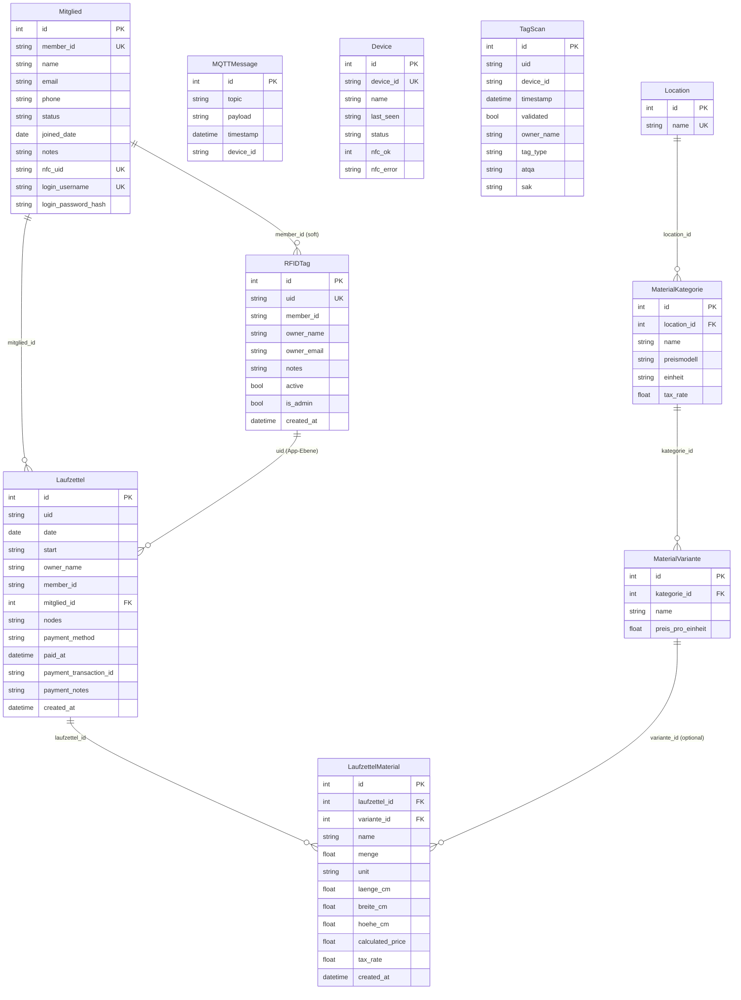
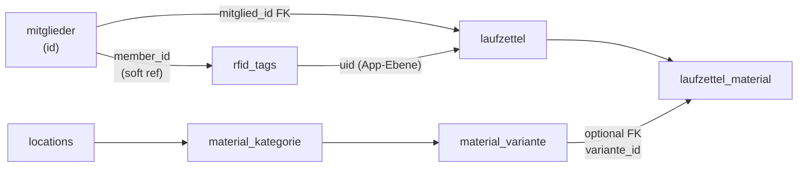

# Datenbank-Modell

Diese Seite beschreibt alle Tabellen, ihre Felder und die Beziehungen zwischen ihnen. Seit dem modularen Refaktor sind die Tabellen über **5 separate SQLite-Datenbanken** verteilt.

## Datenbank-Übersicht

| Datenbank | Modul | Tabellen |
|---|---|---|
| `auth.db` | `backend/auth/` | `users` |
| `members.db` | `backend/members/` | `mitglieder`, `rfid_tags` |
| `laufzettel.db` | `backend/laufzettel/` | `laufzettel`, `laufzettel_material` |
| `catalog.db` | `backend/catalog/` | `locations`, `material_kategorie`, `material_variante` |
| `core.db` | `backend/core/` | `mqtt_messages`, `devices`, `tag_scans` |

Jedes Modul besitzt seine eigene Datenbankverbindung und Models. Datenbank-übergreifende Referenzen verwenden Soft-Keys (z.B. `member_id` als String) statt Fremdschlüsseln.

## Entitätstabellen

### `mitglieder`

Mitglieder-Datensätze, synchronisiert aus easyVerein oder manuell erstellt. Die zentrale Entität, die Benutzer, RFID-Karten und Laufzettel verbindet.

| Spalte | Typ | Hinweise |
|---|---|---|
| `id` | INTEGER PK | Auto-increment |
| `member_id` | TEXT UNIQUE | Externe Mitgliedsnummer (z.B. aus easyVerein) |
| `name` | TEXT | Vollständiger Name (erforderlich) |
| `email` | TEXT | E-Mail-Adresse |
| `phone` | TEXT | Telefonnummer |
| `status` | TEXT | `active` oder `inactive` |
| `joined_date` | DATE | Eintrittsdatum |
| `notes` | TEXT | Freitext-Notizen |
| `nfc_uid` | TEXT UNIQUE | Primäre NFC-Karten-UID für RFID-Login |
| `login_username` | TEXT UNIQUE | Optionaler Benutzername für Passwort-Login |
| `login_password_hash` | TEXT | Bcrypt-Hash für Passwort-Login |

## Entity-Relationship-Diagramm



## Tabellen-Referenz

### `mqtt_messages`

Rohspeicher aller empfangenen MQTT-Nachrichten.

| Spalte | Typ | Hinweise |
|---|---|---|
| `id` | INTEGER PK | Auto-Inkrement |
| `topic` | TEXT | Vollständiger Topic-String |
| `payload` | TEXT | Roh-Payload-String |
| `timestamp` | DATETIME | Server-Empfangszeit (UTC) |
| `device_id` | TEXT | Aus Topic-Präfix extrahiert |

### `devices`

Eine Zeile pro erkanntem Gerät, aktualisiert bei jeder Nachricht.

| Spalte | Typ | Hinweise |
|---|---|---|
| `id` | INTEGER PK | Auto-Inkrement |
| `device_id` | TEXT UNIQUE | Topic-Präfix |
| `name` | TEXT | Anzeigename (optional) |
| `last_seen` | DATETIME | ISO-Zeitstempel (UTC) |
| `status` | TEXT | Letzter bekannter Status-String |
| `nfc_ok` | INTEGER | NULL=unbekannt, 1=OK, 0=Fehler |
| `nfc_error` | TEXT | Fehlermeldung wenn NFC einen Fehler hat |

### `rfid_tags`

Registrierte NFC-Karten. Kann über `member_id` (Soft-Reference) mit einem Mitglied verknüpft werden.

| Spalte | Typ | Hinweise |
|---|---|---|
| `id` | INTEGER PK | Auto-Inkrement |
| `uid` | TEXT UNIQUE | NFC-Karten-UID |
| `member_id` | TEXT | Soft-Ref zu `mitglieder.member_id` |
| `owner_name` | TEXT | Anzeigename |
| `owner_email` | TEXT | E-Mail-Adresse |
| `notes` | TEXT | Freitext-Notizen |
| `active` | BOOLEAN | Standard true |
| `is_admin` | BOOLEAN | Admin-Karte (gewährt Admin-Zugriff) |
| `created_at` | DATETIME | Auto (UTC) |

### `tag_scans`

Ereignis-Log aller empfangenen NFC-Scans.

| Spalte | Typ | Hinweise |
|---|---|---|
| `id` | INTEGER PK | Auto-Inkrement |
| `uid` | TEXT | Gescannte UID |
| `device_id` | TEXT | Quellgerät |
| `timestamp` | DATETIME | Scan-Zeit (UTC) |
| `validated` | BOOLEAN | True wenn UID einem registrierten Tag entsprach |
| `owner_name` | TEXT | Name aus Tag wenn validiert |
| `tag_type` | TEXT | Kartentyp (z.B. MIFARE Classic) |
| `atqa` | TEXT | ATQA-Bytes (hex) |
| `sak` | TEXT | SAK-Byte (hex) |

### `laufzettel`

Ein Datensatz pro Karteninhaber pro Tag. Verknüpft mit Mitglied via `mitglied_id` (bevorzugt) oder legacy via `uid`.

| Spalte | Typ | Hinweise |
|---|---|---|
| `id` | INTEGER PK | Auto-Inkrement |
| `uid` | TEXT | RFID-UID (legacy) |
| `date` | DATE | Nutzungsdatum |
| `start` | DATETIME | Erste Scan-Zeit (UTC) |
| `owner_name` | TEXT | Beim Erstellen aus Tag kopiert |
| `member_id` | TEXT | Beim Erstellen aus Tag kopiert (legacy) |
| `mitglied_id` | INTEGER | FK zu `mitglieder.id` (bevorzugt) |
| `nodes` | TEXT | JSON-Liste der Geräte-IDs |
| `payment_method` | TEXT | `bar` / `karte` — null bis zur Zahlung |
| `paid_at` | DATETIME | UTC-Zeitstempel der Zahlung — null bis zur Zahlung |
| `payment_transaction_id` | TEXT | SumUp `transaction_code` (z.B. `TAAA2VBGK7C`) oder Checkout-ID |
| `payment_notes` | TEXT | Freitext-Notiz (Barzahlung, optional) |
| `created_at` | DATETIME | Auto (UTC) |
| — | UNIQUE | `(uid, date)` |

### `laufzettel_material`

Mit einem Laufzettel verbundene Material-Einträge.

| Spalte | Typ | Hinweise |
|---|---|---|
| `id` | INTEGER PK | Auto-Inkrement |
| `laufzettel_id` | INTEGER FK | → `laufzettel.id` |
| `variante_id` | INTEGER FK | → `material_variante.id` (nullable) |
| `name` | TEXT | Materialname |
| `menge` | FLOAT | Verwendete Menge |
| `unit` | TEXT | Einheits-String |
| `laenge_cm` | FLOAT | Für Volumenpreise |
| `breite_cm` | FLOAT | Für Volumenpreise |
| `hoehe_cm` | FLOAT | Für Volumenpreise |
| `calculated_price` | FLOAT | Eingefroren beim Speichern |
| `tax_rate` | FLOAT | Steuersatz aus Kategorie (Standard 19,0) |

### `locations`

Top-Level Katalog-Gruppierung.

| Spalte | Typ | Hinweise |
|---|---|---|
| `id` | INTEGER PK | Auto-Inkrement |
| `name` | TEXT UNIQUE | Standortname |

### `material_kategorie`

Kategorie mit Preismodell und Einheit.

| Spalte | Typ | Hinweise |
|---|---|---|
| `id` | INTEGER PK | Auto-Inkrement |
| `location_id` | INTEGER FK | → `locations.id` |
| `name` | TEXT | Kategoriename |
| `pricing_model` | TEXT | `per_unit` / `per_gram` / `per_volume_cm3` / `per_volume_l` / `per_minute` |
| `unit` | TEXT | Anzeigeeinheit |
| `tax_rate` | FLOAT | Steuersatz: 0, 7 oder 19 (Standard 19,0) |

### `material_variante`

Konkrete, preisgekrönte Variante.

| Spalte | Typ | Hinweise |
|---|---|---|
| `id` | INTEGER PK | Auto-Inkrement |
| `kategorie_id` | INTEGER FK | → `material_kategorie.id` |
| `name` | TEXT | Variantenname |
| `price` | FLOAT | Preis pro Einheit (€) |

## Wichtige Beziehungen



> **Kein harter FK von laufzettel → rfid_tags.** Die Beziehung nutzt `uid` als gemeinsamen Key auf App-Ebene. Das erlaubt Laufzettel-Einträge für unregistrierte UIDs (z.B. manuelle Erstellung).
>
> **Mitglied ist die zentrale Entität.** Laufzettel verlinkt jetzt zu `mitglieder.id` via `mitglied_id` (bevorzugt). Die legacy `uid` + `member_id` Felder bleiben für Abwärtskompatibilität erhalten.

## Migrations-Ansatz

Jedes Modul nutzt SQLAlchemy `create_all()` beim Start, um seine eigenen Tabellen zu erstellen. Für Schema-Änderungen (neue Spalten) gibt es Migrations-Skripte unter `scripts/`:

```bash
# Neue Zahlungsfelder (payment_transaction_id, payment_notes) zu laufzettel hinzufügen
.venv/bin/python scripts/migrate_payment_fields.py
```

Beim Deploy mit `--migrate` Flag wird das Skript automatisch ausgeführt:

```bash
./scripts/deploy.sh --migrate
```

Wenn Schema-Änderungen häufiger werden, ist **Alembic** pro Modul die empfohlene nächste Stufe. Siehe [Extension Guide](./12-extension-guide).
