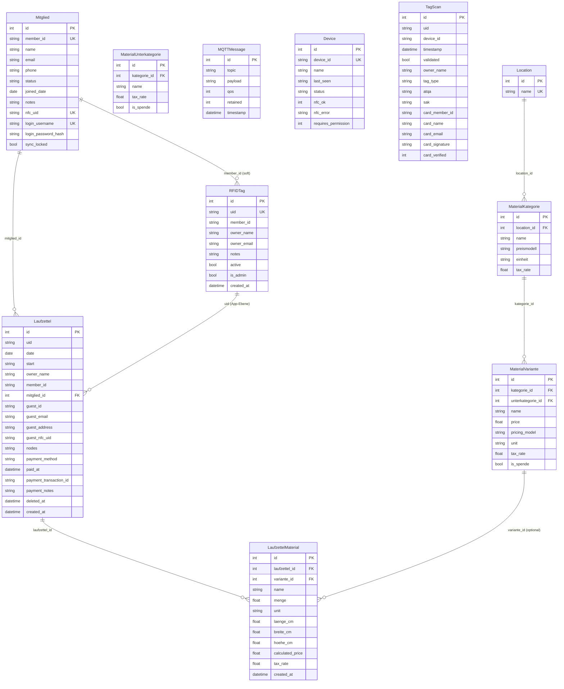
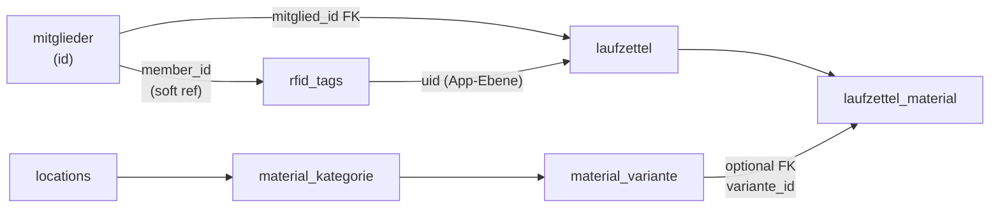

# Datenbank-Modell

Diese Seite beschreibt alle Tabellen, ihre Felder und die Beziehungen zwischen ihnen. Seit dem modularen Refaktor sind die Tabellen über **mehrere separate SQLite-Datenbanken** verteilt.

## Datenbank-Übersicht

| Datenbank | Modul | Tabellen |
|---|---|---|
| `auth.db` | `backend/auth/` | `users` |
| `members.db` | `backend/members/` | `mitglieder`, `rfid_tags`, `device_permissions` |
| `laufzettel.db` | `backend/laufzettel/` | `laufzettel`, `laufzettel_material`, `device_pricing`, `device_sessions`, `laufzettel_gutschein` |
| `catalog.db` | `backend/catalog/` | `locations`, `material_kategorie`, `material_unterkategorie`, `material_variante` |
| `core.db` | `backend/core/` | `mqtt_messages`, `devices`, `tag_scans`, `device_pairings` |
| `buchhaltung.db` | `backend/buchhaltung/` | Buchhaltungstabellen (Spenden, Buchungen) |
| `push.db` | `backend/push/` | Web-Push-Abonnements |

> `buchhaltung.db` und `push.db` gehören den Modulen `buchhaltung` bzw. `push` und sind auf dieser Seite nicht im Detail dokumentiert.

Jedes Modul besitzt seine eigene Datenbankverbindung und Models. Datenbank-übergreifende Referenzen verwenden Soft-Keys (z.B. `member_id` als String) statt Fremdschlüsseln.

## Entitätstabellen

### `mitglieder`

Mitglieder-Datensätze, synchronisiert aus easyVerein oder manuell erstellt. Die zentrale Entität, die Benutzer, RFID-Karten und Laufzettel verbindet.

| Spalte | Typ | Hinweise |
|---|---|---|
| `id` | INTEGER PK | Auto-increment |
| `member_id` | TEXT UNIQUE | Externe Mitgliedsnummer (z.B. aus easyVerein) |
| `name` | TEXT | Vollständiger Name (erforderlich) |
| `email` | TEXT | E-Mail-Adresse |
| `phone` | TEXT | Telefonnummer |
| `status` | TEXT | `active` oder `inactive` |
| `joined_date` | DATE | Eintrittsdatum |
| `notes` | TEXT | Freitext-Notizen |
| `nfc_uid` | TEXT UNIQUE | Primäre NFC-Karten-UID für RFID-Login |
| `login_username` | TEXT UNIQUE | Optionaler Benutzername für Passwort-Login |
| `login_password_hash` | TEXT | Bcrypt-Hash für Passwort-Login |
| `sync_locked` | BOOLEAN | Standard false. Wenn true, wird die easyVerein-Synchronisierung für dieses Mitglied übersprungen |

## Entity-Relationship-Diagramm

## Tabellen-Referenz

### `mqtt_messages`

Rohspeicher aller empfangenen MQTT-Nachrichten.

| Spalte | Typ | Hinweise |
|---|---|---|
| `id` | INTEGER PK | Auto-Inkrement |
| `topic` | TEXT | Vollständiger Topic-String |
| `payload` | TEXT | Roh-Payload-String |
| `qos` | INTEGER | MQTT QoS-Level |
| `retained` | INTEGER | 1 wenn es sich um eine retinierte Nachricht handelte |
| `timestamp` | DATETIME | Server-Empfangszeit (UTC) |

### `devices`

Eine Zeile pro erkanntem Gerät, aktualisiert bei jeder Nachricht.

| Spalte | Typ | Hinweise |
|---|---|---|
| `id` | INTEGER PK | Auto-Inkrement |
| `device_id` | TEXT UNIQUE | Topic-Präfix |
| `name` | TEXT | Anzeigename (optional) |
| `last_seen` | DATETIME | ISO-Zeitstempel (UTC) |
| `status` | TEXT | Letzter bekannter Status-String |
| `nfc_ok` | INTEGER | NULL=unbekannt, 1=OK, 0=Fehler |
| `nfc_error` | TEXT | Fehlermeldung wenn NFC einen Fehler hat |
| `requires_permission` | INTEGER | Standard 1. 1 = Gerät erfordert eine Mitglied-`DevicePermission`, 0 = freier Zugriff |

### `rfid_tags`

Registrierte NFC-Karten. Kann über `member_id` (Soft-Reference) mit einem Mitglied verknüpft werden.

| Spalte | Typ | Hinweise |
|---|---|---|
| `id` | INTEGER PK | Auto-Inkrement |
| `uid` | TEXT UNIQUE | NFC-Karten-UID |
| `member_id` | TEXT | Soft-Ref zu `mitglieder.member_id` |
| `owner_name` | TEXT | Anzeigename |
| `owner_email` | TEXT | E-Mail-Adresse |
| `notes` | TEXT | Freitext-Notizen |
| `active` | BOOLEAN | Standard true |
| `is_admin` | BOOLEAN | Admin-Karte (gewährt Admin-Zugriff) |
| `created_at` | DATETIME | Auto (UTC) |

### `tag_scans`

Ereignis-Log aller empfangenen NFC-Scans.

| Spalte | Typ | Hinweise |
|---|---|---|
| `id` | INTEGER PK | Auto-Inkrement |
| `uid` | TEXT | Gescannte UID |
| `device_id` | TEXT | Quellgerät |
| `timestamp` | DATETIME | Scan-Zeit (UTC) |
| `validated` | BOOLEAN | True wenn UID einem registrierten Tag entsprach |
| `owner_name` | TEXT | Name aus Tag wenn validiert |
| `tag_type` | TEXT | Kartentyp (z.B. MIFARE Classic) |
| `atqa` | TEXT | ATQA-Bytes (hex) |
| `sak` | TEXT | SAK-Byte (hex) |
| `card_member_id` | TEXT | Mitglieds-ID aus Kartendaten (beim Enrollen geschrieben) |
| `card_name` | TEXT | Name aus Kartendaten |
| `card_email` | TEXT | E-Mail aus Kartendaten |
| `card_signature` | TEXT | HMAC-SHA256-Signatur aus Karte |
| `card_verified` | INTEGER | 3VL: `1`=HMAC verifiziert, `0`=HMAC abgelehnt (Klon-Versuch), `NULL`=Legacy-Karte (keine Sig) |

> `card_signature` und `card_verified` (zusammen mit den anderen `card_*`-Spalten) werden beim App-Start automatisch durch die Inline-Migration in jeder `init_db()` hinzugefügt. Es ist kein manueller Schritt nötig. Siehe [NFC Tag Security](./16-nfc-tag-security.de.md).

### `laufzettel`

Ein Datensatz pro Karteninhaber pro Tag. Verknüpft mit Mitglied via `mitglied_id` (bevorzugt) oder legacy via `uid`.

| Spalte | Typ | Hinweise |
|---|---|---|
| `id` | INTEGER PK | Auto-Inkrement |
| `uid` | TEXT | RFID-UID (legacy) |
| `date` | DATE | Nutzungsdatum |
| `start` | DATETIME | Erste Scan-Zeit (UTC) |
| `owner_name` | TEXT | Beim Erstellen aus Tag kopiert |
| `member_id` | TEXT | Beim Erstellen aus Tag kopiert (legacy) |
| `mitglied_id` | INTEGER | FK zu `mitglieder.id` (bevorzugt) |
| `guest_id` | TEXT | UUID für Gast-Sessions |
| `guest_email` | TEXT | Optionale E-Mail für Gäste |
| `guest_address` | TEXT | Vollständige Adresse für Gäste |
| `guest_nfc_uid` | TEXT | NFC-Tag, der mit einer Gast-Session verknüpft ist |
| `nodes` | TEXT | JSON-Liste der Geräte-IDs |
| `payment_method` | TEXT | `bar` / `paypal` / `karte` / `wero` — null bis zur Zahlung |
| `paid_at` | DATETIME | UTC-Zeitstempel der Zahlung — null bis zur Zahlung |
| `payment_transaction_id` | TEXT | SumUp `transaction_code` (z.B. `TAAA2VBGK7C`) oder Checkout-ID |
| `payment_notes` | TEXT | Freitext-Notiz (Barzahlung, optional) |
| `deleted_at` | DATETIME | Soft-Delete-Zeitstempel — null außer beim Löschen |
| `created_at` | DATETIME | Auto (UTC) |
| — | UNIQUE | `(uid, date)` |

### `laufzettel_material`

Mit einem Laufzettel verbundene Material-Einträge.

| Spalte | Typ | Hinweise |
|---|---|---|
| `id` | INTEGER PK | Auto-Inkrement |
| `laufzettel_id` | INTEGER FK | → `laufzettel.id` |
| `variante_id` | INTEGER FK | → `material_variante.id` (nullable) |
| `name` | TEXT | Materialname |
| `menge` | FLOAT | Verwendete Menge |
| `unit` | TEXT | Einheits-String |
| `laenge_cm` | FLOAT | Für Volumenpreise |
| `breite_cm` | FLOAT | Für Volumenpreise |
| `hoehe_cm` | FLOAT | Für Volumenpreise |
| `calculated_price` | FLOAT | Eingefroren beim Speichern |
| `tax_rate` | FLOAT | Steuersatz aus Kategorie (Standard 19,0) |
| `is_spende` | BOOLEAN | Standard false. Markiert eine Spende |

### `locations`

Top-Level Katalog-Gruppierung.

| Spalte | Typ | Hinweise |
|---|---|---|
| `id` | INTEGER PK | Auto-Inkrement |
| `name` | TEXT UNIQUE | Standortname |

### `material_kategorie`

Kategorie mit Preismodell und Einheit.

| Spalte | Typ | Hinweise |
|---|---|---|
| `id` | INTEGER PK | Auto-Inkrement |
| `location_id` | INTEGER FK | → `locations.id` |
| `name` | TEXT | Kategoriename |
| `pricing_model` | TEXT | `per_unit` / `per_gram` / `per_volume_cm3` / `per_volume_l` / `per_minute` |
| `unit` | TEXT | Anzeigeeinheit |
| `tax_rate` | FLOAT | Steuersatz: 0, 7 oder 19 (Standard 19,0) |

### `material_variante`

Konkrete, bepreiste Variante.

| Spalte | Typ | Hinweise |
|---|---|---|
| `id` | INTEGER PK | Auto-Inkrement |
| `kategorie_id` | INTEGER FK | → `material_kategorie.id` (aus Kompatibilität behalten) |
| `unterkategorie_id` | INTEGER FK | → `material_unterkategorie.id` (nullable) |
| `name` | TEXT | Variantenname |
| `price` | FLOAT | Preis pro Einheit (€) |
| `pricing_model` | TEXT | `per_unit` / `per_gram` / `per_kilogram` / `per_volume_cm3` / `per_volume_l` / `per_minute` (Standard `per_unit`) |
| `unit` | TEXT | Anzeigeeinheit |
| `tax_rate` | FLOAT | Steuersatz: 0, 7 oder 19 (Standard 19,0) |
| `is_spende` | BOOLEAN | Standard false. Markiert eine Spenden-Variante |

### `users`

Admin-/Mitglied-Loginkonten in `auth.db`. Jedes Konto kann optional über `mitglied_id` mit einer `mitglieder`-Zeile verknüpft sein.

| Spalte | Typ | Hinweise |
|---|---|---|
| `id` | INTEGER PK | Auto-Inkrement |
| `username` | TEXT UNIQUE | Login-Benutzername (erforderlich) |
| `hashed_password` | TEXT | bcrypt-Hash (erforderlich) |
| `role` | TEXT | `admin` oder `member` (Standard `member`) |
| `mitglied_id` | INTEGER | Soft-Ref zu `mitglieder.id` (nullable) |
| `created_at` | DATETIME | Auto (UTC) |

### `device_pairings`

Token-basierte Paarung zwischen einem NFC-Scanner (PicoW) und einem Client-Gerät (z.B. Kasse-Tablet) in `core.db`. Der Hash wird bei jeder `login-rfid`-Anfrage geprüft; `client_ip` und `last_used` werden bei Verwendung aktualisiert.

| Spalte | Typ | Hinweise |
|---|---|---|
| `id` | INTEGER PK | Auto-Inkrement |
| `device_id` | TEXT | NFC-Scanner-Geräte-ID (z.B. `picow_nfc_01`) |
| `token_hash` | TEXT | SHA-256-Hash des Pairing-Tokens |
| `paired_by` | TEXT | Admin-Benutzername, der die Paarung erstellt hat |
| `paired_at` | DATETIME | Auto (UTC) |
| `last_used` | DATETIME | Letzte Verwendung des Tokens |
| `expires_at` | DATETIME | Optionales Ablaufdatum |
| `description` | TEXT | Lesbare Bezeichnung (z.B. "Kasse Tablet 1") |
| `client_ip` | TEXT | IP des Clients bei letzter Verwendung |

### `device_permissions`

Gewährt einem Mitglied Zugriff auf ein bestimmtes Gerät in `members.db`. Wird bei jedem RFID-Scan geprüft, bevor ein Laufzettel erstellt wird. Die spezielle `device_id` `*` gewährt Zugriff auf alle Geräte.

| Spalte | Typ | Hinweise |
|---|---|---|
| `id` | INTEGER PK | Auto-Inkrement |
| `member_id` | TEXT | Soft-Ref zu einem Mitglied (erforderlich) |
| `device_id` | TEXT | Gerät, das das Mitglied nutzen darf; `*` = alle Geräte (erforderlich) |
| `granted_at` | DATETIME | Auto (UTC) |
| `granted_by` | TEXT | Admin-Benutzername, der es gewährt hat |

### `device_pricing`

Verknüpft ein Gerät mit einer Katalog-`MaterialVariante` für zeitbasierte Abrechnung (z.B. Lasercutter-Minuten) in `laufzettel.db`.

| Spalte | Typ | Hinweise |
|---|---|---|
| `id` | INTEGER PK | Auto-Inkrement |
| `device_id` | TEXT UNIQUE | Das abgerechnete Gerät |
| `variante_id` | INTEGER | Ref zu `material_variante.id` (die Preis-Variante) |
| `requires_permission` | INTEGER | Standard 0. 1 = benötigt `device_permissions`-Eintrag, 0 = frei |
| `is_active` | INTEGER | Standard 1. Zeitabrechnung für dieses Gerät aktivieren/deaktivieren |
| `created_at` | DATETIME | Auto (UTC) |
| `updated_at` | DATETIME | Auto (UTC), wird bei Änderung aktualisiert |

### `device_sessions`

Aktive oder historische Gerätenutzungs-Session für zeitbasierte Abrechnung in `laufzettel.db`. Eine Zeile pro Start/Stopp eines zeitgesteuerten Geräts; `calculated_price` und `duration_seconds` werden beim Beenden der Session gesetzt.

| Spalte | Typ | Hinweise |
|---|---|---|
| `id` | INTEGER PK | Auto-Inkrement |
| `laufzettel_id` | INTEGER | → `laufzettel.id` (erforderlich) |
| `device_id` | TEXT | Das genutzte Gerät (erforderlich) |
| `uid` | TEXT | NFC-UID der Karte, die die Session gestartet hat (erforderlich) |
| `mitglied_id` | INTEGER | Mitglied, falls identifiziert |
| `guest_id` | TEXT | Gast, falls kein Mitglied |
| `variante_id` | INTEGER | Preis-Snapshot beim Start (erforderlich) |
| `start_time` | DATETIME | Auto (UTC) |
| `end_time` | DATETIME | Wird beim Beenden gesetzt |
| `duration_seconds` | INTEGER | Beim Beenden berechnet |
| `calculated_price` | FLOAT | `Dauer × Einheitspreis`, beim Beenden berechnet |
| `tax_rate` | FLOAT | Snapshot aus der Variante |
| `is_active` | INTEGER | Standard 1 (aktiv); beim Beenden auf 0 gesetzt |
| `ended_by` | TEXT | `scan` / `member` / `admin` / `auto_2100` |
| `created_at` | DATETIME | Auto (UTC) |

### `laufzettel_gutschein`

Erfasst eine auf einen Laufzettel angewendete Shopify-Geschenkkarte in `laufzettel.db`.

| Spalte | Typ | Hinweise |
|---|---|---|
| `id` | INTEGER PK | Auto-Inkrement |
| `laufzettel_id` | INTEGER | → `laufzettel.id` |
| `shopify_gift_card_id` | TEXT | Numerische Shopify-Geschenkkarten-ID (als String) |
| `last_chars` | TEXT | Letzte 4 Zeichen des GC-Codes (zur Anzeige) |
| `amount_debited` | FLOAT | EUR-Betrag, der von der Karte abgebucht wurde |
| `transaction_id` | TEXT | Shopify-Transaktions-GID |
| `applied_at` | DATETIME | Auto (UTC) |
| `applied_by` | TEXT | Benutzername oder `member` |
| `note` | TEXT | Freitext-Notiz |

## Wichtige Beziehungen

> **Kein harter FK von laufzettel → rfid_tags.** Die Beziehung nutzt `uid` als gemeinsamen Key auf App-Ebene. Das erlaubt Laufzettel-Einträge für unregistrierte UIDs (z.B. manuelle Erstellung).
>
> **Mitglied ist die zentrale Entität.** Laufzettel verlinkt jetzt zu `mitglieder.id` via `mitglied_id` (bevorzugt). Die legacy `uid` + `member_id` Felder bleiben für Abwärtskompatibilität erhalten.

## Migrations-Ansatz

Jedes Modul nutzt SQLAlchemy `create_all()` beim Start, um seine eigenen Tabellen zu erstellen, und führt anschließend eine idempotente Inline-Migration aus, die die vorhandenen Tabellen introspektiert (`PRAGMA table_info`) und `ALTER TABLE ... ADD COLUMN` für alle im Model vorhandenen, aber in der Datenbank fehlenden Spalten ausführt. Additive Schema-Änderungen werden also automatisch beim nächsten Dienststart angewendet — **es ist kein manueller Migrationsschritt nötig**.

Die folgenden Spalten werden beim Start automatisch hinzugefügt:

| Datenbank | Tabelle | Spalten |
|---|---|---|
| `core.db` | `tag_scans` | `card_member_id`, `card_name`, `card_email`, `card_signature`, `card_verified` |
| `core.db` | `devices` | `requires_permission` |
| `members.db` | `mitglieder` | `nfc_uid`, `login_username`, `login_password_hash`, `sync_locked` |
| `catalog.db` | `material_variante` | `pricing_model`, `unit`, `tax_rate`, `is_spende` |
| `catalog.db` | `material_unterkategorie` | `is_spende` |

Wenn Schema-Änderungen häufiger werden, ist die Ergänzung um **Alembic** pro Modul der empfohlene nächste Schritt. Siehe [Extension Guide](./12-extension-guide.de.md).
