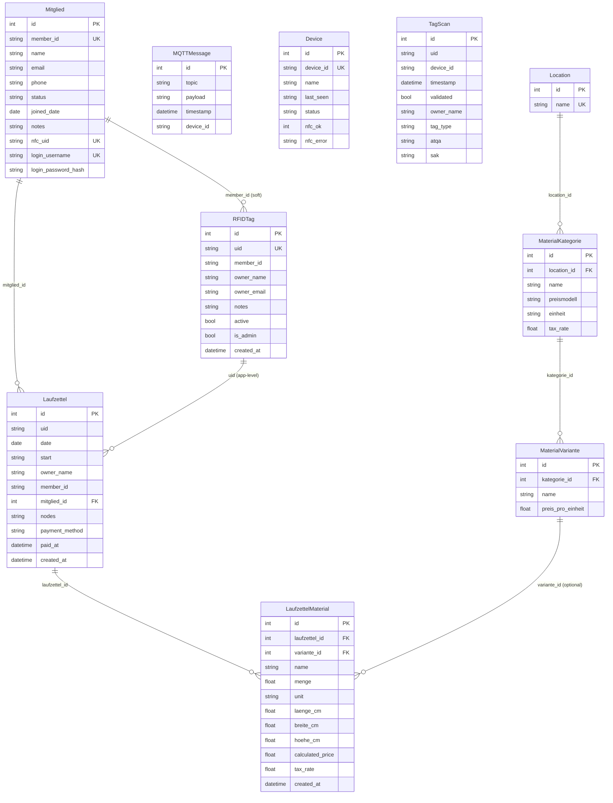
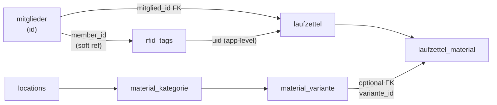

# Database Model

This page describes every table, its fields, and the relationships between them. Since the modular refactor, tables are distributed across **5 separate SQLite databases**.

## Database Overview

| Database | Module | Tables |
|---|---|---|
| `auth.db` | `backend/auth/` | `users` |
| `members.db` | `backend/members/` | `mitglieder`, `rfid_tags` |
| `laufzettel.db` | `backend/laufzettel/` | `laufzettel`, `laufzettel_material` |
| `catalog.db` | `backend/catalog/` | `locations`, `material_kategorie`, `material_variante` |
| `core.db` | `backend/core/` | `mqtt_messages`, `devices`, `tag_scans` |

## Entity tables

### `mitglieder`

Member records synced from easyVerein or created manually. The central member entity that links users, RFID cards, and Laufzettel.

| Column | Type | Notes |
|---|---|---|
| `id` | INTEGER PK | Auto-increment |
| `member_id` | TEXT UNIQUE | External membership number (e.g., from easyVerein) |
| `name` | TEXT | Full name (required) |
| `email` | TEXT | Email address |
| `phone` | TEXT | Phone number |
| `status` | TEXT | `active` or `inactive` |
| `joined_date` | DATE | When the member joined |
| `notes` | TEXT | Free-text notes |
| `nfc_uid` | TEXT UNIQUE | Primary NFC card UID for RFID login |
| `login_username` | TEXT UNIQUE | Optional username for password login |
| `login_password_hash` | TEXT | Bcrypt hash for password login |

Each module owns its database connection and models. Cross-database references use soft keys (e.g., `member_id` stored as string) rather than foreign keys.

## Entity-Relationship diagram

## Table reference

### `mqtt_messages`

Raw store of every received MQTT message.

| Column | Type | Notes |
|---|---|---|
| `id` | INTEGER PK | Auto-increment |
| `topic` | TEXT | Full topic string |
| `payload` | TEXT | Raw payload string |
| `timestamp` | DATETIME | Server receive time (UTC) |
| `device_id` | TEXT | Extracted from topic prefix |

### `devices`

One row per discovered device, updated on every message.

| Column | Type | Notes |
|---|---|---|
| `id` | INTEGER PK | Auto-increment |
| `device_id` | TEXT UNIQUE | Topic prefix |
| `name` | TEXT | Display name (optional) |
| `last_seen` | DATETIME | ISO timestamp string (UTC) |
| `status` | TEXT | Last known status string |
| `nfc_ok` | INTEGER | NULL=unknown, 1=OK, 0=error |
| `nfc_error` | TEXT | Error message if NFC has error |

### `rfid_tags`

Registered NFC cards. Can be linked to a Mitglied via `member_id` (soft reference).

| Column | Type | Notes |
|---|---|---|
| `id` | INTEGER PK | Auto-increment |
| `uid` | TEXT UNIQUE | NFC card UID |
| `member_id` | TEXT | Soft ref to `mitglieder.member_id` |
| `owner_name` | TEXT | Display name |
| `owner_email` | TEXT | Email address |
| `notes` | TEXT | Free-text notes |
| `active` | BOOLEAN | Default true |
| `is_admin` | BOOLEAN | Admin card (grants admin access) |
| `created_at` | DATETIME | Auto (UTC) |

### `tag_scans`

Event log of every NFC scan received.

| Column | Type | Notes |
|---|---|---|
| `id` | INTEGER PK | Auto-increment |
| `uid` | TEXT | Scanned UID |
| `device_id` | TEXT | Source device |
| `timestamp` | DATETIME | Scan time (UTC) |
| `validated` | BOOLEAN | True if UID matched a registered tag |
| `owner_name` | TEXT | Name from tag if validated |
| `tag_type` | TEXT | Card type (e.g., MIFARE Classic) |
| `atqa` | TEXT | ATQA bytes (hex) |
| `sak` | TEXT | SAK byte (hex) |

### `laufzettel`

One record per cardholder per day. Linked to Mitglied via `mitglied_id` (preferred) or legacy via `uid`.

| Column | Type | Notes |
|---|---|---|
| `id` | INTEGER PK | Auto-increment |
| `uid` | TEXT | RFID UID (legacy) |
| `date` | DATE | Usage date |
| `start` | DATETIME | First scan time (UTC) |
| `owner_name` | TEXT | Copied from tag at creation |
| `member_id` | TEXT | Copied from tag at creation (legacy) |
| `mitglied_id` | INTEGER | FK to `mitglieder.id` (preferred) |
| `nodes` | TEXT | JSON list of device IDs |
| `payment_method` | TEXT | `bar` / `paypal` / `karte` — null until paid |
| `paid_at` | DATETIME | UTC timestamp of payment — null until paid |
| `created_at` | DATETIME | Auto (UTC) |
| — | UNIQUE | `(uid, date)` |

### `laufzettel_material`

Material entries attached to a Laufzettel.

| Column | Type | Notes |
|---|---|---|
| `id` | INTEGER PK | Auto-increment |
| `laufzettel_id` | INTEGER FK | → `laufzettel.id` |
| `variante_id` | INTEGER FK | → `material_variante.id` (nullable) |
| `name` | TEXT | Material name |
| `menge` | FLOAT | Amount used |
| `unit` | TEXT | Unit string |
| `laenge_cm` | FLOAT | For volume pricing |
| `breite_cm` | FLOAT | For volume pricing |
| `hoehe_cm` | FLOAT | For volume pricing |
| `calculated_price` | FLOAT | Frozen at save time |
| `tax_rate` | FLOAT | Tax rate snapshotted from category (default 19.0) |

### `locations`

Top-level catalog grouping.

| Column | Type | Notes |
|---|---|---|
| `id` | INTEGER PK | Auto-increment |
| `name` | TEXT UNIQUE | Location name |

### `material_kategorie`

Category with pricing model and unit.

| Column | Type | Notes |
|---|---|---|
| `id` | INTEGER PK | Auto-increment |
| `location_id` | INTEGER FK | → `locations.id` |
| `name` | TEXT | Category name |
| `pricing_model` | TEXT | `per_unit` / `per_gram` / `per_volume_cm3` / `per_volume_l` / `per_minute` |
| `unit` | TEXT | Display unit |
| `tax_rate` | FLOAT | Tax rate: 0, 7, or 19 (default 19.0) |

### `material_variante`

Concrete priced variant.

| Column | Type | Notes |
|---|---|---|
| `id` | INTEGER PK | Auto-increment |
| `kategorie_id` | INTEGER FK | → `material_kategorie.id` |
| `name` | TEXT | Variant name |
| `price` | FLOAT | Price per unit (€) |

## Key relationships

> **No hard FK from laufzettel → rfid_tags.** The relation uses `uid` as a shared key managed at the application level. This allows Laufzettel entries to exist for unregistered UIDs (e.g. manual creation).
>
> **Mitglied is the central entity.** Laufzettel now links to `mitglieder.id` via `mitglied_id` (preferred). The legacy `uid` + `member_id` fields are maintained for backward compatibility.

## Migration approach

Each module uses SQLAlchemy `create_all()` on startup to create its own tables. There is no automatic migration for schema changes — each module manages its own database independently.

If schema changes become frequent, adding **Alembic** per module is the recommended next step. See [Extension Guide](./12-extension-guide.md).
