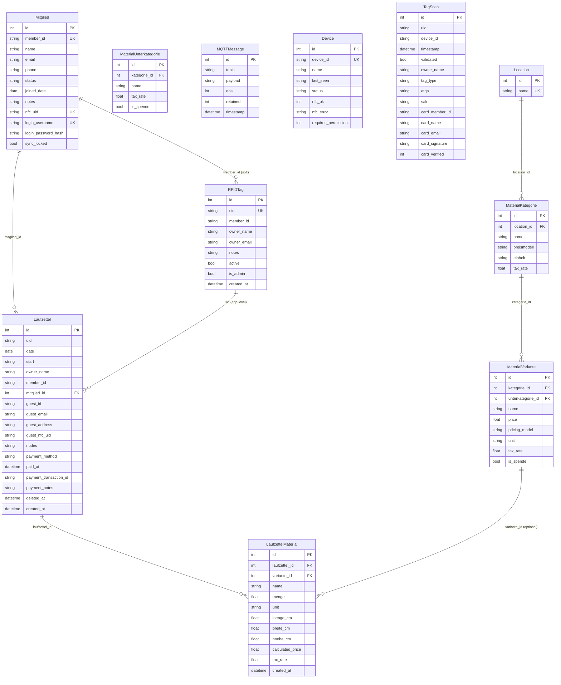
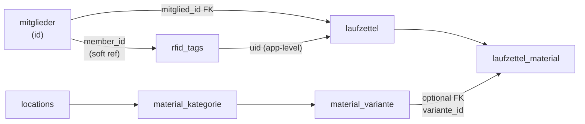

# Database Model

This page describes every table, its fields, and the relationships between them. Since the modular refactor, tables are distributed across **several separate SQLite databases**.

## Database Overview

| Database | Module | Tables |
|---|---|---|
| `auth.db` | `backend/auth/` | `users` |
| `members.db` | `backend/members/` | `mitglieder`, `rfid_tags`, `device_permissions` |
| `laufzettel.db` | `backend/laufzettel/` | `laufzettel`, `laufzettel_material`, `device_pricing`, `device_sessions`, `laufzettel_gutschein` |
| `catalog.db` | `backend/catalog/` | `locations`, `material_kategorie`, `material_unterkategorie`, `material_variante` |
| `core.db` | `backend/core/` | `mqtt_messages`, `devices`, `tag_scans`, `device_pairings` |
| `buchhaltung.db` | `backend/buchhaltung/` | accounting tables (Spenden, bookings) |
| `push.db` | `backend/push/` | web-push subscriptions |

> `buchhaltung.db` and `push.db` are owned by the `buchhaltung` and `push` modules respectively and are not detailed on this page.

## Entity tables

### `mitglieder`

Member records synced from easyVerein or created manually. The central member entity that links users, RFID cards, and Laufzettel.

| Column | Type | Notes |
|---|---|---|
| `id` | INTEGER PK | Auto-increment |
| `member_id` | TEXT UNIQUE | External membership number (e.g., from easyVerein) |
| `name` | TEXT | Full name (required) |
| `email` | TEXT | Email address |
| `phone` | TEXT | Phone number |
| `status` | TEXT | `active` or `inactive` |
| `joined_date` | DATE | When the member joined |
| `notes` | TEXT | Free-text notes |
| `nfc_uid` | TEXT UNIQUE | Primary NFC card UID for RFID login |
| `login_username` | TEXT UNIQUE | Optional username for password login |
| `login_password_hash` | TEXT | Bcrypt hash for password login |
| `sync_locked` | BOOLEAN | Default false. If true, skip easyVerein sync for this member |

Each module owns its database connection and models. Cross-database references use soft keys (e.g., `member_id` stored as string) rather than foreign keys.

## Entity-Relationship diagram

## Table reference

### `mqtt_messages`

Raw store of every received MQTT message.

| Column | Type | Notes |
|---|---|---|
| `id` | INTEGER PK | Auto-increment |
| `topic` | TEXT | Full topic string |
| `payload` | TEXT | Raw payload string |
| `qos` | INTEGER | MQTT QoS level |
| `retained` | INTEGER | 1 if message was a retained message |
| `timestamp` | DATETIME | Server receive time (UTC) |

### `devices`

One row per discovered device, updated on every message.

| Column | Type | Notes |
|---|---|---|
| `id` | INTEGER PK | Auto-increment |
| `device_id` | TEXT UNIQUE | Topic prefix |
| `name` | TEXT | Display name (optional) |
| `last_seen` | DATETIME | ISO timestamp string (UTC) |
| `status` | TEXT | Last known status string |
| `nfc_ok` | INTEGER | NULL=unknown, 1=OK, 0=error |
| `nfc_error` | TEXT | Error message if NFC has error |
| `requires_permission` | INTEGER | Default 1. 1 = device requires a member `DevicePermission`, 0 = open access |

### `rfid_tags`

Registered NFC cards. Can be linked to a Mitglied via `member_id` (soft reference).

| Column | Type | Notes |
|---|---|---|
| `id` | INTEGER PK | Auto-increment |
| `uid` | TEXT UNIQUE | NFC card UID |
| `member_id` | TEXT | Soft ref to `mitglieder.member_id` |
| `owner_name` | TEXT | Display name |
| `owner_email` | TEXT | Email address |
| `notes` | TEXT | Free-text notes |
| `active` | BOOLEAN | Default true |
| `is_admin` | BOOLEAN | Admin card (grants admin access) |
| `created_at` | DATETIME | Auto (UTC) |

### `tag_scans`

Event log of every NFC scan received.

| Column | Type | Notes |
|---|---|---|
| `id` | INTEGER PK | Auto-increment |
| `uid` | TEXT | Scanned UID |
| `device_id` | TEXT | Source device |
| `timestamp` | DATETIME | Scan time (UTC) |
| `validated` | BOOLEAN | True if UID matched a registered tag |
| `owner_name` | TEXT | Name from tag if validated |
| `tag_type` | TEXT | Card type (e.g., MIFARE Classic) |
| `atqa` | TEXT | ATQA bytes (hex) |
| `sak` | TEXT | SAK byte (hex) |
| `card_member_id` | TEXT | Member ID read from card data (written during enrollment) |
| `card_name` | TEXT | Name read from card data |
| `card_email` | TEXT | Email read from card data |
| `card_signature` | TEXT | HMAC-SHA256 signature read from card |
| `card_verified` | INTEGER | 3VL: `1`=HMAC verified, `0`=HMAC rejected (clone attempt), `NULL`=legacy card (no sig) |

> `card_signature` and `card_verified` (along with the other `card_*` columns) are added automatically at app startup by the inline migration in each module's `init_db()`. No manual step is required. See [NFC Tag Security](./16-nfc-tag-security.en.md).

### `laufzettel`

One record per cardholder per day. Linked to Mitglied via `mitglied_id` (preferred) or legacy via `uid`.

| Column | Type | Notes |
|---|---|---|
| `id` | INTEGER PK | Auto-increment |
| `uid` | TEXT | RFID UID (legacy) |
| `date` | DATE | Usage date |
| `start` | DATETIME | First scan time (UTC) |
| `owner_name` | TEXT | Copied from tag at creation |
| `member_id` | TEXT | Copied from tag at creation (legacy) |
| `mitglied_id` | INTEGER | FK to `mitglieder.id` (preferred) |
| `guest_id` | TEXT | UUID for guest sessions |
| `guest_email` | TEXT | Optional email for guests |
| `guest_address` | TEXT | Full address for guests |
| `guest_nfc_uid` | TEXT | NFC tag linked to a guest session |
| `nodes` | TEXT | JSON list of device IDs |
| `payment_method` | TEXT | `bar` / `paypal` / `karte` / `wero` — null until paid |
| `paid_at` | DATETIME | UTC timestamp of payment — null until paid |
| `payment_transaction_id` | TEXT | SumUp `transaction_code` (e.g. `TAAA2VBGK7C`) or checkout ID |
| `payment_notes` | TEXT | Free-text note (cash payments, optional) |
| `deleted_at` | DATETIME | Soft-delete timestamp — null unless deleted |
| `created_at` | DATETIME | Auto (UTC) |
| — | UNIQUE | `(uid, date)` |

### `laufzettel_material`

Material entries attached to a Laufzettel.

| Column | Type | Notes |
|---|---|---|
| `id` | INTEGER PK | Auto-increment |
| `laufzettel_id` | INTEGER FK | → `laufzettel.id` |
| `variante_id` | INTEGER FK | → `material_variante.id` (nullable) |
| `name` | TEXT | Material name |
| `menge` | FLOAT | Amount used |
| `unit` | TEXT | Unit string |
| `laenge_cm` | FLOAT | For volume pricing |
| `breite_cm` | FLOAT | For volume pricing |
| `hoehe_cm` | FLOAT | For volume pricing |
| `calculated_price` | FLOAT | Frozen at save time |
| `tax_rate` | FLOAT | Tax rate snapshotted from category (default 19.0) |
| `is_spende` | BOOLEAN | Default false. Marks a donation entry |

Top-level catalog grouping.

| Column | Type | Notes |
|---|---|---|
| `id` | INTEGER PK | Auto-increment |
| `name` | TEXT UNIQUE | Location name |

### `material_kategorie`

Category with pricing model and unit.

| Column | Type | Notes |
|---|---|---|
| `id` | INTEGER PK | Auto-increment |
| `location_id` | INTEGER FK | → `locations.id` |
| `name` | TEXT | Category name |
| `pricing_model` | TEXT | `per_unit` / `per_gram` / `per_volume_cm3` / `per_volume_l` / `per_minute` |
| `unit` | TEXT | Display unit |
| `tax_rate` | FLOAT | Tax rate: 0, 7, or 19 (default 19.0) |

### `material_variante`

Concrete priced variant.

| Column | Type | Notes |
|---|---|---|
| `id` | INTEGER PK | Auto-increment |
| `kategorie_id` | INTEGER FK | → `material_kategorie.id` (kept for backward compat) |
| `unterkategorie_id` | INTEGER FK | → `material_unterkategorie.id` (nullable) |
| `name` | TEXT | Variant name |
| `price` | FLOAT | Price per unit (€) |
| `pricing_model` | TEXT | `per_unit` / `per_gram` / `per_kilogram` / `per_volume_cm3` / `per_volume_l` / `per_minute` (default `per_unit`) |
| `unit` | TEXT | Display unit |
| `tax_rate` | FLOAT | Tax rate: 0, 7, or 19 (default 19.0) |
| `is_spende` | BOOLEAN | Default false. Marks a donation variant |

### `users`

Admin/member login accounts in `auth.db`. Each may optionally link to a `mitglieder` row via `mitglied_id`.

| Column | Type | Notes |
|---|---|---|
| `id` | INTEGER PK | Auto-increment |
| `username` | TEXT UNIQUE | Login username (required) |
| `hashed_password` | TEXT | bcrypt hash (required) |
| `role` | TEXT | `admin` or `member` (default `member`) |
| `mitglied_id` | INTEGER | Soft ref to `mitglieder.id` (nullable) |
| `created_at` | DATETIME | Auto (UTC) |

### `device_pairings`

Token-based pairing between an NFC scanner (PicoW) and a client device (e.g. the Kasse tablet), in `core.db`. The hash is checked on every `login-rfid` request; `client_ip` and `last_used` are refreshed on use.

| Column | Type | Notes |
|---|---|---|
| `id` | INTEGER PK | Auto-increment |
| `device_id` | TEXT | NFC scanner device ID (e.g. `picow_nfc_01`) |
| `token_hash` | TEXT | SHA-256 hash of the pairing token |
| `paired_by` | TEXT | Admin username who created the pairing |
| `paired_at` | DATETIME | Auto (UTC) |
| `last_used` | DATETIME | Last time the token was used |
| `expires_at` | DATETIME | Optional expiration |
| `description` | TEXT | Human-readable label (e.g. "Kasse Tablet 1") |
| `client_ip` | TEXT | IP of the client when last used |

### `device_permissions`

Grants a member access to a specific device, in `members.db`. Checked on every RFID scan before a Laufzettel is created. The special `device_id` `*` grants access to all devices.

| Column | Type | Notes |
|---|---|---|
| `id` | INTEGER PK | Auto-increment |
| `member_id` | TEXT | Soft ref to a Mitglied (required) |
| `device_id` | TEXT | Device the member may use; `*` = all devices (required) |
| `granted_at` | DATETIME | Auto (UTC) |
| `granted_by` | TEXT | Admin username who granted it |

### `device_pricing`

Links a device to a catalog `MaterialVariante` for time-based billing (e.g. laser-cutter minutes), in `laufzettel.db`.

| Column | Type | Notes |
|---|---|---|
| `id` | INTEGER PK | Auto-increment |
| `device_id` | TEXT UNIQUE | The billed device |
| `variante_id` | INTEGER | Ref to `material_variante.id` (the pricing variant) |
| `requires_permission` | INTEGER | Default 0. 1 = require a `device_permissions` row, 0 = open |
| `is_active` | INTEGER | Default 1. Enable/disable time billing for this device |
| `created_at` | DATETIME | Auto (UTC) |
| `updated_at` | DATETIME | Auto (UTC), updated on change |

### `device_sessions`

Active or historical device-usage session for time-based billing, in `laufzettel.db`. One row per start/stop of a timed device; `calculated_price` and `duration_seconds` are filled when the session ends.

| Column | Type | Notes |
|---|---|---|
| `id` | INTEGER PK | Auto-increment |
| `laufzettel_id` | INTEGER | → `laufzettel.id` (required) |
| `device_id` | TEXT | The device used (required) |
| `uid` | TEXT | NFC UID of the card that started the session (required) |
| `mitglied_id` | INTEGER | Member, if identified |
| `guest_id` | TEXT | Guest, if not a member |
| `variante_id` | INTEGER | Pricing snapshot at start (required) |
| `start_time` | DATETIME | Auto (UTC) |
| `end_time` | DATETIME | Set when the session ends |
| `duration_seconds` | INTEGER | Calculated on end |
| `calculated_price` | FLOAT | `duration × unit price`, calculated on end |
| `tax_rate` | FLOAT | Snapshot from the variant |
| `is_active` | INTEGER | Default 1 (active); set to 0 on end |
| `ended_by` | TEXT | `scan` / `member` / `admin` / `auto_2100` |
| `created_at` | DATETIME | Auto (UTC) |

### `laufzettel_gutschein`

Records a Shopify gift card applied to a Laufzettel, in `laufzettel.db`.

| Column | Type | Notes |
|---|---|---|
| `id` | INTEGER PK | Auto-increment |
| `laufzettel_id` | INTEGER | → `laufzettel.id` |
| `shopify_gift_card_id` | TEXT | Shopify numeric gift-card ID (as string) |
| `last_chars` | TEXT | Last 4 characters of the GC code (for display) |
| `amount_debited` | FLOAT | EUR amount taken from the card |
| `transaction_id` | TEXT | Shopify transaction GID |
| `applied_at` | DATETIME | Auto (UTC) |
| `applied_by` | TEXT | Username or `member` |
| `note` | TEXT | Free-text note |

## Key relationships

> **No hard FK from laufzettel → rfid_tags.** The relation uses `uid` as a shared key managed at the application level. This allows Laufzettel entries to exist for unregistered UIDs (e.g. manual creation).
>
> **Mitglied is the central entity.** Laufzettel now links to `mitglieder.id` via `mitglied_id` (preferred). The legacy `uid` + `member_id` fields are maintained for backward compatibility.

## Migration approach

Each module uses SQLAlchemy `create_all()` on startup to create its own tables, then runs an inline, idempotent migration that introspects the existing tables (`PRAGMA table_info`) and runs `ALTER TABLE ... ADD COLUMN` for any columns present in the model but missing from the database. Additive schema changes are therefore applied automatically on the next service start — **no manual migration step is required**.

The following columns are auto-added on startup:

| Database | Table | Columns |
|---|---|---|
| `core.db` | `tag_scans` | `card_member_id`, `card_name`, `card_email`, `card_signature`, `card_verified` |
| `core.db` | `devices` | `requires_permission` |
| `members.db` | `mitglieder` | `nfc_uid`, `login_username`, `login_password_hash`, `sync_locked` |
| `catalog.db` | `material_variante` | `pricing_model`, `unit`, `tax_rate`, `is_spende` |
| `catalog.db` | `material_unterkategorie` | `is_spende` |

If schema changes become frequent, adding **Alembic** per module is the recommended next step. See [Extension Guide](./12-extension-guide.en.md).
