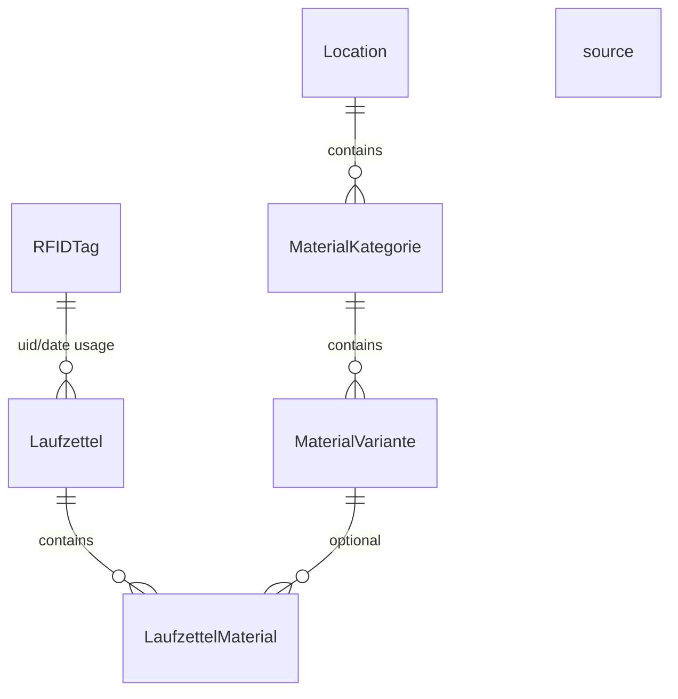

# Database Model

This page describes the important database tables and their relations.

## Core tables

### `mqtt_messages`

Stores raw MQTT traffic history.

### `devices`

Stores discovered devices and their latest known status.

### `rfid_tags`

Stores registered RFID tag metadata.

### `tag_scans`

Stores scan events and whether they matched a known registered tag.

### `laufzettel`

Stores one usage record per `uid + date`.

### `laufzettel_material`

Stores material entries attached to one Laufzettel.

### `locations`

Top-level material catalog grouping.

### `material_kategorie`

Material category definition, including pricing model and unit.

### `material_variante`

Concrete selectable material variants with unit price.

## Mermaid ER diagram

## Practical relation explanation

### Tag to Laufzettel

A tag is not directly foreign-key-linked in SQL right now. Instead, the relation is based on `uid` and application logic.

### Laufzettel to material

`laufzettel_material.laufzettel_id` points to the owning Laufzettel.

### Catalog to material usage

A Laufzettel material entry may optionally reference a catalog variant through `variante_id`.

This keeps the system flexible:

- free-text entries still work
- catalog-based entries can calculate price automatically

## Important stored-vs-derived rule

The system stores `calculated_price` on the Laufzettel material entry instead of recalculating it from the catalog every time.

This preserves historical truth even if pricing changes later.

## Migration note

The project currently uses SQLAlchemy table creation plus lightweight startup migration logic for added columns. That is simple, but if schema changes become more frequent, a dedicated migration tool such as Alembic may eventually be worth adding.
