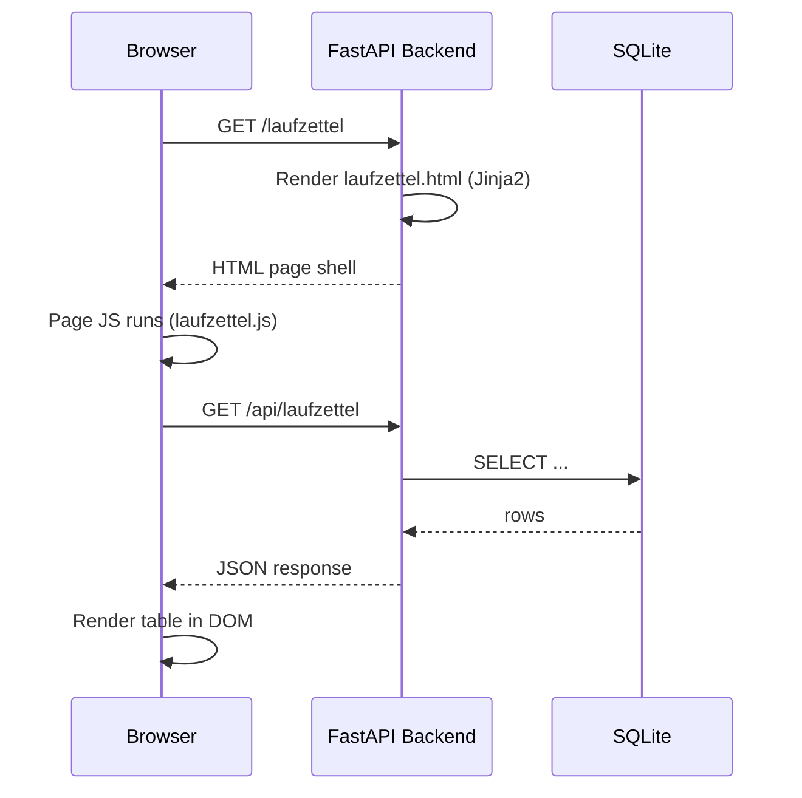
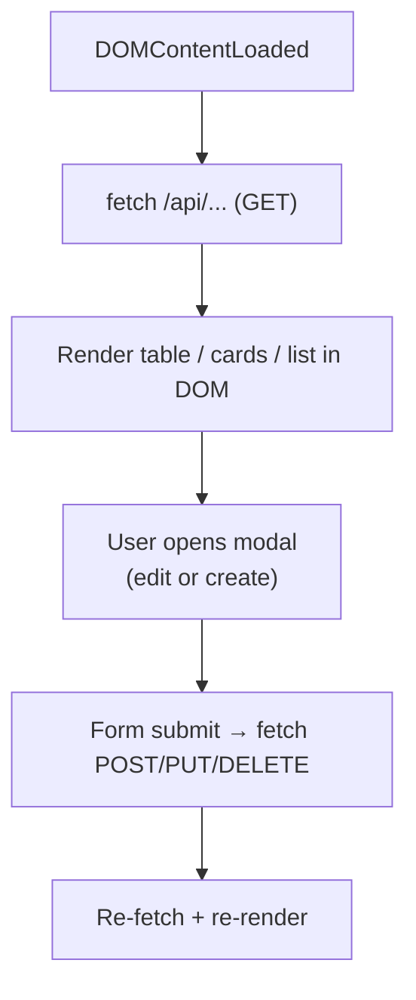

# Frontend Structure

The frontend is server-rendered HTML with Jinja2 templates, enhanced by per-page JavaScript that calls the JSON API. There is no build step — files are served directly.

## Request lifecycle



## File structure

```
templates/              ← Jinja2 HTML shells
│
├── index.html          ← Dashboard (device list, MQTT live feed)
├── database.html       ← Message browser, DB stats
├── tags.html           ← RFID tag CRUD, scan events
├── laufzettel.html     ← Laufzettel list + new-entry modal
├── laufzettel-detail.html  ← Laufzettel editor + material modal
├── katalog.html        ← Material catalog tree editor
└── docs-layout.html    ← Docs site shell (sidebar, TOC, pager)

static/css/
├── style.css           ← Global CSS variables + shared styles
├── docs.css            ← Docs site layout + typography
├── laufzettel-detail.css   ← Material modal, mode toggle, price column
└── katalog.css         ← Catalog tree styles

static/js/
├── docs.js             ← Search, Mermaid init, scrollspy, sidebar toggle
├── laufzettel.js       ← List, filter, manual creation modal
├── laufzettel-detail.js    ← Dual-mode material modal, catalog selects, price calc
├── katalog.js          ← Location/Kategorie/Variante CRUD
└── (index, tags, etc.) ← Per-page JS
```

## Per-page JS pattern

Every page follows the same pattern:



### Example: add material entry

```javascript
// 1. Open modal, populate catalog dropdowns
async function openMaterialModal() {
    const locations = await fetch('/api/katalog/locations').then(r => r.json());
    renderLocationSelect(locations);
}

// 2. Cascade: on location change, load kategorien
locationSelect.addEventListener('change', async () => {
    const kategorien = await fetch(`/api/katalog/kategorien?location_id=${locationSelect.value}`)
        .then(r => r.json());
    renderKategorieSelect(kategorien);
});

// 3. Submit
async function saveMaterial() {
    await fetch(`/api/laufzettel/${id}/material`, {
        method: 'POST',
        headers: { 'Content-Type': 'application/json' },
        body: JSON.stringify(collectFormData()),
    });
    closeMaterialModal();
    loadMaterials();  // re-fetch + re-render
}
```

## Template page map

| Template | JS file | CSS file | API calls |
|---|---|---|---|
| `index.html` | `index.js` | `style.css` | `/api/status`, `/api/devices`, `/api/messages` |
| `database.html` | `database.js` | `style.css` | `/api/database/stats`, `/api/messages`, `/api/topics` |
| `tags.html` | `tags.js` | `style.css` | `/api/tags`, `/api/tags/scans` |
| `laufzettel.html` | `laufzettel.js` | `style.css` | `/api/laufzettel`, `/api/tags/{uid}` |
| `laufzettel-detail.html` | `laufzettel-detail.js` | `laufzettel-detail.css` | `/api/laufzettel/{id}`, `/api/katalog`, `/api/laufzettel/{id}/material` |
| `katalog.html` | `katalog.js` | `katalog.css` | `/api/katalog`, `/api/katalog/locations`, `/api/katalog/kategorien`, `/api/katalog/varianten` |
| `docs-layout.html` | `docs.js` | `docs.css` | `/api/search` (docs app) |

## Modals

Modals are built with plain HTML `<dialog>` or overlay divs — no external library. Each page manages its own modal state:

- `openModal()` — set display, populate fields
- `closeModal()` — hide, clear fields
- `submitModal()` — POST/PUT to API, then reload data

## Making UI changes

| Goal | Edit |
|---|---|
| Change page layout / HTML structure | `templates/<page>.html` |
| Change how data is fetched / rendered | `static/js/<page>.js` |
| Change table/modal/button styles | `static/css/<page>.css` |
| Add a new column to a table | HTML template + JS render function + API endpoint |
| Add a new field to a modal form | HTML template + JS form reader + API Pydantic model |

## Best practices

**Do:**

- **Progressive enhancement** — pages work without JS, are better with it
- **Debounce** search inputs (`setTimeout` + `clearTimeout`)
- **XSS-escape all dynamic content** — use an `esc()` helper in every render function:
  ```javascript
  function esc(str) {
      return String(str)
          .replace(/&/g, '&amp;')
          .replace(/</g, '&lt;')
          .replace(/>/g, '&gt;');
  }
  ```
- **Always `try/catch` fetch calls** and show user-visible feedback on failure

**Don't:**

- Don't introduce frameworks without a strong reason — the codebase is intentionally framework-free
- Don't add client-side routing
- Don't use complex state management libraries
- Don't use inline styles (except for dynamic positioning)

## Browser support

- Chrome/Edge (last 2 releases)
- Firefox (last 2 releases)
- Safari (last 2 releases)
- IE11 is explicitly **not** supported

## Performance notes

- CSS/JS are served as static files and cached by the browser
- No build step required
- Large tables use server-side pagination to avoid rendering thousands of rows

## CSS variables (from `style.css`)

| Variable | Value | Used for |
|---|---|---|
| `--bg-primary` | `#0d1117` | Page background |
| `--bg-secondary` | `#161b22` | Cards, sidebar |
| `--bg-tertiary` | `#21262d` | Table rows, inputs |
| `--border-color` | `#30363d` | All borders |
| `--text-primary` | `#f0f6fc` | Main text |
| `--text-secondary` | `#8b949e` | Muted text, labels |
| `--accent` | `#58a6ff` | Links, active items, highlights |
| `--success` | `#3fb950` | Status OK |
| `--warning` | `#d29922` | Warnings |
| `--danger` | `#f85149` | Errors, delete actions |
