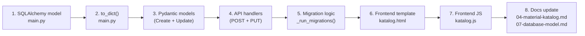

# How to Change Things

Practical developer checklists for the most common changes. Each section lists every file you need to touch so nothing gets missed.

## Add a new database field

Example: adding `color` to `Material Variante`.



**Checklist:**

| # | File | What to do |
|---|---|---|
| 1 | `backend/main.py` | Add `Column(String)` to SQLAlchemy model |
| 2 | `backend/main.py` | Add field to `to_dict()` |
| 3 | `backend/main.py` | Add field to `VarianteCreate` and `VarianteUpdate` Pydantic models |
| 4 | `backend/main.py` | Read field in `POST` and `PUT` route handlers |
| 5 | `backend/main.py` | Add `ALTER TABLE ... ADD COLUMN` in `_run_migrations()` |
| 6 | `templates/katalog.html` | Add form input to modal |
| 7 | `static/js/katalog.js` | Read new field when building form payload |
| 8 | `docs/07-database-model.md` | Update field table for `material_variante` |

---

## Add a new API endpoint

Example: `GET /api/laufzettel/{id}/summary`

**Checklist:**

| # | File | What to do |
|---|---|---|
| 1 | `backend/main.py` | Add `@app.get(...)` route function |
| 2 | `backend/main.py` | Open `SessionLocal()`, query, return dict, close in `finally` |
| 3 | `static/js/<page>.js` | `fetch(...)` from the new endpoint |
| 4 | `templates/<page>.html` | Render result if needed |
| 5 | `docs/08-backend-api.md` | Add row to the endpoint table |

**Route template:**

```python
@app.get("/api/laufzettel/{laufzettel_id}/summary")
def get_laufzettel_summary(laufzettel_id: int):
    db = SessionLocal()
    try:
        lz = db.query(Laufzettel).filter(Laufzettel.id == laufzettel_id).first()
        if not lz:
            raise HTTPException(status_code=404, detail="Not found")
        materials = db.query(LaufzettelMaterial).filter_by(laufzettel_id=laufzettel_id).all()
        return {
            "id": lz.id,
            "total_price": sum(m.calculated_price or 0 for m in materials),
            "material_count": len(materials),
        }
    finally:
        db.close()
```

---

## Add a new HTML page

Example: a new `/reports` page.

**Checklist:**

| # | File | What to do |
|---|---|---|
| 1 | `templates/reports.html` | Create template (copy nav block from another page) |
| 2 | `static/js/reports.js` | Create page JS |
| 3 | `static/css/reports.css` | Create CSS if needed |
| 4 | `backend/main.py` | Add `@app.get("/reports", response_class=HTMLResponse)` |
| 5 | All nav templates | Add `<a href="/reports">` in nav block |
| 6 | `docs/02-web-ui.md` | Add section for the new page |

---

## Add a new MQTT topic

Example: `{device_id}/door` for a door sensor.

**Checklist:**

| # | File | What to do |
|---|---|---|
| 1 | `backend/main.py` | Find `MQTTHandler.on_message()` |
| 2 | `backend/main.py` | Add `elif "/door" in msg.topic:` branch |
| 3 | `backend/main.py` | Parse payload, validate fields |
| 4 | `backend/main.py` | Decide: new table, or extend `devices`? |
| 5 | Templates/JS | Show data in UI if needed |
| 6 | `docs/06-mqtt-data-flow.md` | Add row to topic table |

**Topic handler pattern:**

```python
elif "/door" in msg.topic:
    try:
        data = json.loads(payload_str)
        device_id = data.get("device_id") or msg.topic.split("/")[0]
        state = data.get("state")  # "open" or "closed"
        # ... store or act on data
    except Exception as e:
        logger.warning(f"door message parse error: {e}")
```

---

## Add a new pricing model

Example: `per_meter` for filament runs.

**Checklist:**

| # | File | What to do |
|---|---|---|
| 1 | `backend/main.py` | Add `"per_meter"` as valid value in Pydantic model |
| 2 | `backend/main.py` | Add price calculation branch in material POST/PUT |
| 3 | `templates/katalog.html` | Add `<option value="per_meter">` in select |
| 4 | `static/js/laufzettel-detail.js` | Show correct input fields when `per_meter` is selected |
| 5 | `static/js/laufzettel-detail.js` | Add `per_meter` case to client-side price preview |
| 6 | `docs/04-material-katalog.md` | Document the new model, formula, and use case |

---

## Add a new docs page

The docs app picks up files automatically — no registration needed.

| # | Action |
|---|---|
| 1 | Create `docs/NN-page-name.md` (use next available number) |
| 2 | Start with a `# Page Title` H1 heading |
| 3 | The sidebar picks it up immediately on the next page load |
| 4 | Link to it from related pages using `[Title](./NN-page-name.md)` |

---

## Update an existing doc page

Docs are plain Markdown files. Edit them directly in `docs/`. Changes are live on the next page reload (no server restart needed when running with `--reload`).

**When to update docs:**

| Changed | Update these docs |
|---|---|
| UI behavior / new page | `02-web-ui.md` |
| MQTT topic contract | `06-mqtt-data-flow.md` |
| DB schema | `07-database-model.md` |
| API endpoint | `08-backend-api.md` |
| Startup / deploy | `10-operations-and-deploy.md` |
| Pricing model | `04-material-katalog.md` |
| Architecture change | `05-system-architecture.md` |

---

## Reset the admin password

**Option 1: Via web UI (when logged in as admin)**

Go to `/admin/users` → "Change password".

**Option 2: Via config reset**

Edit `config/config.json` and set `admin_password` to a temporary value, then restart the service. The app re-seeds the admin user on startup when the hashed password doesn't match.

```bash
sudo systemctl restart makerpi-groundcontrol
```

**Option 3: Direct database edit**

```bash
sqlite3 backend/auth.db
# Set a bcrypt hash for the new password (generate with passlib):
UPDATE users SET hashed_password = '$2b$12$...' WHERE username = 'admin';
```

---

## Common errors

### "Template not found"

- Check that the template file exists in `templates/`
- Look for typos in the filename
- Restart the app (templates are cached on startup in production mode)

### 404 on an API route

- Is the router registered in `main.py`?
- Are URL parameters spelled correctly?
- Does the HTTP method match (GET vs POST)?

### Database error after a schema change

```bash
# Check current schema
sqlite3 backend/laufzettel.db ".schema laufzettel"

# Apply manual migration
sqlite3 backend/laufzettel.db "ALTER TABLE laufzettel ADD COLUMN new_field TEXT;"
```

---

## Development workflow

### Test changes locally

```bash
# The server auto-reloads on file save
uv run uvicorn backend.main:app --reload --port 8000
```

### Add debug logging

```python
import logging
logger = logging.getLogger(__name__)

# In a route handler
logger.info(f"Laufzettel {id} loaded")
logger.error(f"Unexpected error: {e}")
```

### Generate test data

```bash
python scripts/generate_demo_data.py
# Creates: ~50 members, ~100 Laufzettel, ~500 material entries
```
