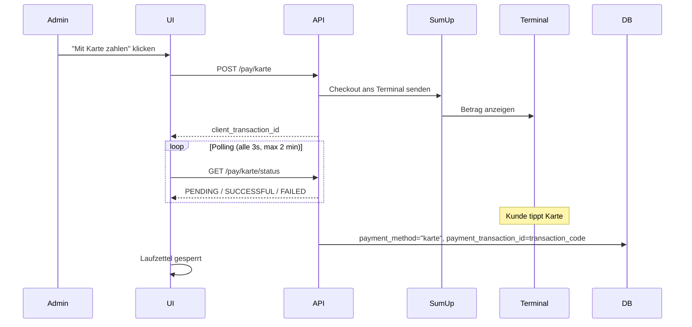
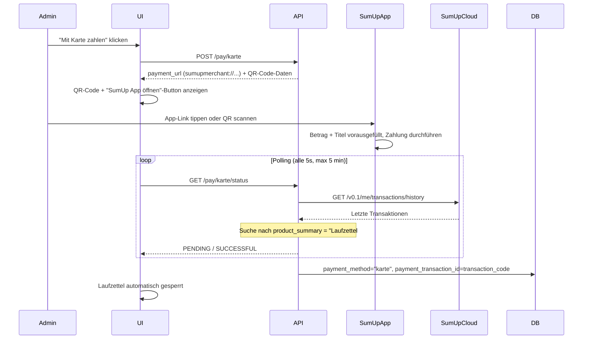

# Zahlungen

Diese Seite beschreibt die Zahlungsintegration auf der Laufzettel-Detailseite.

## Übersicht

Sobald ein Laufzettel Materialeinträge mit einem Gesamtbetrag > 0 hat, erscheinen Zahlungsschaltflächen:

| Methode | Integration | Ablauf |
|---------|-------------|--------|
| **Bar** | Nativ | Admin bestätigt Bareingang manuell, optionale Notiz möglich |
| **Karte (Solo)** | SumUp Cloud API | Betrag wird direkt ans gepaarte Solo-Terminal gesendet |
| **Karte (Payment Switch)** | SumUp URL-Scheme | QR-Code + App-Link, automatische Bestätigung per Polling |

Nach jeder Zahlung wird der Laufzettel gesperrt: keine Bearbeitung mehr möglich. Die gespeicherten Zahlungsdetails (Methode, Zeitstempel, Transaktions-ID, Notiz) sind im Banner und im PDF-Export sichtbar.

---

## Konfiguration

In `config/config.json`:

```json
{
  "sumup_api_key": "sup_sk_...",
  "sumup_merchant_code": "MC...",
  "sumup_reader_id": "",
  "sumup_affiliate_key": "dein-affiliate-key",
  "sumup_mock": false
}
```

Das System wählt den Zahlungsmodus **automatisch** anhand der vorhandenen Konfiguration:

| Modus | Bedingung | Verhalten |
|-------|-----------|-----------|
| **Mock** | `sumup_mock: true` | Kein echter API-Call, sofortige Bestätigung |
| **Solo** | `sumup_reader_id` gesetzt | Checkout wird per Cloud API ans Terminal geschickt |
| **Payment Switch** | `sumup_affiliate_key` gesetzt, kein Reader | `sumupmerchant://`-Deeplink zur SumUp-App |

Den **Affiliate Key** erstellt man unter [developer.sumup.com](https://developer.sumup.com) → *Affiliate Keys*.

Alle Werte können auch als Umgebungsvariablen gesetzt werden: `SUMUP_API_KEY`, `SUMUP_MERCHANT_CODE`, `SUMUP_READER_ID`, `SUMUP_AFFILIATE_KEY`.

---

## Barzahlung

- Admin klickt „Bar bezahlen", bestätigt den angezeigten Betrag
- Optionales **Notizfeld** (z.B. Kassenbon-Nummer) wird in `payment_notes` gespeichert
- Sofortige Verbuchung, kein externer Service nötig

---

## Kartenzahlung – Solo Terminal (Cloud API)

Voraussetzung: ein **SumUp Solo**-Gerät, das über die SumUp App oder API gepaart wurde.

### Flow



> **SumUp-Beschreibung:** Der an SumUp gesendete Titel lautet `"Laufzettel #ID – Membername"` für einfachere Suche im SumUp-Dashboard.

---

## Kartenzahlung – Payment Switch (SumUp App auf Handy)

Für alle anderen SumUp-Terminals (Air, 3G, Air Lite) oder wenn die SumUp-App auf dem Kassiergerät installiert ist.

### Flow



> **Automatische Erkennung:** Nach Abschluss der Zahlung in der SumUp-App pollt das Backend die SumUp-Transaktionshistorie und erkennt die Zahlung anhand des `product_summary`-Felds (`"Laufzettel #ID – Membername"`). Die SumUp `transaction_code` (z.B. `TAAA2VBGK7C`) wird als `payment_transaction_id` gespeichert.
>
> **Kein manueller Bestätigungs-Button:** Die Erkennung erfolgt vollautomatisch.

---

## Mock-Modus

Für Tests ohne echtes Terminal:

```json
{ "sumup_mock": true }
```

- Keine echten API-Calls
- Laufzettel wird sofort als „per Karte bezahlt" gesperrt

---

## API-Endpunkte

| Methode | Endpunkt | Beschreibung |
|---|---|---|
| `GET` | `/api/payment/config` | Konfigurationsstatus inkl. `payment_mode` |
| `POST` | `/api/laufzettel/{id}/pay/bar` | Barzahlung erfassen (Body: `{"notes": "..."}`) |
| `POST` | `/api/laufzettel/{id}/pay/karte` | Kartenzahlung initiieren |
| `GET` | `/api/laufzettel/{id}/pay/karte/status` | Zahlungsstatus pollen (Solo + Payment Switch) |
| `POST` | `/api/laufzettel/{id}/pay/checkout` | Hosted Checkout (Apple/Google Pay) erstellen |
| `GET` | `/api/laufzettel/{id}/pay/checkout/{checkout_id}/status` | Checkout-Status pollen |
| `DELETE` | `/api/laufzettel/{id}/pay/karte` | Laufende Kartenzahlung abbrechen |
| `DELETE` | `/api/laufzettel/{id}/pay` | Zahlungsstatus zurücksetzen (Admin) |

### `/api/payment/config` Antwort

```json
{
  "sumup_configured": true,
  "sumup_mock": false,
  "payment_mode": "payment_switch",
  "checkout_link_available": true
}
```

Mögliche Werte für `payment_mode`: `"solo"`, `"payment_switch"`, `"mock"`, `null`.

---

## Gespeicherte Zahlungsdetails

Nach jeder Zahlung werden folgende Felder am Laufzettel gespeichert:

| Feld | Inhalt |
|------|--------|
| `payment_method` | `"bar"` oder `"karte"` |
| `paid_at` | UTC-Zeitstempel der Zahlung |
| `payment_transaction_id` | SumUp `transaction_code` (z.B. `TAAA2VBGK7C`) oder Checkout-ID |
| `payment_notes` | Freitext-Notiz (nur Barzahlung) |

Diese Felder erscheinen im **Bezahlt-Banner** auf der Detailseite und im **PDF-Export**.

---

## Sicherheit

- API-Keys nie im Frontend exponieren
- Keys in `config/config.json` (gitignored) oder als Umgebungsvariablen

## Tagesabschluss / Abstimmung

SumUp-Transaktionen erscheinen im SumUp-Dashboard und in der SumUp-App. GroundControl speichert den SumUp `transaction_code` (z.B. `TAAA2VBGK7C`) in `payment_transaction_id` – damit lässt sich jede Zahlung direkt im SumUp-Dashboard nachschlagen und einem Laufzettel zuordnen.
