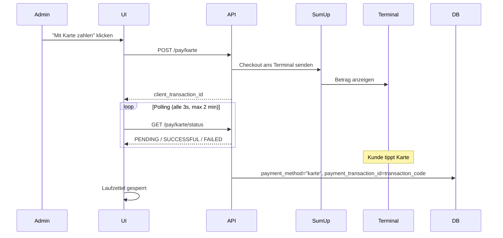
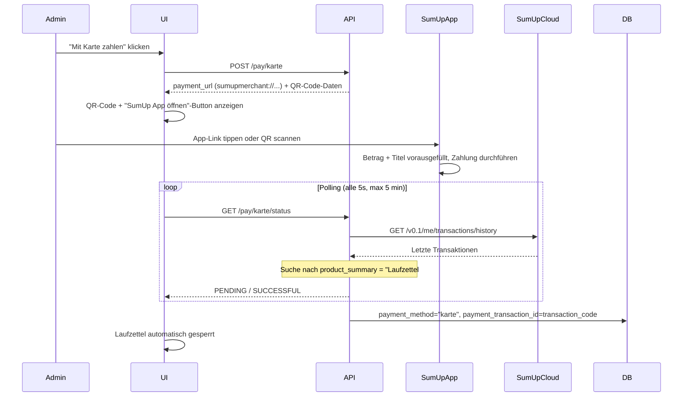
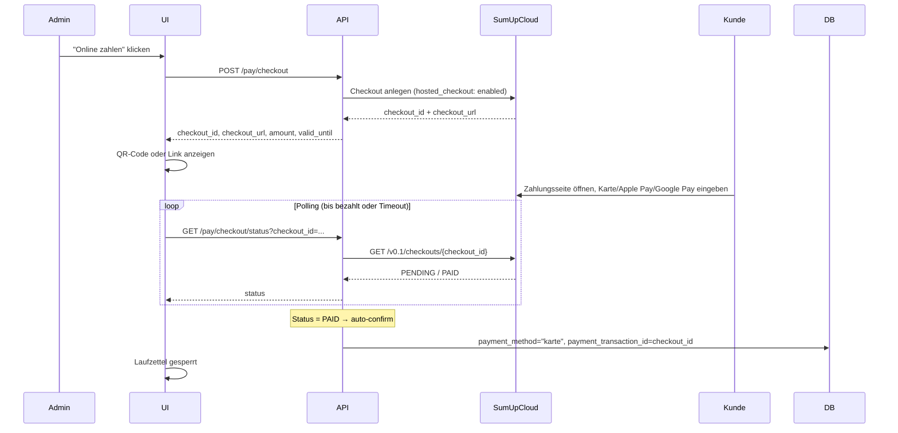
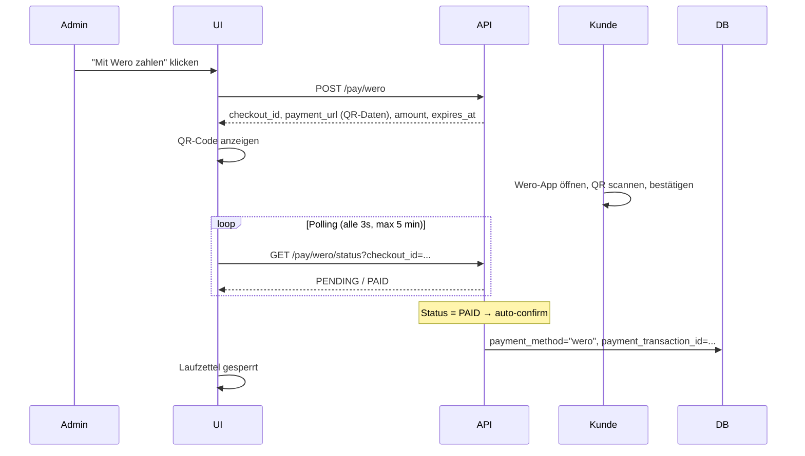

# Zahlungen

Diese Seite beschreibt die Zahlungsintegration auf der Laufzettel-Detailseite.

## Übersicht

Sobald ein Laufzettel Materialeinträge mit einem Gesamtbetrag > 0 hat, erscheinen Zahlungsschaltflächen:

| Methode | Integration | Ablauf |
|---------|-------------|--------|
| **Bar** | Nativ | Admin bestätigt Bareingang manuell, optionale Notiz möglich |
| **Karte (Solo)** | SumUp Cloud API | Betrag wird direkt ans gepaarte Solo-Terminal gesendet |
| **Karte (Payment Switch)** | SumUp URL-Scheme | QR-Code + App-Link, automatische Bestätigung per Polling |
| **Karte (Hosted Checkout)** | SumUp Hosted Checkout | Web-Zahlungsseite (Apple/Google Pay, Karte), automatische Bestätigung per Polling |
| **Wero** | Wero QR-Code | QR-Code, den der Kunde mit der Wero-App scannt |

Nach jeder Zahlung wird der Laufzettel gesperrt: keine Bearbeitung mehr möglich. Die gespeicherten Zahlungsdetails (Methode, Zeitstempel, Transaktions-ID, Notiz) sind im Banner und im PDF-Export sichtbar.

---

## Konfiguration

In `config/config.json`:

```json
{
  "sumup_api_key": "sup_sk_...",
  "sumup_merchant_code": "MC...",
  "sumup_reader_id": "",
  "sumup_affiliate_key": "dein-affiliate-key",
  "sumup_mock": false,
  "wero_enabled": false,
  "wero_mock": true,
  "wero_merchant_id": "",
  "wero_api_key": "",
  "public_base_url": "https://groundcontrol.example.com"
}
```

Das System wählt den Zahlungsmodus **automatisch** anhand der vorhandenen Konfiguration:

| Modus | Bedingung | Verhalten |
|-------|-----------|-----------|
| **Mock** | `sumup_mock: true` | Kein echter API-Call, sofortige Bestätigung |
| **Solo** | `sumup_reader_id` gesetzt | Checkout wird per Cloud API ans Terminal geschickt |
| **Payment Switch** | `sumup_affiliate_key` gesetzt, kein Reader | `sumupmerchant://`-Deeplink zur SumUp-App |
| **Hosted Checkout** | `sumup_api_key` + `sumup_merchant_code` gesetzt | Web-Hosted-Checkout unabhängig vom Reader-Modus verfügbar |

Den **Affiliate Key** erstellt man unter [developer.sumup.com](https://developer.sumup.com) → *Affiliate Keys*.

Alle Werte können auch als Umgebungsvariablen gesetzt werden: `SUMUP_API_KEY`, `SUMUP_MERCHANT_CODE`, `SUMUP_READER_ID`, `SUMUP_AFFILIATE_KEY`, `WERO_ENABLED`, `WERO_MOCK`, `WERO_MERCHANT_ID`, `WERO_API_KEY`, `PUBLIC_BASE_URL`.

---

## Barzahlung

- Admin klickt „Bar bezahlen", bestätigt den angezeigten Betrag
- Optionales **Notizfeld** (z.B. Kassenbon-Nummer) wird in `payment_notes` gespeichert
- Sofortige Verbuchung, kein externer Service nötig

---

## Kartenzahlung – Solo Terminal (Cloud API)

Voraussetzung: ein **SumUp Solo**-Gerät, das über die SumUp App oder API gepaart wurde.

### Flow



> **SumUp-Beschreibung:** Der an SumUp gesendete Titel lautet `"Laufzettel #ID – Membername"` für einfachere Suche im SumUp-Dashboard.

---

## Kartenzahlung – Payment Switch (SumUp App auf Handy)

Für alle anderen SumUp-Terminals (Air, 3G, Air Lite) oder wenn die SumUp-App auf dem Kassiergerät installiert ist.

### Flow



> **Automatische Erkennung:** Nach Abschluss der Zahlung in der SumUp-App pollt das Backend die SumUp-Transaktionshistorie und erkennt die Zahlung anhand des `product_summary`-Felds (`"Laufzettel #ID – Membername"`). Die SumUp `transaction_code` (z.B. `TAAA2VBGK7C`) wird als `payment_transaction_id` gespeichert.
>
> **Kein manueller Bestätigungs-Button:** Die Erkennung erfolgt vollautomatisch.

---

## Kartenzahlung – Hosted Checkout (Web-Zahlungsseite)

Der Hosted Checkout ist die dritte SumUp-Zahlungsmethode. SumUp hostet eine eigene Zahlungsseite, die Apple Pay, Google Pay und Karteneingabe unterstützt. Der Kunde zahlt im Browser – keine App-Installation erforderlich.

**Voraussetzung:** `sumup_api_key` und `sumup_merchant_code` müssen gesetzt sein. Der Hosted Checkout ist unabhängig vom Reader-Modus und steht immer zur Verfügung, wenn SumUp konfiguriert ist.

### Flow



### API-Endpunkte (Hosted Checkout)

| Methode | Endpunkt | Beschreibung |
|---------|----------|--------------|
| `POST` | `/api/laufzettel/{id}/pay/checkout` | Neuen Hosted Checkout anlegen |
| `GET` | `/api/laufzettel/{id}/pay/checkout/status?checkout_id=...` | Status pollen, auto-bestätigt bei `PAID` |
| `DELETE` | `/api/laufzettel/{id}/pay/checkout?checkout_id=...` | Ausstehenden Checkout abbrechen |

**POST-Antwort:**

```json
{
  "checkout_id": "abc123...",
  "checkout_url": "https://pay.sumup.com/b2c/...",
  "amount": "12.50",
  "valid_until": "2026-06-03T18:00:00Z",
  "status": "PENDING"
}
```

**GET-Antwort (bezahlt):**

```json
{
  "status": "PAID",
  "laufzettel": { "...": "..." }
}
```

---

## Wero-Zahlung (QR-Code)

Wero ist ein europäisches Instant-Payment-Netzwerk. Der Kunde scannt einen QR-Code mit der Wero-App und bestätigt die Zahlung auf seinem Gerät.

**Konfiguration:**

| Schlüssel | Env-Variable | Beschreibung |
|-----------|--------------|--------------|
| `wero_enabled` | `WERO_ENABLED` | Wero aktivieren (`true`/`false`) |
| `wero_mock` | `WERO_MOCK` | Mock-Modus ohne echte API (Standard: `true`) |
| `wero_merchant_id` | `WERO_MERCHANT_ID` | Wero Händler-ID |
| `wero_api_key` | `WERO_API_KEY` | Wero API-Schlüssel |

> Solange `wero_mock: true` gesetzt ist, werden keine echten Wero-API-Calls durchgeführt. Im Mock-Modus wird die Zahlung nach ~3 Sekunden automatisch bestätigt.

### Flow



### API-Endpunkte (Wero)

| Methode | Endpunkt | Beschreibung |
|---------|----------|--------------|
| `POST` | `/api/laufzettel/{id}/pay/wero` | Wero-Zahlung initiieren, gibt QR-Code-URL zurück |
| `GET` | `/api/laufzettel/{id}/pay/wero/status?checkout_id=...` | Status pollen |
| `POST` | `/api/laufzettel/{id}/pay/wero/confirm?checkout_id=...` | Zahlung manuell bestätigen (Fallback) |
| `DELETE` | `/api/laufzettel/{id}/pay/wero?checkout_id=...` | Ausstehende Wero-Zahlung abbrechen |

**POST-Antwort:**

```json
{
  "mock": true,
  "checkout_id": "uuid...",
  "payment_url": "wero://pay?amount=12.50&currency=EUR&checkout=uuid...",
  "amount": "12.50",
  "status": "PENDING",
  "expires_at": "2026-06-03T18:00:00Z"
}
```

---

## Mock-Modus

Für Tests ohne echtes Terminal:

```json
{ "sumup_mock": true }
```

- Keine echten API-Calls
- Laufzettel wird sofort als „per Karte bezahlt" gesperrt

Für Wero ohne echte Credentials:

```json
{ "wero_enabled": true, "wero_mock": true }
```

- Kein echter Wero-API-Call
- Zahlung wird nach ~3 Sekunden im Polling automatisch bestätigt

---

## Nachzahlungs-Workflow (nach jeder Zahlung)

Nach jeder erfolgreich verbuchten Zahlung (unabhängig von der Methode) löst das System automatisch folgende Aktionen aus. Diese laufen **fire-and-forget** im Hintergrund — ein Fehler dabei beeinflusst die Zahlungsantwort an den Client nicht.

### 1. PDF-Quittung generieren und auf Google Drive hochladen

- Eine PDF-Quittung mit allen Materialeinträgen und Zahlungsdetails wird generiert.
- Das PDF wird automatisch in den konfigurierten Google Drive Ordner hochgeladen (nach Jahr/Monat strukturiert).
- Google Drive muss separat aktiviert und konfiguriert sein (`google_drive_enabled: true`, Service Account oder OAuth2-Token).

### 2. E-Mail-Quittung versenden

- Eine HTML-Quittung wird per E-Mail an den Eigentümer des Laufzettels gesendet.
- **Empfänger:** `guest_email` (bei Gast-Laufzetteln) → E-Mail des verknüpften Mitglieds aus `members.db` → `owner_email` des RFID-Tags.
- Die E-Mail enthält einen Link zur **öffentlichen Ansicht** des Laufzettels: `{PUBLIC_BASE_URL}/laufzettel/view/{id}`.
- Wenn kein SMTP konfiguriert ist oder keine E-Mail-Adresse ermittelt werden kann, wird die Aktion still übersprungen.

### `PUBLIC_BASE_URL` – Reverse-Proxy-Konfiguration

Wenn GroundControl hinter einem Reverse Proxy läuft (z.B. nginx oder Caddy), entspricht `request.url.netloc` der internen Adresse statt der öffentlichen Domain. In diesem Fall muss `public_base_url` gesetzt werden:

```json
{ "public_base_url": "https://groundcontrol.example.com" }
```

oder als Umgebungsvariable:

```bash
PUBLIC_BASE_URL=https://groundcontrol.example.com
```

Ohne diese Einstellung enthält der E-Mail-Link die interne Adresse des Servers (z.B. `http://localhost:8000`), die für den Empfänger nicht erreichbar ist.

---

## Zahlung zurücksetzen (Admin)

Ein Admin kann eine versehentlich verbuchte Zahlung rückgängig machen:

```
DELETE /api/laufzettel/{id}/pay
```

Dies löscht folgende Felder:

| Feld | Vorher | Nachher |
|------|--------|---------|
| `payment_method` | `"bar"` / `"karte"` / `"wero"` / ... | `null` |
| `paid_at` | UTC-Zeitstempel | `null` |
| `payment_transaction_id` | SumUp-Code / Checkout-ID | `null` |
| `payment_notes` | Freitext | `null` |

Nach dem Reset ist der Laufzettel wieder offen: Materialeinträge können bearbeitet werden und alle Zahlungsendpunkte akzeptieren erneut Anfragen.

> **Hinweis:** Der Reset löscht nur den lokalen Datensatz. Echte SumUp- oder Wero-Transaktionen werden dadurch nicht storniert — das muss im jeweiligen Dashboard separat erledigt werden.

---

## API-Endpunkte

| Methode | Endpunkt | Beschreibung |
|---|---|---|
| `GET` | `/api/payment/config` | Konfigurationsstatus inkl. `payment_mode`, `wero_configured` |
| `POST` | `/api/laufzettel/{id}/pay/bar` | Barzahlung erfassen (Body: `{"notes": "..."}`) |
| `POST` | `/api/laufzettel/{id}/pay/karte` | Kartenzahlung initiieren (Solo oder Payment Switch) |
| `GET` | `/api/laufzettel/{id}/pay/karte/status` | Zahlungsstatus pollen (Solo + Payment Switch) |
| `DELETE` | `/api/laufzettel/{id}/pay/karte` | Laufende Kartenzahlung abbrechen |
| `POST` | `/api/laufzettel/{id}/pay/checkout` | Hosted Checkout (Apple/Google Pay) erstellen |
| `GET` | `/api/laufzettel/{id}/pay/checkout/status` | Checkout-Status pollen |
| `DELETE` | `/api/laufzettel/{id}/pay/checkout` | Ausstehenden Checkout abbrechen |
| `POST` | `/api/laufzettel/{id}/pay/wero` | Wero-Zahlung initiieren |
| `GET` | `/api/laufzettel/{id}/pay/wero/status` | Wero-Status pollen |
| `POST` | `/api/laufzettel/{id}/pay/wero/confirm` | Wero-Zahlung manuell bestätigen |
| `DELETE` | `/api/laufzettel/{id}/pay/wero` | Ausstehende Wero-Zahlung abbrechen |
| `DELETE` | `/api/laufzettel/{id}/pay` | Zahlungsstatus zurücksetzen (Admin) |

### `/api/payment/config` Antwort

```json
{
  "sumup_configured": true,
  "sumup_mock": false,
  "payment_mode": "payment_switch",
  "checkout_link_available": true,
  "wero_configured": false,
  "wero_mock": true
}
```

Mögliche Werte für `payment_mode`: `"solo"`, `"payment_switch"`, `"mock"`, `null`.

---

## Gespeicherte Zahlungsdetails

Nach jeder Zahlung werden folgende Felder am Laufzettel gespeichert:

| Feld | Inhalt |
|------|--------|
| `payment_method` | `"bar"`, `"karte"`, `"wero"` oder `"gutschein"` |
| `paid_at` | UTC-Zeitstempel der Zahlung |
| `payment_transaction_id` | SumUp `transaction_code` (z.B. `TAAA2VBGK7C`), Checkout-ID oder Wero-Referenz |
| `payment_notes` | Freitext-Notiz (nur Barzahlung) |

Diese Felder erscheinen im **Bezahlt-Banner** auf der Detailseite und im **PDF-Export**.

---

## Sicherheit

- API-Keys nie im Frontend exponieren
- Keys in `config/config.json` (gitignored) oder als Umgebungsvariablen

## Tagesabschluss / Abstimmung

SumUp-Transaktionen erscheinen im SumUp-Dashboard und in der SumUp-App. GroundControl speichert den SumUp `transaction_code` (z.B. `TAAA2VBGK7C`) in `payment_transaction_id` – damit lässt sich jede Zahlung direkt im SumUp-Dashboard nachschlagen und einem Laufzettel zuordnen.
