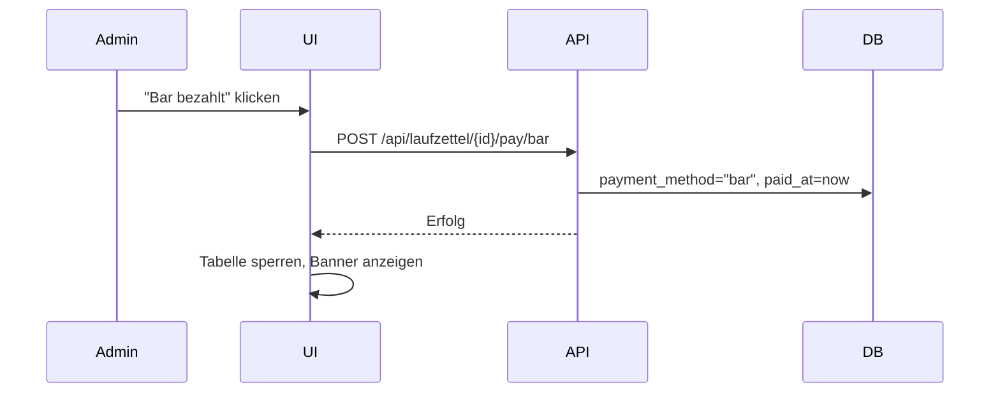
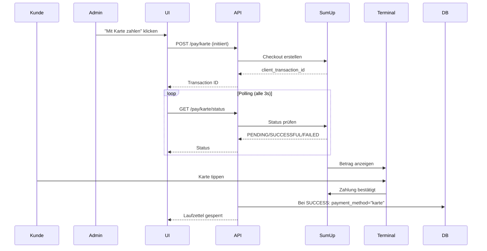

# Zahlungen

Diese Seite beschreibt die Zahlungsintegration mit SumUp.

## Übersicht

Das System unterstützt zwei Zahlungsmethoden:

| Methode | Integration | Zweck |
|---------|-------------|-------|
| **Bar** | Nativ | Bareingang durch Admin erfassen |
| **Karte** | SumUp API | Kartenzahlung via SumUp-Terminal |

## Barzahlung

### Flow



### Implementierung

- Sofortige Verbuchung
- Kein externer Service nötig
- Admin bestätigt Bareingang manuell

## Kartenzahlung (SumUp)

### Voraussetzungen

- SumUp Konto
- SumUp Air-Kartenterminal
- API-Key und Merchant Code

### Konfiguration

In `config/config.json`:

```json
{
  "sumup_api_key": "sup_sk_...",
  "sumup_merchant_code": "MC...",
  "sumup_reader_id": "R...",
  "sumup_mock": false
}
```

### Zahlungs-Flow



### Timeout-Handling

- **Initiierung:** 30 Sekunden für Terminal-Antwort
- **Zahlung:** 2 Minuten für Kunden-Aktion
- **Nach Timeout:** Zahlung als abgebrochen markieren

### Mock-Modus

Für Tests ohne echtes Terminal:

```json
{
  "sumup_mock": true
}
```

Im Mock-Modus:
- Keine echten API-Calls
- Sofortige "Zahlung bestätigt"-Rückmeldung
- Admin kann Test-Transaktionen durchführen

## API-Endpunkte

| Methode | Endpunkt | Beschreibung |
|---|---|---|
| `GET` | `/api/payment/config` | Konfigurationsstatus |
| `POST` | `/api/laufzettel/{id}/pay/bar` | Barzahlung erfassen |
| `POST` | `/api/laufzettel/{id}/pay/karte` | Kartenzahlung initiieren |
| `GET` | `/api/laufzettel/{id}/pay/karte/status` | Zahlungsstatus prüfen |
| `DELETE` | `/api/laufzettel/{id}/pay` | Zahlung zurücksetzen (Admin) |

## Fehlerbehandlung

| Fehler | Ursache | Lösung |
|--------|---------|--------|
| "SumUp nicht konfiguriert" | API-Key fehlt | config.json prüfen |
| "Terminal nicht erreichbar" | Netzwerk/Bluetooth | Terminal neu starten |
| "Zahlung abgebrochen" | Kunde hat abgebrochen | Neu initiieren |
| "Timeout" | Keine Reaktion | Status prüfen, ggf. erneut versuchen |

## Sicherheit

- API-Keys nie im Frontend exponieren
- Keys in Umgebungsvariablen oder config.json (nicht im Git)
- Webhook-Signatur prüfen (falls implementiert)

## Tagesabschluss

SumUp-Transaktionen erscheinen:
- Im SumUp-Dashboard
- In der SumUp-App
- Nicht direkt in GroundControl (nur Status: bezahlt/nicht bezahlt)

Für detaillierte Auswertungen SumUp-Export verwenden.
