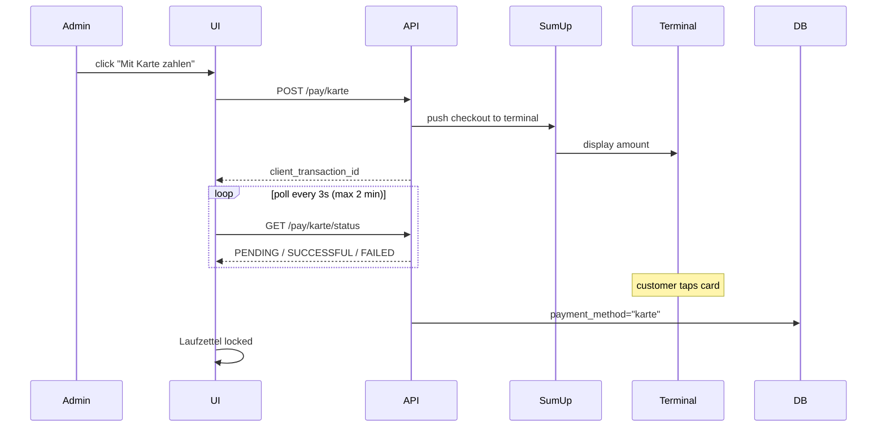
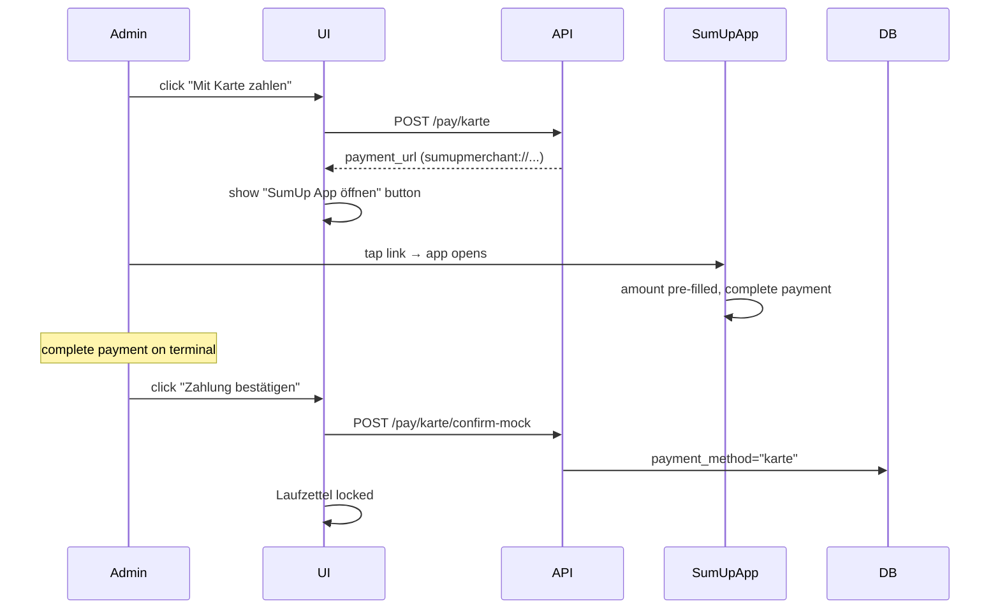
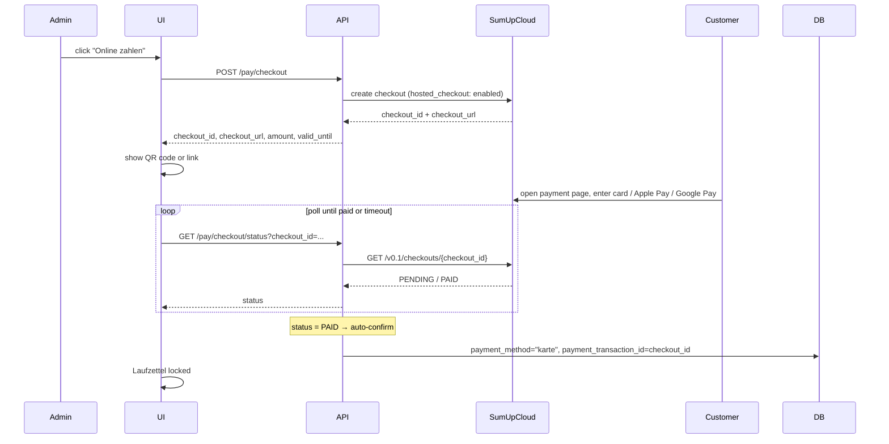
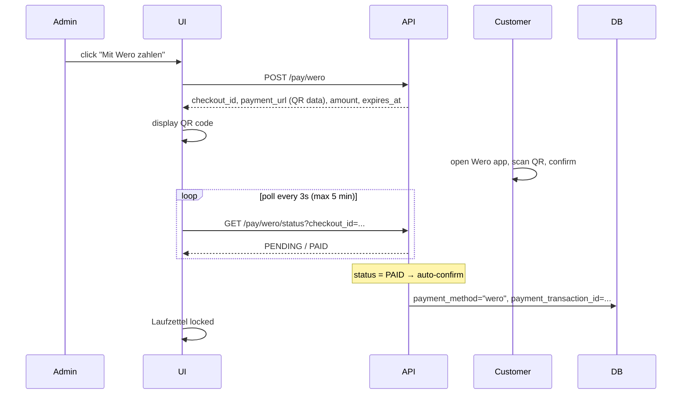

# Payments

This page describes the payment integration on the Laufzettel detail page.

## Overview

Once a Laufzettel has material entries with a non-zero total, payment buttons appear below the total row:

| Method | Integration | What happens |
|---|---|---|
| **Bar bezahlen** (Cash) | Native | Operator confirms receipt of cash manually |
| **Karte – Solo** | SumUp Cloud API | Checkout is pushed directly to the paired Solo terminal |
| **Karte – Payment Switch** | SumUp URL scheme | Deep-link opens the SumUp app on the cashier's phone with the amount pre-filled |
| **Karte – Hosted Checkout** | SumUp Hosted Checkout | Web-based payment page (Apple/Google Pay, card entry); auto-confirmed by polling |
| **Wero** | Wero QR code | Customer scans a QR code with the Wero app |

After any payment is confirmed:
- `payment_method` and `paid_at` are written to the Laufzettel record.
- A green **locked banner** replaces the payment buttons.
- All edit actions are blocked in the UI **and** rejected by the API (`409 Conflict`).

---

## Configuration

Copy `config.json.example` to `config/config.json` (gitignored) and fill in the relevant keys:

```json
{
    "sumup_api_key": "sup_sk_...",
    "sumup_merchant_code": "XXXXXXXX",
    "sumup_reader_id": "",
    "sumup_affiliate_key": "your-affiliate-key",
    "sumup_mock": false,
    "wero_enabled": false,
    "wero_mock": true,
    "wero_merchant_id": "",
    "wero_api_key": "",
    "public_base_url": "https://groundcontrol.example.com"
}
```

The system **automatically selects** the payment mode based on what is configured:

| Mode | Condition | Behaviour |
|---|---|---|
| **Mock** | `sumup_mock: true` | No real API call — locks immediately |
| **Solo** | `sumup_reader_id` is set | Checkout pushed via Cloud API to the terminal |
| **Payment Switch** | `sumup_affiliate_key` set, no reader | Generates a `sumupmerchant://` deep-link for the SumUp app |
| **Hosted Checkout** | `sumup_api_key` + `sumup_merchant_code` set | Web-hosted checkout available independently of the reader mode |

All values can also be provided as environment variables:

| Config key | Env var |
|---|---|
| `sumup_api_key` | `SUMUP_API_KEY` |
| `sumup_merchant_code` | `SUMUP_MERCHANT_CODE` |
| `sumup_reader_id` | `SUMUP_READER_ID` |
| `sumup_affiliate_key` | `SUMUP_AFFILIATE_KEY` |
| `wero_enabled` | `WERO_ENABLED` |
| `wero_mock` | `WERO_MOCK` |
| `wero_merchant_id` | `WERO_MERCHANT_ID` |
| `wero_api_key` | `WERO_API_KEY` |
| `public_base_url` | `PUBLIC_BASE_URL` |

---

## SumUp setup

### Get your credentials

1. Sign up or log in at [developer.sumup.com](https://developer.sumup.com).
2. Generate an API key (`sup_sk_...`) under **API Keys**.
3. Find your **Merchant Code** (8-character alphanumeric) under **Business > Account**.

**For Solo (Cloud API):** Pair a Solo reader via the SumUp app, then fetch the reader ID:
```bash
curl -H "Authorization: Bearer sup_sk_..." \
  "https://api.sumup.com/v0.1/merchants/MERCHANT_CODE/readers"
```
Copy the `id` value into `sumup_reader_id`.

**For Payment Switch:** Create an Affiliate Key under **Developer → Affiliate Keys** in the SumUp Dashboard. Copy the key value into `sumup_affiliate_key`. Leave `sumup_reader_id` empty.

**For Hosted Checkout:** No additional credentials are needed beyond `sumup_api_key` and `sumup_merchant_code`. The hosted checkout is available whenever SumUp is configured, regardless of whether a reader or affiliate key is set.

### Important SumUp notes

- **Solo:** The target reader must be online when the checkout is sent. SumUp gives 60 seconds to start the transaction.
- **Payment Switch:** The SumUp app must be installed on the cashier's phone. After tapping the link, the cashier completes the payment on the terminal and then manually confirms in GroundControl.
- **Air / 3G / Air Lite terminals** do not support the Cloud API — use Payment Switch mode.

---

## Cash payment flow

1. Operator clicks **Bar bezahlen**.
2. A modal shows the total amount.
3. Operator confirms after receiving cash.
4. Laufzettel is locked immediately.

---

## Card payment – Solo terminal (Cloud API)



---

## Card payment – Payment Switch (SumUp app on phone)

For Air, 3G, or Air Lite terminals where the SumUp app is installed on a mobile device.



> Manual confirmation is required because SumUp does not provide a server-side callback for the mobile app URL scheme.

---

## Card payment – Hosted Checkout (web payment page)

The Hosted Checkout is the third SumUp payment method. SumUp hosts a payment page that supports Apple Pay, Google Pay, and direct card entry. The customer pays in a browser — no app installation required.

**Prerequisite:** `sumup_api_key` and `sumup_merchant_code` must be set. The Hosted Checkout is independent of the reader mode and is always available when SumUp is configured (`checkout_link_available: true` in `/api/payment/config`).



### Hosted Checkout endpoints

| Method | Path | Description |
|---|---|---|
| `POST` | `/api/laufzettel/{id}/pay/checkout` | Create a new hosted checkout |
| `GET` | `/api/laufzettel/{id}/pay/checkout/status?checkout_id=...` | Poll status; auto-confirms when `PAID` |
| `DELETE` | `/api/laufzettel/{id}/pay/checkout?checkout_id=...` | Cancel a pending checkout |

**POST response:**

```json
{
    "checkout_id": "abc123...",
    "checkout_url": "https://pay.sumup.com/b2c/...",
    "amount": "12.50",
    "valid_until": "2026-06-03T18:00:00Z",
    "status": "PENDING"
}
```

**GET response (paid):**

```json
{
    "status": "PAID",
    "laufzettel": { "...": "..." }
}
```

---

## Wero payment (QR code)

Wero is a European instant-payment network. The customer scans a QR code with the Wero app and confirms the payment on their device.

**Configuration:**

| Key | Env var | Description |
|---|---|---|
| `wero_enabled` | `WERO_ENABLED` | Enable Wero (`true`/`false`) |
| `wero_mock` | `WERO_MOCK` | Mock mode without a real API call (default: `true`) |
| `wero_merchant_id` | `WERO_MERCHANT_ID` | Wero merchant ID |
| `wero_api_key` | `WERO_API_KEY` | Wero API key |

> While `wero_mock: true` is set, no real Wero API calls are made. In mock mode the payment auto-confirms after ~3 seconds of polling.



### Wero endpoints

| Method | Path | Description |
|---|---|---|
| `POST` | `/api/laufzettel/{id}/pay/wero` | Initiate Wero payment; returns QR code URL |
| `GET` | `/api/laufzettel/{id}/pay/wero/status?checkout_id=...` | Poll payment status |
| `POST` | `/api/laufzettel/{id}/pay/wero/confirm?checkout_id=...` | Manually confirm payment (fallback) |
| `DELETE` | `/api/laufzettel/{id}/pay/wero?checkout_id=...` | Cancel a pending Wero payment |

**POST response:**

```json
{
    "mock": true,
    "checkout_id": "uuid...",
    "payment_url": "wero://pay?amount=12.50&currency=EUR&checkout=uuid...",
    "amount": "12.50",
    "status": "PENDING",
    "expires_at": "2026-06-03T18:00:00Z"
}
```

---

## Mock mode

Set `"sumup_mock": true` for testing without hardware:
- No real API calls.
- Laufzettel is locked immediately as if paid by card.

For Wero without real credentials:
```json
{ "wero_enabled": true, "wero_mock": true }
```
- No real Wero API calls.
- Payment auto-confirms after ~3 seconds of polling.

---

## Post-payment workflow

After any payment is successfully recorded — regardless of method — the system triggers the following side effects automatically. These run **fire-and-forget** in the background. A failure in any of them does **not** affect the payment response returned to the client.

### 1. PDF receipt generated and uploaded to Google Drive

- A PDF receipt containing all material entries and payment details is generated.
- The PDF is uploaded automatically to the configured Google Drive folder (organised by year/month).
- Google Drive must be separately enabled and configured (`google_drive_enabled: true`, service account or OAuth2 token).

### 2. Email receipt sent

- An HTML receipt email is sent to the owner of the Laufzettel.
- **Recipient resolution order:** `guest_email` (guest Laufzettel) → member email from `members.db` (matched by `mitglied_id` or RFID UID) → `owner_email` from the RFIDTag record.
- The email contains a link to the **public view** of the Laufzettel: `{PUBLIC_BASE_URL}/laufzettel/view/{id}`.
- If no SMTP is configured, or no email address can be resolved, the action is silently skipped.

### `PUBLIC_BASE_URL` — reverse proxy configuration

When GroundControl runs behind a reverse proxy (e.g. nginx or Caddy), `request.url.netloc` resolves to the internal address rather than the public domain. In this case, set `public_base_url`:

```json
{ "public_base_url": "https://groundcontrol.example.com" }
```

or as an environment variable:

```bash
PUBLIC_BASE_URL=https://groundcontrol.example.com
```

Without this setting the email link will contain the server's internal address (e.g. `http://localhost:8000`), which the recipient cannot reach.

---

## Payment reset (admin)

An admin can undo an accidentally recorded payment:

```
DELETE /api/laufzettel/{id}/pay
```

This clears the following fields:

| Field | Before | After |
|---|---|---|
| `payment_method` | `"bar"` / `"karte"` / `"wero"` / … | `null` |
| `paid_at` | UTC timestamp | `null` |
| `payment_transaction_id` | SumUp code / checkout ID | `null` |
| `payment_notes` | free text | `null` |

After the reset the Laufzettel is open again: material entries can be edited and all payment endpoints accept new requests.

> **Note:** The reset only clears the local record. Real SumUp or Wero transactions are not reversed — those must be handled separately in the respective dashboard.

---

## API endpoints

| Method | Path | Description |
|---|---|---|
| `GET` | `/api/payment/config` | Configuration flags including `payment_mode`, `wero_configured` |
| `POST` | `/api/laufzettel/{id}/pay/bar` | Record cash payment, lock Laufzettel |
| `POST` | `/api/laufzettel/{id}/pay/karte` | Initiate card payment (Solo or Payment Switch) |
| `GET` | `/api/laufzettel/{id}/pay/karte/status` | Poll transaction status (Solo mode) |
| `POST` | `/api/laufzettel/{id}/pay/karte/confirm-mock` | Manually confirm payment (mock / Payment Switch) |
| `DELETE` | `/api/laufzettel/{id}/pay/karte` | Cancel pending card payment |
| `POST` | `/api/laufzettel/{id}/pay/checkout` | Create hosted checkout (Apple/Google Pay) |
| `GET` | `/api/laufzettel/{id}/pay/checkout/status` | Poll hosted checkout status |
| `DELETE` | `/api/laufzettel/{id}/pay/checkout` | Cancel pending hosted checkout |
| `POST` | `/api/laufzettel/{id}/pay/wero` | Initiate Wero payment |
| `GET` | `/api/laufzettel/{id}/pay/wero/status` | Poll Wero payment status |
| `POST` | `/api/laufzettel/{id}/pay/wero/confirm` | Manually confirm Wero payment |
| `DELETE` | `/api/laufzettel/{id}/pay/wero` | Cancel pending Wero payment |
| `DELETE` | `/api/laufzettel/{id}/pay` | Reset payment status (admin) |

### `GET /api/payment/config` response

```json
{
    "sumup_configured": true,
    "sumup_mock": false,
    "payment_mode": "payment_switch",
    "checkout_link_available": true,
    "wero_configured": false,
    "wero_mock": true
}
```

Possible values for `payment_mode`: `"solo"`, `"payment_switch"`, `"mock"`, `null`.

The frontend uses this to show/hide the **Karte** button (hidden if `sumup_configured` is false or `payment_mode` is null) and the **Wero** button (hidden if `wero_configured` is false).

---

## Lock behaviour

Once `payment_method` is set, these endpoints return `409 Conflict`:

- `PUT /api/laufzettel/{id}`
- `POST /api/laufzettel/{id}/material`
- `PUT /api/laufzettel/{id}/material/{mid}`
- `DELETE /api/laufzettel/{id}/material/{mid}`
- Any subsequent `POST /api/laufzettel/{id}/pay/*`

The UI enforces the same: edit/add buttons are hidden, table actions are disabled.

---

## Daily close-out

SumUp transactions appear in the SumUp Dashboard and the SumUp app. GroundControl stores the SumUp `transaction_code` (e.g. `TAAA2VBGK7C`) in `payment_transaction_id` — this allows every payment to be looked up in the SumUp Dashboard and matched to a Laufzettel.
