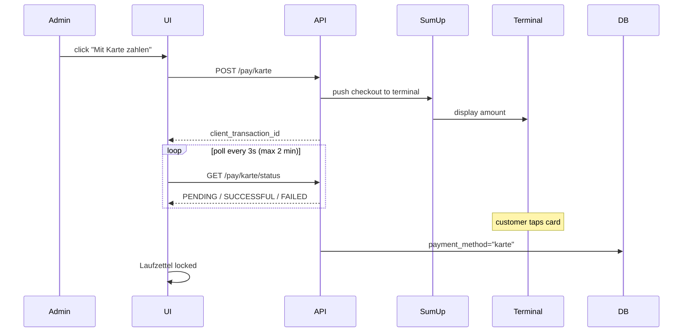
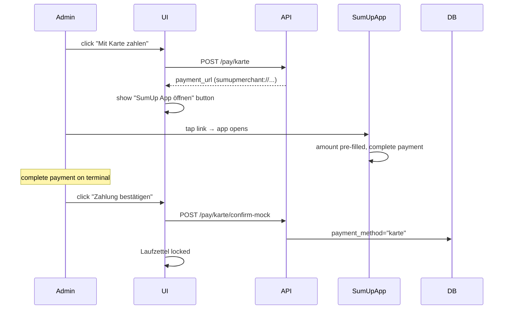

# Payments

This page describes the payment integration on the Laufzettel detail page.

## Overview

Once a Laufzettel has material entries with a non-zero total, payment buttons appear below the total row:

| Method | Integration | What happens |
|---|---|---|
| **Bar bezahlen** (Cash) | Native | Operator confirms receipt of cash manually |
| **Karte – Solo** | SumUp Cloud API | Checkout is pushed directly to the paired Solo terminal |
| **Karte – Payment Switch** | SumUp URL scheme | Deep-link opens the SumUp app on the cashier's phone with the amount pre-filled |

After any payment is confirmed:
- `payment_method` and `paid_at` are written to the Laufzettel record.
- A green **locked banner** replaces the payment buttons.
- All edit actions are blocked in the UI **and** rejected by the API (`409 Conflict`).

---

## Configuration

Copy `config.json.example` to `config/config.json` (gitignored) and fill in the relevant keys:

```json
{
    "sumup_api_key": "sup_sk_...",
    "sumup_merchant_code": "XXXXXXXX",
    "sumup_reader_id": "",
    "sumup_affiliate_key": "your-affiliate-key",
    "sumup_mock": false
}
```

The system **automatically selects** the payment mode based on what is configured:

| Mode | Condition | Behaviour |
|---|---|---|
| **Mock** | `sumup_mock: true` | No real API call — locks immediately |
| **Solo** | `sumup_reader_id` is set | Checkout pushed via Cloud API to the terminal |
| **Payment Switch** | `sumup_affiliate_key` set, no reader | Generates a `sumupmerchant://` deep-link for the SumUp app |

All values can also be provided as environment variables:

| Config key | Env var |
|---|---|
| `sumup_api_key` | `SUMUP_API_KEY` |
| `sumup_merchant_code` | `SUMUP_MERCHANT_CODE` |
| `sumup_reader_id` | `SUMUP_READER_ID` |
| `sumup_affiliate_key` | `SUMUP_AFFILIATE_KEY` |

---

## SumUp setup

### Get your credentials

1. Sign up or log in at [developer.sumup.com](https://developer.sumup.com).
2. Generate an API key (`sup_sk_...`) under **API Keys**.
3. Find your **Merchant Code** (8-character alphanumeric) under **Business > Account**.

**For Solo (Cloud API):** Pair a Solo reader via the SumUp app, then fetch the reader ID:
```bash
curl -H "Authorization: Bearer sup_sk_..." \
  "https://api.sumup.com/v0.1/merchants/MERCHANT_CODE/readers"
```
Copy the `id` value into `sumup_reader_id`.

**For Payment Switch:** Create an Affiliate Key under **Developer → Affiliate Keys** in the SumUp Dashboard. Copy the key value into `sumup_affiliate_key`. Leave `sumup_reader_id` empty.

### Important SumUp notes

- **Solo:** The target reader must be online when the checkout is sent. SumUp gives 60 seconds to start the transaction.
- **Payment Switch:** The SumUp app must be installed on the cashier's phone. After tapping the link, the cashier completes the payment on the terminal and then manually confirms in GroundControl.
- **Air / 3G / Air Lite terminals** do not support the Cloud API — use Payment Switch mode.

---

## Cash payment flow

1. Operator clicks **Bar bezahlen**.
2. A modal shows the total amount.
3. Operator confirms after receiving cash.
4. Laufzettel is locked immediately.

---

## Card payment – Solo terminal (Cloud API)



---

## Card payment – Payment Switch (SumUp app on phone)

For Air, 3G, or Air Lite terminals where the SumUp app is installed on a mobile device.



> Manual confirmation is required because SumUp does not provide a server-side callback for the mobile app URL scheme.

---

## Mock mode

Set `"sumup_mock": true` for testing without hardware:
- No real API calls.
- Laufzettel is locked immediately as if paid by card.

---

## API endpoints

| Method | Path | Description |
|---|---|---|
| `GET` | `/api/payment/config` | Configuration flags including `payment_mode` |
| `POST` | `/api/laufzettel/{id}/pay/bar` | Record cash payment, lock Laufzettel |
| `POST` | `/api/laufzettel/{id}/pay/karte` | Initiate card payment |
| `GET` | `/api/laufzettel/{id}/pay/karte/status` | Poll transaction status (Solo mode) |
| `POST` | `/api/laufzettel/{id}/pay/karte/confirm-mock` | Manually confirm payment (mock / Payment Switch) |
| `DELETE` | `/api/laufzettel/{id}/pay/karte` | Cancel pending card payment |
| `DELETE` | `/api/laufzettel/{id}/pay` | Reset payment status (admin) |

### `GET /api/payment/config` response

```json
{
    "sumup_configured": true,
    "sumup_mock": false,
    "payment_mode": "payment_switch"
}
```

Possible values for `payment_mode`: `"solo"`, `"payment_switch"`, `"mock"`, `null`.

The frontend uses this to show/hide the **Karte** button (hidden if `sumup_configured` is false or `payment_mode` is null).

---

## Lock behaviour

Once `payment_method` is set, these endpoints return `409 Conflict`:

- `PUT /api/laufzettel/{id}`
- `POST /api/laufzettel/{id}/material`
- `PUT /api/laufzettel/{id}/material/{mid}`
- `DELETE /api/laufzettel/{id}/material/{mid}`
- Any subsequent `POST /api/laufzettel/{id}/pay/*`

The UI enforces the same: edit/add buttons are hidden, table actions are disabled.

---

## Daily close-out

SumUp transactions appear in the SumUp Dashboard and the SumUp app. GroundControl stores only the payment status (paid / not paid) — no transaction details. Use the SumUp export for detailed reporting.
