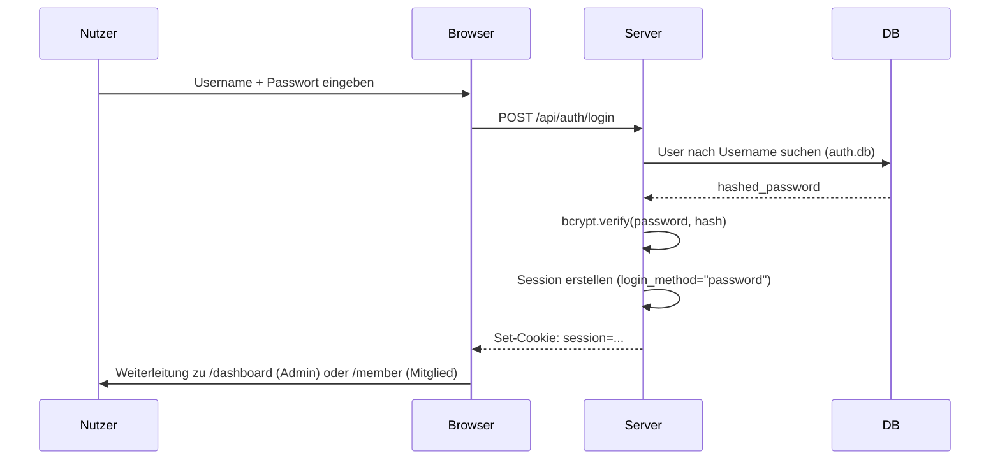
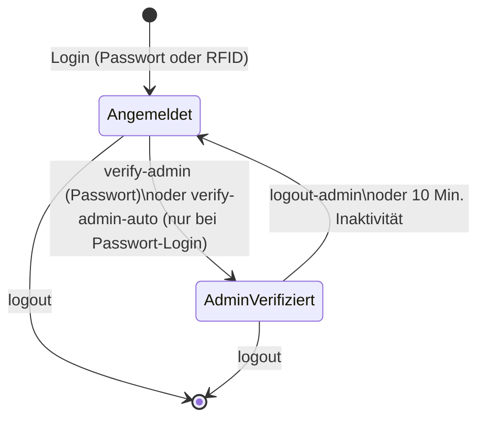

# Authentifizierung

Diese Seite beschreibt das Login- und Session-System.

## Übersicht

- **Session-basiert:** Signierte Cookies via Starlette
- **Passwort-Hashing:** bcrypt durch passlib
- **Session-Speicher:** Client-seitig (Cookie)
- **Server-Storage:** SQLite `auth.db` → `users` Tabelle
- **Zwei Login-Wege:** Passwort-Login und RFID-Karten-Login

## Login-Flow (Passwort)



## RFID-Login

Mitglieder können sich durch Auflegen ihrer NFC-Karte auf einen gekoppelten Leser anmelden, ohne ein Passwort einzugeben.

### Endpunkt

```
POST /api/auth/login-rfid
Content-Type: application/json
```

### Request-Body

```json
{
  "rfid_uid": "AABBCCDD",
  "pairing_token": "optional-token-string"
}
```

| Feld | Pflicht | Beschreibung |
|------|---------|--------------|
| `rfid_uid` | Ja | UID der NFC-Karte (wird intern großgeschrieben) |
| `pairing_token` | Nein | Token des gekoppelten Lesers; fehlt er, wird IP-basiertes Pairing versucht |

### Ablauf

1. **Pairing-Prüfung** — Der Leser muss als `DevicePairing` in `core.db` registriert sein. Ohne gültiges Pairing wird `403` zurückgegeben.
2. **Scan-Aktualität** — In `core.db` muss ein `TagScan` für dieselbe UID und denselben `device_id` existieren, der **nicht älter als 60 Sekunden** ist. Ältere Scans werden mit `403` abgewiesen.
3. **Mitglied-Lookup** — Die UID wird gegen `Mitglied.nfc_uid` gesucht. Fallback: Suche über `RFIDTag.uid` → `RFIDTag.member_id`.
4. **User-Anlage** — Existiert noch kein `User`-Eintrag in `auth.db` für dieses Mitglied, wird er automatisch erstellt (Rolle: `member`; bei Admin-Karte: `admin`).
5. **Admin-Karten-Erkennung** — Ist `RFIDTag.is_admin == True`, erhält die Session `is_admin_capable=True`. `admin_verified` bleibt dennoch `False` — für Admin-Aktionen ist weiterhin eine explizite Bestätigung nötig.
6. **Session** — `login_method` wird auf `"rfid"` gesetzt.

### Erfolg-Response

```json
{
  "success": true,
  "user": {
    "id": 42,
    "username": "Max Mustermann",
    "role": "member",
    "mitglied_id": 7
  },
  "mitglied": { "...": "Mitglied-Objekt" },
  "is_admin_capable": false,
  "redirect": "/member",
  "stale_laufzettel": "none"
}
```

### Fehler-Responses

| HTTP | Ursache |
|------|---------|
| `403` | Kein gültiges Pairing, Token abgelaufen oder Scan zu alt |
| `404` | UID nicht bekannt oder kein Mitglied mit dieser Karte verknüpft |

---

## Session-Management

### Session-Cookie

```
Name: session
Value: {session_data}.signatur (itsdangerous)
HttpOnly: true
Secure: false (lokal) / true (Produktion mit HTTPS)
SameSite: lax
```

### Session-Felder

| Feld | Typ | Beschreibung |
|------|-----|--------------|
| `user` | `str` | Username des eingeloggten Nutzers |
| `mitglied_id` | `int\|null` | Verknüpfte Mitglieds-ID |
| `is_admin_capable` | `bool` | Nutzer hat grundsätzlich Admin-Berechtigung |
| `login_method` | `"password"\|"rfid"` | Wie die aktuelle Session erstellt wurde |
| `admin_verified` | `bool` | Admin-Modus aktiv (läuft nach 10 Min. ohne Aktivität ab) |
| `admin_verified_at` | `ISO-8601\|null` | Zeitpunkt der letzten Admin-Bestätigung |
| `last_activity` | `ISO-8601` | Letzter Aktivitätszeitpunkt (UTC) |

### Timeouts

| Art | Dauer | Auswirkung |
|-----|-------|------------|
| Mitglieds-Session | **3 Minuten** Inaktivität | Session wird gelöscht, Nutzer wird ausgeloggt |
| Admin-Verifizierung | **10 Minuten** Inaktivität | `admin_verified` wird auf `false` zurückgesetzt |

### GET /api/auth/session

Gibt Informationen zur aktuellen Session zurück.

**Response:**

```json
{
  "mitglied_id": 7,
  "is_admin_capable": true,
  "admin_verified": false,
  "can_access_admin": false,
  "login_method": "rfid"
}
```

### POST /api/auth/heartbeat

Verlängert die Session und prüft deren Gültigkeit.

- Aktualisiert `last_activity` (verhindert Session-Timeout)
- Gibt `{"valid": true}` zurück, solange die Session gültig ist
- Gibt `{"valid": false}` mit HTTP `401` zurück, wenn die Session abgelaufen ist

**Verwendung:** Das Frontend sendet diesen Aufruf regelmäßig (z. B. alle 60 Sekunden), um die Session am Leben zu halten.

---

## Admin-Verifizierung

Für destruktive oder sicherheitskritische Aktionen (z. B. Nutzerverwaltung, Zahlungen stornieren) reicht eine normale angemeldete Session nicht aus. Der Nutzer muss sich zusätzlich als Admin **verifizieren**.

### POST /api/auth/verify-admin

Aktiviert den Admin-Modus durch erneute Passworteingabe.

```
POST /api/auth/verify-admin
Content-Type: application/x-www-form-urlencoded

password=mein-passwort
```

**Response (Erfolg):** `{"success": true}`
**Response (Fehler):** `{"success": false, "error": "Invalid password or not admin"}` — HTTP `403`

Nach erfolgreicher Verifizierung wird `admin_verified = true` und `admin_verified_at` auf den aktuellen Zeitpunkt gesetzt. Das Flag verfällt automatisch nach **10 Minuten Inaktivität**.

### POST /api/auth/verify-admin-auto

Aktiviert den Admin-Modus **ohne Passworteingabe** — aber nur wenn `login_method == "password"` gilt (d. h. der Nutzer hat sich gerade eben mit Passwort angemeldet).

- Bei `login_method == "rfid"` wird `{"success": false, "error": "requires_password"}` zurückgegeben (HTTP `403`).
- Damit wird sichergestellt, dass ein reiner RFID-Login keine stumme Admin-Eskalation erlaubt.

### POST /api/auth/logout-admin

Beendet den Admin-Modus ohne vollständigen Logout. Setzt `admin_verified = false` und leitet zu `/member` weiter.



---

## Nutzerverwaltung (/admin/users)

Die Nutzerverwaltung ist unter `/admin/users` erreichbar und erfordert eine aktive Admin-Verifizierung.

### Übersicht der Endpunkte

| Methode | Pfad | Beschreibung |
|---------|------|--------------|
| `GET` | `/admin/users` | Nutzerliste anzeigen |
| `POST` | `/admin/users/add` | Neuen Admin-Nutzer anlegen |
| `POST` | `/admin/users/delete` | Nutzer löschen |
| `POST` | `/admin/users/toggle-role` | Rolle zwischen `admin` und `member` umschalten |
| `POST` | `/admin/users/promote-member-to-admin` | Mitglied mit Login-Daten zum Admin erheben |
| `POST` | `/admin/users/revoke-member-login` | Login-Daten eines Mitglieds entfernen |
| `POST` | `/admin/users/change-password` | Eigenes Admin-Passwort ändern |

### Mitglied zum Admin erheben

```
POST /admin/users/promote-member-to-admin
Content-Type: application/x-www-form-urlencoded

mitglied_id=7
```

Erstellt einen neuen `User`-Eintrag in `auth.db` mit `role="admin"`, basierend auf den Login-Daten (`login_username`, `login_password_hash`) des Mitglieds. Das Mitglied muss bereits Login-Zugangsdaten haben.

### Login-Zugangsdaten eines Mitglieds entfernen

```
POST /admin/users/revoke-member-login
Content-Type: application/x-www-form-urlencoded

mitglied_id=7
```

Setzt `login_username` und `login_password_hash` in `members.db` auf `null`. Das Mitglied kann sich danach nicht mehr per Passwort anmelden (RFID bleibt weiterhin möglich).

### Eigenes Passwort ändern

```
POST /admin/users/change-password
Content-Type: application/x-www-form-urlencoded

current_password=altes-passwort&new_password=neues-passwort
```

Nur der aktuell eingeloggte Admin kann sein eigenes Passwort ändern. Das aktuelle Passwort muss korrekt sein.

### Sicherheitsschranken

- **Kein Selbst-Löschen:** Ein Nutzer kann seinen eigenen Account nicht löschen.
- **Kein Löschen des primären Admins:** Der in `config.json` konfigurierte `admin_username` ist geschützt.
- **Kein Löschen des letzten Nutzers:** Solange nur noch ein Nutzer in `auth.db` existiert, ist Löschen gesperrt.
- **Keine Selbst-Rollenänderung:** Ein Nutzer kann seine eigene Rolle nicht umschalten.

---

## Seiten-Schutz

### HTML-Seiten (Jinja2)

```python
from backend.auth.dependencies import check_auth

@router.get("/seite")
async def seite(request: Request):
    if not check_auth(request):
        return RedirectResponse("/login")
    # ...
```

### API-Endpunkte

API-Endpunkte sind **nicht authentifiziert** (Annahme: lokales Netzwerk).

Falls nötig:

```python
async def api_endpoint(request: Request):
    if not check_auth(request):
        raise HTTPException(401, "Nicht authentifiziert")
```

---

## Standard-Login

| Feld | Standardwert | Ort |
|------|--------------|-----|
| Username | `admin` | `config/config.json` → `admin_username` |
| Passwort | `changeme` | `config/config.json` → `admin_password` |

Beim ersten Start wird automatisch ein Admin-Nutzer angelegt, falls `auth.db` leer ist.

## Passwort ändern

### Als Admin

1. Einloggen
2. `/admin/users` öffnen und Admin-Modus bestätigen
3. "Passwort ändern" klicken

### Via Datenbank (Fallback)

```python
from backend.auth.dependencies import get_password_hash
from backend.auth.db import SessionLocal
from backend.auth.models import User

db = SessionLocal()
user = db.query(User).filter_by(username="admin").first()
user.hashed_password = get_password_hash("neues_passwort")
db.commit()
```

---

## Session-Einstellungen

In `backend/main.py`:

```python
app.add_middleware(
    SessionMiddleware,
    secret_key=SECRET_KEY,
    max_age=3600 * 24 * 7,  # 7 Tage Cookie-Lebensdauer
    same_site="lax",
    https_only=False,  # True in Produktion
)
```

Hinweis: `max_age` ist die maximale Cookie-Lebensdauer. Die effektive Session-Laufzeit wird durch den **3-Minuten-Inaktivitäts-Timeout** (`MEMBER_TIMEOUT_MINUTES`) serverseitig begrenzt.

---

## Sicherheitshinweise

1. **Standard-Passwort ändern** sofort nach erster Installation
2. **SECRET_KEY rotieren** in Produktion (alle bestehenden Sessions werden damit ungültig)
3. **HTTPS verwenden** wenn von extern erreichbar
4. **Keine Passwörter loggen** — weder im Code noch in Logs
5. **RFID-Login nur über gekoppelte Geräte** — ungekoppelte IPs werden abgewiesen

---

## Troubleshooting

### "Session abgelaufen"

- Cookie löschen oder neu einloggen
- `MEMBER_TIMEOUT_MINUTES` in `backend/auth/dependencies.py` prüfen (Standard: 3 Minuten)

### "Login funktioniert nicht"

- `config/config.json` prüfen
- Browser-DevTools → Application → Cookies prüfen
- Server-Logs auf Fehler prüfen

### "RFID-Login: Scan zu alt"

- Der Scan muss innerhalb von 60 Sekunden nach dem Auflegen der Karte erfolgen
- Prüfen ob NFC-Leser korrekt gekoppelt ist (`/api/devices` / Device-Pairing)

### Passwort vergessen

Siehe [Wie man Dinge ändert → Passwort zurücksetzen](./11-how-to-change-things)
