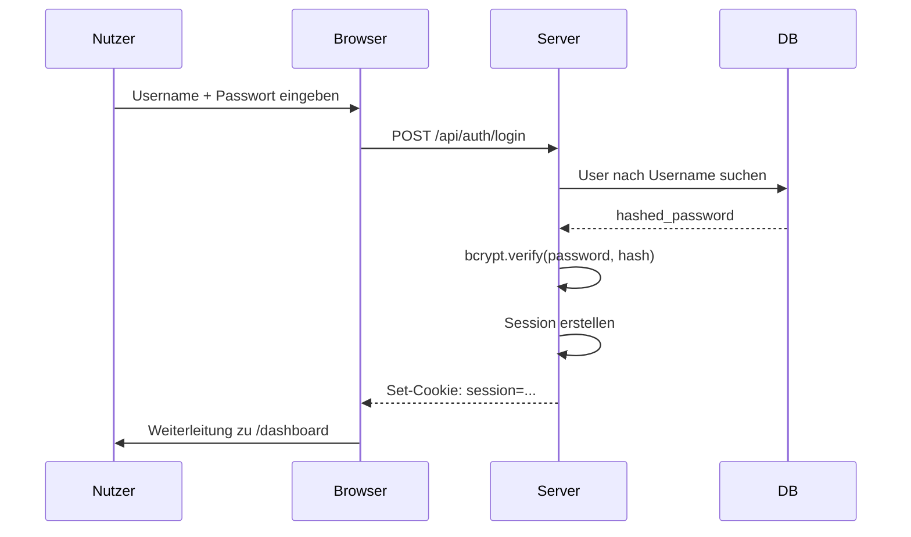

# Authentifizierung

Diese Seite beschreibt das Login- und Session-System.

## Übersicht

- **Session-basiert:** Signierte Cookies via Starlette
- **Passwort-Hashing:** bcrypt durch passlib
- **Session-Speicher:** Client-seitig (Cookie)
- **Server-Storage:** SQLite `auth.db` → `users` Tabelle

## Login-Flow



## Session-Cookie

```
Name: session
Value: {session_data}.signatur (itsdangerous)
HttpOnly: true
Secure: false (lokal) / true (produktion mit HTTPS)
SameSite: lax
```

## Seiten-Schutz

### HTML-Seiten (Jinja2)

```python
from backend.auth.dependencies import check_auth

@router.get("/seite")
async def seite(request: Request):
    if not check_auth(request):
        return RedirectResponse("/login")
    # ...
```

### API-Endpunkte

API-Endpunkte sind **nicht authentifiziert** (Annahme: lokales Netzwerk).

Falls nötig:

```python
async def api_endpoint(request: Request):
    if not check_auth(request):
        raise HTTPException(401, "Nicht authentifiziert")
```

## Standard-Login

| Feld | Standardwert | Ort |
|------|--------------|-----|
| Username | `admin` | Hardcoded in dependencies |
| Passwort | `changeme` | `config/config.json` |

## Passwort ändern

### Als Admin

1. Einloggen
2. `/admin/users` öffnen
3. "Passwort ändern" klicken

### Via Datenbank (Fallback)

```python
from backend.auth.dependencies import get_password_hash
from backend.auth.db import SessionLocal
from backend.auth.models import User

db = SessionLocal()
user = db.query(User).filter_by(username="admin").first()
user.hashed_password = get_password_hash("neues_passwort")
db.commit()
```

## Nutzer verwalten

| Aktion | Seite |
|--------|-------|
| Nutzer anzeigen | `/admin/users` |
| Nutzer hinzufügen | `/admin/users` → "+ Hinzufügen" |
| Passwort ändern | `/admin/users` → "Bearbeiten" |
| Nutzer deaktivieren | `/admin/users` → "Deaktivieren" |

## Session-Einstellungen

In `backend/main.py`:

```python
app.add_middleware(
    SessionMiddleware,
    secret_key=SECRET_KEY,
    max_age=3600 * 24 * 7,  # 7 Tage
    same_site="lax",
    https_only=False,  # True in Produktion
)
```

## Sicherheitshinweise

1. **Standard-Passwort ändern** sofort nach erster Installation
2. **SECRET_KEY rotieren** in Produktion (generiere neu, alle Sessions werden ungültig)
3. **HTTPS verwenden** wenn von extern erreichbar
4. **Keine Passwörter loggen** – weder im Code noch in Logs

## Troubleshooting

### "Session abgelaufen"

- Cookie löschen oder neu einloggen
- `max_age` in SessionMiddleware prüfen

### "Login funktioniert nicht"

- `config/config.json` prüfen
- Browser-DevTools → Application → Cookies prüfen
- Server-Logs auf Fehler prüfen

### Passwort vergessen

Siehe [Wie man Dinge ändert → Passwort zurücksetzen](./11-how-to-change-things)
