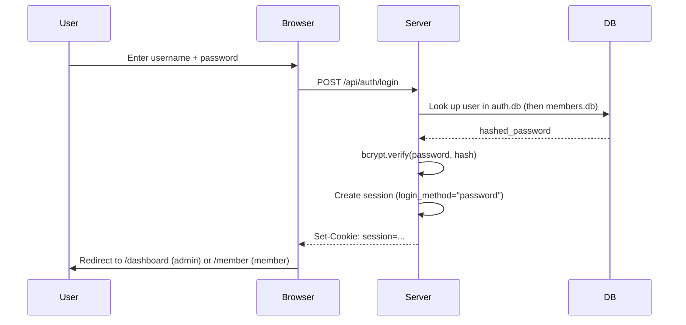
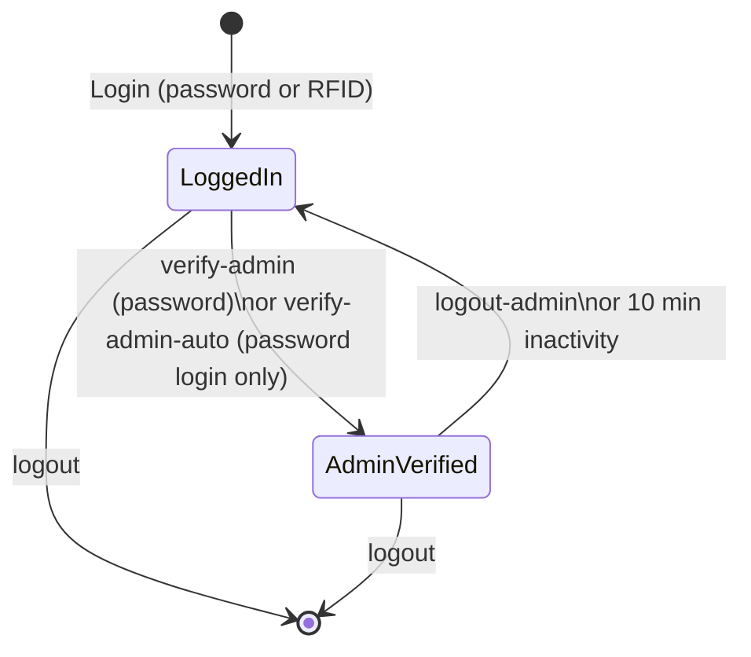

# Authentication

GroundControl has a login-protected admin area. The public welcome page is accessible to anyone; all other pages require a valid session.

## How it works

- Login state is stored in a **signed session cookie** using Starlette's `SessionMiddleware` and `itsdangerous`.
- Passwords are stored as **bcrypt hashes** (`passlib`) in the `users` table in `auth.db`.
- Only **HTML page routes** check for a session. `/api/` endpoints are left open — this is intentional for a local network deployment.
- The `secret_key` in `config/config.json` signs the cookie. If you change this key, all existing sessions are invalidated.
- Three login methods are supported: **password**, **RFID card**, and **OAuth** (Google, when enabled — see docs 27/28).

## Password login flow



## RFID login

Members can log in by tapping their NFC card on a paired reader — no password required.

### Endpoint

```
POST /api/auth/login-rfid
Content-Type: application/json
```

### Request body

```json
{
  "rfid_uid": "AABBCCDD",
  "pairing_token": "optional-token-string"
}
```

| Field | Required | Description |
|-------|----------|-------------|
| `rfid_uid` | Yes | NFC card UID (uppercased internally) |
| `pairing_token` | No | Token from the paired reader; if absent, IP-based pairing is attempted |

### How it works

1. **Pairing check** — The reader must be registered as a `DevicePairing` in `core.db`. Without a valid pairing, `403` is returned.
2. **Scan recency** — A `TagScan` record must exist in `core.db` for the same UID and `device_id`, and it must be **no older than 60 seconds**. Stale scans are rejected with `403`.
3. **Member lookup** — The UID is matched against `Mitglied.nfc_uid`. Fallback: search via `RFIDTag.uid` → `RFIDTag.member_id`.
4. **Auto account creation** — If no `User` record exists in `auth.db` for this member yet, one is created automatically (role: `member`; role: `admin` if admin card).
5. **Admin card detection** — If `RFIDTag.is_admin == True`, the session gets `is_admin_capable=True`. However, `admin_verified` always starts as `False` — explicit verification is still required for admin actions.
6. **Session** — `login_method` is set to `"rfid"`.

### Success response

```json
{
  "success": true,
  "user": {
    "id": 42,
    "username": "Max Mustermann",
    "role": "member",
    "mitglied_id": 7
  },
  "mitglied": { "...": "Mitglied object" },
  "is_admin_capable": false,
  "redirect": "/member",
  "stale_laufzettel": "none"
}
```

### Error responses

| HTTP | Cause |
|------|-------|
| `403` | No valid pairing, expired token, or scan too old |
| `404` | UID unknown or no member linked to this card |

---

## Session management

### Session cookie

```
Name: session
Value: {session_data}.signature (itsdangerous)
HttpOnly: true
Secure: not set (cookie is sent over HTTP; gated by network trust)
SameSite: omitted (falls back to browser default)
```

> SameSite is intentionally omitted via a custom `PWASessionMiddleware`. Starlette's default `samesite=lax` breaks session cookies in iOS PWA standalone mode (the `fetch()` calls don't send the cookie). Omitting it works in both HTTP and iOS PWA contexts.

### Session fields

| Field | Type | Description |
|-------|------|-------------|
| `user` | `str` | Username of the logged-in user |
| `mitglied_id` | `int\|null` | Linked member ID |
| `is_admin_capable` | `bool` | User has admin capability in principle |
| `login_method` | `"password"\|"rfid"\|"oauth"` | How the current session was established |
| `admin_verified` | `bool` | Admin mode active (expires after 10 min inactivity) |
| `admin_verified_at` | `ISO-8601\|null` | Timestamp of last admin verification |
| `last_activity` | `ISO-8601` | Last activity timestamp (UTC) |

### Timeouts

| Type | Duration | Effect |
|------|----------|--------|
| Member session | **3 minutes** of inactivity | Session is cleared, user is logged out |
| Admin verification | **10 minutes** of inactivity | `admin_verified` is reset to `false` |

### GET /api/auth/session

Returns information about the current session.

**Response:**

```json
{
  "mitglied_id": 7,
  "is_admin_capable": true,
  "admin_verified": false,
  "can_access_admin": false,
  "login_method": "rfid"
}
```

### POST /api/auth/heartbeat

Extends the session and checks its validity.

- Updates `last_activity` (prevents session timeout)
- Returns `{"valid": true}` while the session is valid
- Returns `{"valid": false}` with HTTP `401` when the session has expired

**Usage:** The frontend sends this call periodically (e.g. every 60 seconds) to keep the session alive.

---

## Admin verification

For destructive or security-critical actions (e.g. user management, cancelling payments), a regular logged-in session is not sufficient. The user must additionally **verify** as an admin.

### POST /api/auth/verify-admin

Activates admin mode by re-entering the password.

```
POST /api/auth/verify-admin
Content-Type: application/x-www-form-urlencoded

password=my-password
```

**Response (success):** `{"success": true}`
**Response (failure):** `{"success": false, "error": "Invalid password or not admin"}` — HTTP `403`

After successful verification, `admin_verified = true` and `admin_verified_at` is set to the current time. The flag expires automatically after **10 minutes of inactivity**.

### POST /api/auth/verify-admin-auto

Activates admin mode **without a password prompt** — but only when `login_method == "password"` (i.e. the user just logged in with a password moments ago).

- When `login_method == "rfid"`, returns `{"success": false, "error": "requires_password"}` with HTTP `403`.
- This ensures that a pure RFID login cannot silently escalate to admin mode.

### POST /api/auth/logout-admin

Ends admin mode without a full logout. Sets `admin_verified = false` and redirects to `/member`.



---

## User management (/admin/users)

User management is available at `/admin/users` and requires active admin verification.

### Endpoint overview

| Method | Path | Description |
|--------|------|-------------|
| `GET` | `/admin/users` | View user list |
| `POST` | `/admin/users/add` | Create a new admin user |
| `POST` | `/admin/users/delete` | Delete a user |
| `POST` | `/admin/users/toggle-role` | Toggle role between `admin` and `member` |
| `POST` | `/admin/users/promote-member-to-admin` | Elevate a member with login credentials to admin |
| `POST` | `/admin/users/revoke-member-login` | Remove login credentials from a member |
| `POST` | `/admin/users/change-password` | Change your own admin password |

### Promote a member to admin

```
POST /admin/users/promote-member-to-admin
Content-Type: application/x-www-form-urlencoded

mitglied_id=7
```

Creates a new `User` entry in `auth.db` with `role="admin"`, copying `login_username` and `login_password_hash` from the member record. The member must already have login credentials set.

### Revoke a member's login credentials

```
POST /admin/users/revoke-member-login
Content-Type: application/x-www-form-urlencoded

mitglied_id=7
```

Sets `login_username` and `login_password_hash` to `null` in `members.db`. The member can no longer log in with a password, but RFID login remains available.

### Change your own password

```
POST /admin/users/change-password
Content-Type: application/x-www-form-urlencoded

current_password=old-password&new_password=new-password
```

Only the currently logged-in admin can change their own password. The current password must be correct.

### Safety rails

- **No self-deletion:** A user cannot delete their own account.
- **No deleting the primary admin:** The `admin_username` configured in `config.json` is protected.
- **No deleting the last user:** Deletion is blocked when only one user remains in `auth.db`.
- **No self-role-change:** A user cannot toggle their own role.

---

## Route overview

| Route | Public? | Description |
|---|---|---|
| `GET /` | Yes | Welcome / login page (redirects to `/member` if already logged in) |
| `GET /login` | Yes | Same as `/` |
| `POST /api/auth/login` | Yes | Form submit — sets session, redirects to `/dashboard` or `/member` |
| `POST /api/auth/login-rfid` | Yes | RFID card login — sets session, returns redirect URL |
| `GET /logout` | — | Clears session, redirects to `/` |
| `POST /api/auth/logout-admin` | — | Drops admin_verified, redirects to `/member` |
| `GET /api/auth/session` | — | Returns current session info |
| `POST /api/auth/heartbeat` | — | Extends session, returns `{valid: bool}` |
| `POST /api/auth/verify-admin` | 🔒 Login | Re-enter password to activate admin mode |
| `POST /api/auth/verify-admin-auto` | 🔒 Login | Auto-activate admin mode (password logins only) |
| `GET /dashboard` | 🔒 Login | Main dashboard |
| `GET /member` | 🔒 Login | Member view |
| `GET /admin/users` | 🔒 Admin | User management |

---

## First login

On first startup, if no users exist in the database, a default admin user is created from `config/config.json`:

```json
{
  "admin_username": "admin",
  "admin_password": "changeme"
}
```

**Change this immediately** after first login.

## Two roles

| Role | Access |
|------|--------|
| `admin` | Full access to all pages; can activate admin mode |
| `member` | Access to own `/member` area only (Laufzettel, account) |

Members with `login_username`/`login_password_hash` set in `members.db` can log in via password. All members with a registered NFC card can log in via RFID.

---

## Config keys

All auth settings live in `config/config.json`:

```json
{
  "secret_key": "change-me-to-a-long-random-string",
  "admin_username": "admin",
  "admin_password": "changeme",
  "easyverein_api_key": "",
  "easyverein_org_id": "",
  "enrollment_reader_id": ""
}
```

| Key | Purpose |
|---|---|
| `secret_key` | Session signing key — **change in production** |
| `admin_username` / `admin_password` | Seeded on first startup if no users exist |
| `easyverein_api_key` / `easyverein_org_id` | Member sync from easyVerein |
| `enrollment_reader_id` | Device ID for dedicated NFC enrollment reader |

To generate a strong secret key:

```bash
python3 -c "import secrets; print(secrets.token_hex(32))"
```

---

## Session middleware settings

In `backend/main.py`:

```python
# Uses PWASessionMiddleware to omit SameSite so iOS PWA fetch() calls send the cookie
app.add_middleware(PWASessionMiddleware, secret_key=SECRET_KEY)
```

`PWASessionMiddleware` (in `backend/middleware.py`) subclasses Starlette's `SessionMiddleware` and overrides `security_flags` to `"httponly"`, removing the `samesite=lax` flag that Starlette adds by default. No `max_age` is passed, so the cookie is a browser-session cookie; the effective session duration is limited by the **3-minute inactivity timeout** (`MEMBER_TIMEOUT_MINUTES`) enforced server-side via `last_activity`.

---

## Security notes

- Sessions time out after **3 minutes of inactivity** (`MEMBER_TIMEOUT_MINUTES` in `backend/auth/dependencies.py`).
- Admin verification expires after **10 minutes of inactivity**, independently of the session.
- API endpoints (`/api/...`) are **not** protected — any device on the network can call them. This is acceptable for a trusted local network.
- RFID login is gated by device pairing — unpaired IP addresses are rejected.
- The docs app on port `8001` has **no authentication** — restrict it at the nginx layer if exposed externally.
- Changing `secret_key` invalidates all existing sessions immediately.

---

## Troubleshooting

### "Session expired"

- Delete the cookie or log in again.
- Check `MEMBER_TIMEOUT_MINUTES` in `backend/auth/dependencies.py` (default: 3 minutes).

### "Login doesn't work"

- Check `config/config.json`.
- Browser DevTools → Application → Cookies.
- Check server logs for errors.

### "RFID login: scan too old"

- The scan must arrive within 60 seconds of tapping the card.
- Check that the NFC reader is correctly paired (Device Pairing in the admin area).

### "verify-admin-auto returns requires_password"

- This endpoint only works when `login_method == "password"`. If you logged in via RFID, use `POST /api/auth/verify-admin` and enter your password manually.

### Forgot password

See [How to change things → Reset password](./11-how-to-change-things)
