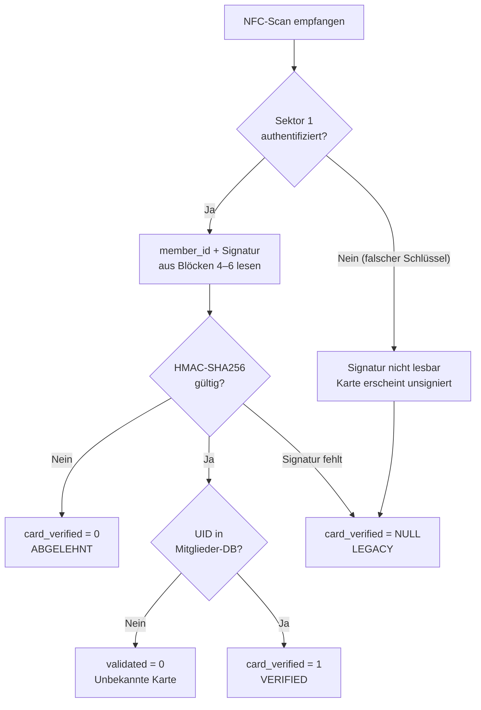
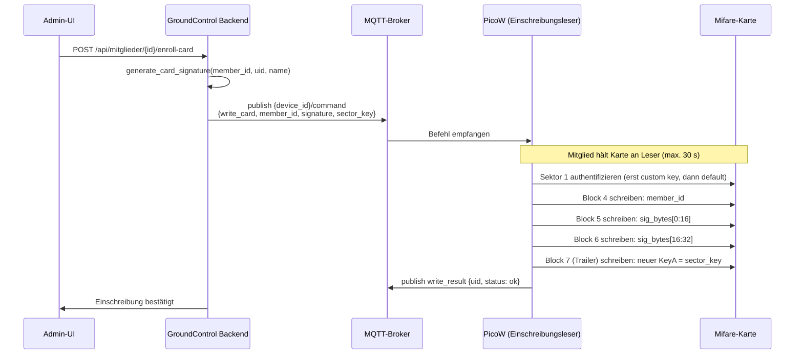

# NFC-Tag-Sicherheit

Diese Seite beschreibt das Drei-Schichten-Sicherheitsmodell, das NFC-Kartenkopien verhindert,
und erklärt, wie das Backend jeden Scan mit Three-Value Logic (3VL) überprüft.

## Bedrohungsmodell

Das System verwendet Mifare Classic 1K Karten. Die eingebaute Verschlüsselung (CRYPTO1) ist
kryptographisch gebrochen. Wir schützen uns gegen den **opportunistischen Angreifer**
mit handelsüblichen Werkzeugen wie einem Flipper Zero oder einem einfachen NFC-Schreiber:

| Angriff | Ohne Sicherheit | Mit Sicherheit |
|---|---|---|
| UID auf Magic-Karte kopieren | Funktioniert | ABGELEHNT — Signatur fehlt |
| Gesamten Sektor dumpen & klonen | Funktioniert | ABGELEHNT — HMAC ist an `SECRET_KEY` gebunden |
| Signatur für neue Karte fälschen | Nicht nötig | BLOCKIERT — erfordert Kenntnis von `SECRET_KEY` |
| Sektordaten abfangen | Einfach mit Standardschlüsseln | BLOCKIERT — benutzerdefinierter Sektorschlüssel schützt Sektor 1 |

## Three-Value Logic Scan-Zustände

Jeder NFC-Scan wird einem von drei Zuständen in `TagScan.card_verified` zugeordnet:

| Zustand | `card_verified` | Bedingung | Ergebnis |
|---|---|---|---|
| **VERIFIED** | `1` | Signatur auf Karte + HMAC gültig + UID in DB | Zugang gewährt |
| **LEGACY** | `NULL` | Keine Signaturdaten + UID in DB | Zugang gewährt (permissiv) oder verweigert (strict) |
| **REJECTED** | `0` | Signatur vorhanden aber HMAC-Prüfung fehlgeschlagen | Immer verweigert + Sicherheitswarnung |

## Sicherheitsschichten



**Schicht 1 — Benutzerdefinierter Mifare-Sektorschlüssel**
Der Server leitet einen 6-Byte-Sektorschlüssel aus `SECRET_KEY` ab:
```
sector_key = HMAC(SECRET_KEY, "mifare-sector-key-v1")[:6]
```
Dieser Schlüssel wird beim Start als gespeicherte MQTT-Nachricht an `groundcontrol/nfc/config`
veröffentlicht. Der PicoW liest diese Nachricht sofort nach der Verbindung und verwendet den
Schlüssel, um sich bei Sektor 1 jeder Karte zu authentifizieren. Ohne den richtigen Schlüssel
kann kein Lesegerät (einschließlich Flipper Zero) die Daten in Sektor 1 lesen oder schreiben.

**Schicht 2 — HMAC-SHA256-Kartensignatur**
Bei der Einschreibung schreibt der Server eine Signatur auf die Karte:
```
signature = HMAC(SECRET_KEY, "{member_id}:{uid}:{name}")
```
Bei jedem Scan berechnet das Backend die erwartete Signatur neu und vergleicht mit
zeitkonstantem Vergleich. Ein Angreifer, der die rohen Signatur-Bytes liest, kann sie
nicht auf einer Karte mit anderer UID verwenden — die UID ist in den Hash eingebunden.

**Schicht 3 — Serverseitiger UID-Abgleich**
Auch ohne Signatur muss die UID in `members.db` vorhanden sein, damit ein Scan einen
Laufzettel erzeugt. Die Deaktivierung eines Mitglieds blockiert sofort alle Karten.

## Kartendatenlayout (Mifare Classic 1K, Sektor 1)

Sektor 1 umfasst Blöcke 4–7. Block 7 ist der Sektor-Trailer (Schlüssel + Zugangsbits);
Blöcke 4–6 enthalten die Einschreibungsdaten:

| Block | Bytes | Inhalt |
|---|---|---|
| 4 | 0–15 | `member_id`, null-aufgefüllt (max. 15 Zeichen) |
| 5 | 0–15 | HMAC-SHA256-Digest Bytes 0–15 |
| 6 | 0–15 | HMAC-SHA256-Digest Bytes 16–31 |
| 7 | 0–15 | Sektor-Trailer: KeyA (6 B) \| Zugangsbits (4 B) \| KeyB (6 B) |

> **Hinweis zur Signatur:** `generate_card_signature()` gibt einen 64-Zeichen-Hex-String
> zurück (= 32 Rohbytes). Die Firmware konvertiert diesen Hex-String vor dem Schreiben
> in Rohbytes (`bytes.fromhex(sig_hex)`) und teilt sie gleichmäßig auf Blöcke 5 und 6 auf.
> Beim Lesen werden die 32 Rohbytes vor dem Senden im MQTT-Payload wieder als Hex kodiert.

## Konfiguration

Folgende Schlüssel in `config/config.json` eintragen:

| Schlüssel | Standard | Beschreibung |
|---|---|---|
| `nfc_signature_mode` | `"permissive"` | `"permissive"`: Legacy-Karten funktionieren weiterhin. `"strict"`: Nur VERIFIED-Scans erlaubt. |
| `mifare_sector_key` | *(leer)* | Optionaler 12-Zeichen-Hex-Override. Leer lassen für automatische Ableitung aus `SECRET_KEY`. |

## Einschreibungsablauf



> **Der Sektor-Trailer-Schreibvorgang ist pro Karte nicht umkehrbar.** Nach der ersten
> Einschreibung wird der Werksstandard-Schlüssel (`FF FF FF FF FF FF`) ersetzt.
> Bei der erneuten Einschreibung wird der aktuelle Sektorschlüssel zur Authentifizierung
> verwendet und dann mit demselben Schlüssel neu geschrieben.

## Schrittweise Einführung (permissiv → strict)

1. **Backend + Firmware deployen** mit `nfc_signature_mode = "permissive"`
2. **Mitgliedskarten einzeln einschreiben** über die Mitglieder-UI
3. **Scan-Protokoll beobachten** — eingeschriebene Karten zeigen `card_verified = 1`
4. **Nach vollständiger Einschreibung** auf `"strict"` umstellen und Dienst neu starten
5. Ab jetzt werden nicht eingeschriebene Karten mit `card_verified = NULL` abgelehnt

## Scan-Protokoll

Der `TagScan`-Datensatz enthält `card_verified` in der API-Antwort (`/api/scans`):

| `card_verified` | Bedeutung |
|---|---|
| `1` | VERIFIED — HMAC stimmt überein |
| `null` | LEGACY — keine Signaturdaten auf der Karte |
| `0` | REJECTED — Signatur vorhanden, aber HMAC-Abgleich fehlgeschlagen |
