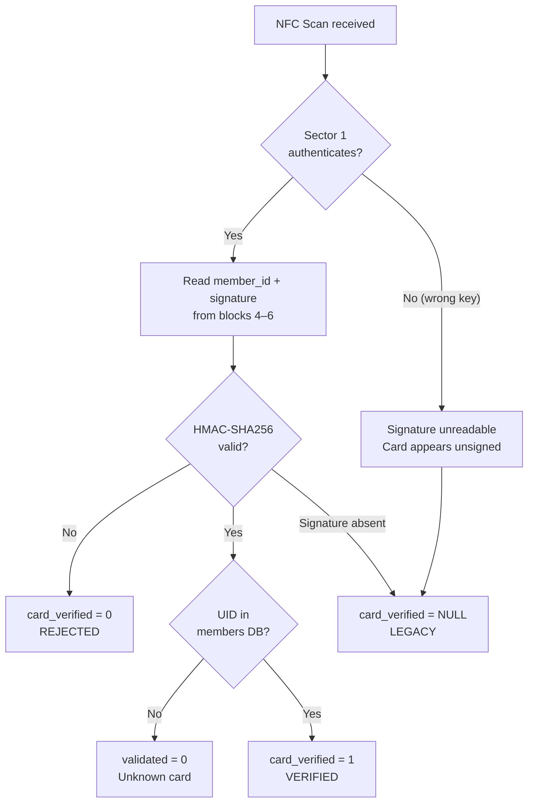
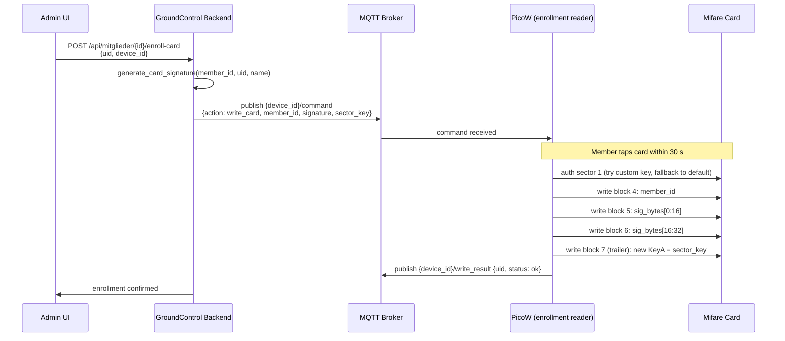

# NFC Tag Security

This page describes the three-layer security model used to prevent NFC card cloning,
and explains how the backend verifies each scan using Three-Value Logic (3VL).

## Threat model

The system uses Mifare Classic 1K cards. The hardware cipher (CRYPTO1) is cryptographically
broken, meaning a motivated attacker with specialized tools can clone a card — but the threat
we're protecting against is the **casual attacker** using off-the-shelf tools like a Flipper
Zero or a budget NFC writer:

| Attack | Without security | With security |
|---|---|---|
| Copy UID to magic card | Works — grants access | REJECTED — signature missing |
| Dump + clone full sector | Works — grants access | REJECTED — signature HMAC is bound to server secret |
| Forge signature for new card | N/A | BLOCKED — requires knowledge of `SECRET_KEY` |
| Intercept sector data | Easy with default keys | BLOCKED — non-default sector key prevents reading sector 1 |

## Three-Value Logic scan states

Every NFC scan is classified into one of three states stored in `TagScan.card_verified`:

| State | `card_verified` | Condition | Result |
|---|---|---|---|
| **VERIFIED** | `1` | Signature on card + HMAC valid + UID in DB | Access granted |
| **LEGACY** | `NULL` | No signature data on card + UID in DB | Access granted (permissive mode) or denied (strict mode) |
| **REJECTED** | `0` | Signature present but HMAC check fails | Always denied + security warning logged |

## Defense layers



**Layer 1 — Custom Mifare sector key**
The server derives a 6-byte sector key from `SECRET_KEY` using HMAC-SHA256:
```
sector_key = HMAC(SECRET_KEY, "mifare-sector-key-v1")[:6]
```
This key is published as a retained MQTT message to `groundcontrol/nfc/config` at
broker startup. The PicoW reads this message immediately on connect and uses it to
authenticate to sector 1 on every card. Without the correct key, no reader (including
Flipper Zero) can read or write sector 1 data.

**Layer 2 — HMAC-SHA256 card signature**
During enrollment, the server writes a signature to the card:
```
signature = HMAC(SECRET_KEY, "{member_id}:{uid}:{name}")
```
On every scan, the backend recomputes the expected signature and compares using
constant-time comparison. An attacker who somehow reads the raw signature bytes
cannot reuse them on a card with a different UID — the UID is bound into the hash.

**Layer 3 — Server-side UID lookup**
Even without a signature, the UID must exist in `members.db` for a scan to produce
a Laufzettel. Deactivating a member immediately blocks all their cards regardless
of what is stored on the physical card.

## Card data layout (Mifare Classic 1K, Sector 1)

Sector 1 occupies blocks 4–7. Block 7 is the sector trailer (keys + access bits);
blocks 4–6 carry the enrollment data:

| Block | Bytes | Content |
|---|---|---|
| 4 | 0–15 | `member_id`, null-padded (max 15 characters) |
| 5 | 0–15 | HMAC-SHA256 digest bytes 0–15 |
| 6 | 0–15 | HMAC-SHA256 digest bytes 16–31 |
| 7 | 0–15 | Sector trailer: KeyA (6 B) \| access bits (4 B) \| KeyB (6 B) |

> **Note on the signature:** `generate_card_signature()` returns a 64-char hex string
> (= 32 raw bytes). The firmware converts this hex string to raw bytes
> (`bytes.fromhex(sig_hex)`) before writing, splitting evenly across blocks 5 and 6.
> On read, the 32 raw bytes are re-encoded as hex before being sent in the MQTT payload,
> so the server receives the same 64-char hex string that was originally generated.

## Configuration

Add these keys to `config/config.json`:

| Key | Default | Description |
|---|---|---|
| `nfc_signature_mode` | `"permissive"` | `"permissive"`: legacy cards still work. `"strict"`: only VERIFIED scans allowed. |
| `mifare_sector_key` | *(empty)* | Optional 12-char hex override. Leave empty to auto-derive from `SECRET_KEY`. |

Example `config.json` snippet:
```json
{
  "nfc_signature_mode": "permissive",
  "mifare_sector_key": ""
}
```

The sector key is auto-derived when `mifare_sector_key` is empty, which is the
recommended setting. The derivation is deterministic — the same `SECRET_KEY` always
produces the same sector key, so the system works consistently across reboots and
re-deployments without manual key management.

## Enrollment flow



> **Sector trailer write is irreversible per card.** After the first enrollment, the
> factory default key (`FF FF FF FF FF FF`) is replaced. Re-enrollment uses the current
> sector key to authenticate, then overwrites the data blocks and re-writes the trailer
> with the same key.

## Gradual rollout (permissive → strict)

Because firmware updates and card re-enrollments take time, the system supports a
controlled migration path:

1. **Deploy backend + firmware** with `nfc_signature_mode = "permissive"`
2. **Re-enroll** member cards one by one via the Mitglieder UI
3. **Monitor** the scan log — enrolled cards show `card_verified = 1` (VERIFIED)
4. **Once all cards are enrolled**, switch to `"strict"` in `config/config.json` and restart the service
5. From this point, any un-enrolled card receives `card_verified = NULL` → access denied

Cards that were never re-enrolled will stop working in strict mode. This is intentional
— it means no card can gain access without having been explicitly enrolled by an admin.

## Scan log visibility

The `TagScan` record exposes `card_verified` via the `/api/scans` endpoint and shows
in the admin dashboard:

```json
{
  "id": 1234,
  "uid": "04A3B5C2",
  "validated": true,
  "card_verified": 1,
  "card_member_id": "M042",
  "owner_name": "Alice Example",
  ...
}
```

| `card_verified` | Meaning |
|---|---|
| `1` | VERIFIED — HMAC matched |
| `null` | LEGACY — no signature data on card |
| `0` | REJECTED — signature present but HMAC mismatch |
