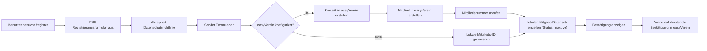

# 19 · Mitglied-Registrierung

## Übersicht

Das Mitglied-Registrierungssystem ermöglicht es neuen Mitgliedern, sich über ein öffentliches Webformular unter `/register` anzumelden. Diese Funktion erstellt einen Mitgliedsantrag in easyVerein (falls konfiguriert), der vom Vorstand bestätigt werden muss, mit einem lokalen Fallback für Offline-Szenarien. Der Beitrag wird stets monatlich per SEPA-Lastschrift eingezogen.

## Funktionen

- **Öffentliches Registrierungsformular**: Zugänglich unter `/register` ohne Authentifizierung
- **easyVerein-Integration**: Erstellt Mitgliedsantrag (`isApplication: true`) in easyVerein — der Vorstand muss den Antrag bestätigen, bevor das Mitglied aktiv wird
- **Lokaler Fallback**: Erstellt lokale Mitglied-Datensätze auch wenn easyVerein nicht verfügbar ist
- **E-Mail-Validierung**: Verhindert doppelte Registrierungen mit derselben E-Mail
- **Datenschutzerklärung**: Erfordert Akzeptanz der Datenschutzrichtlinie vor der Übermittlung
- **Monatlicher Beitrag**: Fester monatlicher Zahlungsintervall (keine Auswahlmöglichkeit)

## Konfiguration

Fügen Sie diese Einstellungen zu `config/config.json` hinzu:

```json
{
  "easyverein_api_key": "YOUR_EASYVEREIN_API_KEY_HERE",
  "easyverein_org_id": "YOUR_ORG_ID_HERE",
  "easyverein_registration_mock": false,
  "easyverein_signup_redirect_url": "",
  "membership_groups": [
    {
      "label": "Regulär (30 €/Monat)",
      "ev_url": "",
      "amount": 30
    },
    {
      "label": "Ermäßigt (15 €/Monat)",
      "ev_url": "",
      "amount": 15
    }
  ]
}
```

### Konfigurationsschlüssel

| Schlüssel | Zweck |
|---|---|
| `easyverein_api_key` | API-Schlüssel für easyVerein-Integration (optional) |
| `easyverein_org_id` | Organisations-ID in easyVerein (optional) |
| `easyverein_registration_mock` | Auf `true` setzen, um easyVerein-Aufrufe zum Testen zu simulieren |
| `easyverein_signup_redirect_url` | Externe URL für Signup-Weiterleitung (optional) |
| `membership_groups` | Array von Mitgliedschaftsgruppen-Konfigurationen |

### Konfiguration von Mitgliedschaftsgruppen

Jede Mitgliedschaftsgruppe in `membership_groups` unterstützt:

| Feld | Typ | Beschreibung |
|---|---|---|
| `label` | string | Anzeigelabel für die Mitgliedschaftsoption |
| `ev_url` | string | easyVerein-URL für diesen Mitgliedschaftstyp (optional) |
| `amount` | number | Monatlicher Zahlungsbetrag in EUR |

## Registrierungsablauf



## API-Endpunkte

### `GET /register`

Gibt das öffentliche Registrierungsformular zurück.

**Antwort**: HTML-Seite mit Registrierungsformular

### `POST /api/register`

Verarbeitet eine neue Mitglied-Registrierungsanmeldung.

**Anfragekörper**:
```json
{
  "first_name": "Max",
  "family_name": "Mustermann",
  "email": "max@example.com",
  "date_of_birth": "1990-01-01",
  "mobile_phone": "+491234567890",
  "private_phone": "+491234567891",
  "street": "Musterstraße 1",
  "zip_code": "12345",
  "city": "Musterstadt",
  "country": "Germany",
  "iban": "DE89370400440532013000",
  "bic": "COBADEFFXXX",
  "bank_account_owner": "Max Mustermann",
  "method_of_payment": 1,
  "membership_group_url": "",
  "payment_amount": 30.0,
  "payment_interval_months": 1,
  "salutation": "Herr",
  "privacy_accepted": true
}
```

**Antwort** (Erfolg):
```json
{
  "success": true,
  "message": "Antrag erfolgreich eingereicht"
}
```

**Antwort** (mit easyVerein-Warnung):
```json
{
  "success": true,
  "message": "Antrag erfolgreich eingereicht",
  "warning": "Antrag lokal gespeichert; easyVerein-Übertragung fehlgeschlagen"
}
```

**Fehlerantworten**:
- `400` - Datenschutzrichtlinie nicht akzeptiert
- `422` - Fehlende Pflichtfelder (Name, E-Mail)
- `409` - E-Mail bereits registriert

## easyVerein-Integration

Wenn `easyverein_api_key` konfiguriert ist, führt das Registrierungssystem folgende Schritte aus:

1. Erstellt einen Kontakt-Datensatz in easyVerein mit persönlichen Details
2. Erstellt einen **Mitgliedsantrag** (`isApplication: true`) in easyVerein — der Antrag erscheint in easyVerein unter "offene Mitgliedschaftsanträge" und muss vom Vorstand bestätigt werden
3. Ruft die Mitgliedsnummer von easyVerein ab
4. Verwendet die Mitgliedsnummer als lokale `member_id`
5. Setzt den lokalen Status auf "inactive" — wird bei der nächsten Synchronisation auf "active" aktualisiert, sobald der Antrag in easyVerein bestätigt wurde

### Rate Limiting

Die easyVerein-Integration verwendet konservatives Rate Limiting, um API-Fehler zu vermeiden:
- Seitengröße: 10 Datensätze pro Anfrage
- Anfrageverzögerung: 5 Sekunden zwischen Anfragen
- Max. Wiederholungen: 3 mit exponentiellem Backoff (15s, 30s, 45s)

## Lokaler Fallback

Wenn easyVerein nicht konfiguriert ist oder der API-Aufruf fehlschlägt, führt das System folgende Schritte aus:

1. Generiert eine lokale Mitglieds-ID mit Zeitstempel: `REG-{timestamp}`
2. Erstellt einen lokalen `Mitglied`-Datensatz mit Status "inactive"
3. Speichert Zahlungsdetails im Notizen-Feld
4. Gibt eine Erfolgsantwort zurück (mit Warnung, wenn easyVerein fehlschlug)

## Struktur des Mitglied-Datensatzes

Erstellte Mitglied-Datensätze enthalten:

| Feld | Quelle |
|---|---|
| `member_id` | easyVerein-Mitgliedsnummer oder generierte lokale ID |
| `name` | Kombination aus first_name + family_name |
| `email` | Aus Registrierungsformular (kleingeschrieben) |
| `phone` | mobile_phone oder private_phone |
| `status` | Auf "inactive" gesetzt (erfordert Admin-Aktivierung) |
| `joined_date` | null (wird bei Aktivierung gesetzt) |
| `notes` | Registrierungsmethode und Zahlungsdetails |

## Datenschutz und Sicherheit

- **E-Mail-Validierung**: E-Mail-Adressen werden normalisiert (kleingeschrieben, getrimmt) vor der Speicherung
- **Duplikat-Verhinderung**: Das System überprüft auf vorhandene E-Mail-Adressen vor der Registrierung
- **Datenschutzrichtlinie**: Registrierung erfordert explizite Akzeptanz der Datenschutzrichtlinie
- **Datenspeicherung**: Alle Registrierungsdaten werden lokal in `members.db` gespeichert
- **API-Sicherheit**: Der easyVerein-API-Schlüssel wird in der Konfiguration gespeichert (nicht im Code)

## Admin-Workflow

Nach der Registrierung:

1. **easyVerein**: Den Mitgliedsantrag in easyVerein überprüfen und bestätigen (unter "offene Mitgliedschaftsanträge")
2. Bei der nächsten Synchronisation wird der lokale Status automatisch auf "active" gesetzt
3. RFID-Tag zuweisen, falls erforderlich
4. joined_date wird bei der Bestätigung automatisch gesetzt

## Testen

Um die Registrierung ohne easyVerein zu testen:

```json
{
  "easyverein_registration_mock": true
}
```

Dies simuliert easyVerein-Aufrufe, ohne tatsächlich die API zu kontaktieren.

## Fehlerbehebung

### easyVerein-Registrierung schlägt fehl

Überprüfen Sie:
- API-Schlüssel ist gültig und nicht abgelaufen
- Organisations-ID ist korrekt
- Internetkonnektivität vom Server
- easyVerein-API-Status

### E-Mail bereits registriert

Das System verhindert doppelte E-Mail-Adressen. Wenn ein Benutzer sich mit einer neuen E-Mail registrieren muss:
1. Sollte der Admin die E-Mail des vorhandenen Datensatzes aktualisieren
2. Oder den doppelten Datensatz löschen, falls er irrtümlich erstellt wurde

### Kollision lokaler Mitglieds-ID

Das System verwendet Zeitstempel, um ID-Kollisionen zu vermeiden. Im unwahrscheinlichen Fall einer Kollision wird die Datenbank-Datensatz-ID angehängt, um Eindeutigkeit zu gewährleisten.

## Verwandte Dokumentation

- [Konfigurationsreferenz](./18-configuration-reference.de.md) - Vollständige Konfigurationsoptionen
- [Authentifizierung](./14-authentication.de.md) - Benutzerauthentifizierung und Zugriffskontrolle
- [Mitgliederbereich](./15-member-area.de.md) - Mitglieder-Self-Service-Funktionen