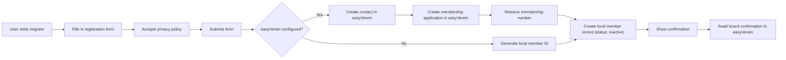

# 19 · Member Registration

## Overview

The member registration system lets new members sign up via a public web form at `/register`. The feature creates a membership application in easyVerein (if configured) that must be confirmed by the board, with a local fallback for offline scenarios. Membership fees are always collected monthly via SEPA direct debit.

## Features

- **Public registration form**: Accessible at `/register` without authentication
- **easyVerein integration**: Creates a membership application (`isApplication: true`) in easyVerein — the board must confirm the application before the member becomes active
- **Local fallback**: Creates local member records even when easyVerein is unavailable
- **Email validation**: Prevents duplicate registrations with the same email address
- **Privacy policy**: Requires acceptance of the privacy policy before submission
- **Monthly billing**: Fixed monthly payment interval (no choice)

## Configuration

Add these settings to `config/config.json`:

```json
{
  "easyverein_api_key": "YOUR_EASYVEREIN_API_KEY_HERE",
  "easyverein_org_id": "YOUR_ORG_ID_HERE",
  "easyverein_registration_mock": false,
  "easyverein_signup_redirect_url": "",
  "membership_groups": [
    {
      "label": "Regular (€30/month)",
      "ev_url": "",
      "amount": 30
    },
    {
      "label": "Reduced (€15/month)",
      "ev_url": "",
      "amount": 15
    }
  ]
}
```

### Configuration keys

| Key | Purpose |
|---|---|
| `easyverein_api_key` | API key for easyVerein integration (optional) |
| `easyverein_org_id` | Organisation ID in easyVerein (optional) |
| `easyverein_registration_mock` | Set to `true` to mock easyVerein calls for testing |
| `easyverein_signup_redirect_url` | External URL for signup redirect (optional) |
| `membership_groups` | Array of membership group configurations |

### Membership group configuration

Each entry in `membership_groups` supports:

| Field | Type | Description |
|---|---|---|
| `label` | string | Display label for the membership option |
| `ev_url` | string | easyVerein URL for this membership type (optional) |
| `amount` | number | Monthly payment amount in EUR |

## Registration flow



## API endpoints

### `GET /register`

Returns the public registration form.

**Response**: HTML page with registration form

### `POST /api/register`

Processes a new member registration submission.

**Request body**:
```json
{
  "first_name": "Max",
  "family_name": "Mustermann",
  "email": "max@example.com",
  "date_of_birth": "1990-01-01",
  "mobile_phone": "+491234567890",
  "private_phone": "+491234567891",
  "street": "Musterstraße 1",
  "zip_code": "12345",
  "city": "Musterstadt",
  "country": "Germany",
  "iban": "DE89370400440532013000",
  "bic": "COBADEFFXXX",
  "bank_account_owner": "Max Mustermann",
  "method_of_payment": 1,
  "membership_group_url": "",
  "payment_amount": 30.0,
  "payment_interval_months": 1,
  "salutation": "Herr",
  "privacy_accepted": true
}
```

**Response** (success):
```json
{
  "success": true,
  "message": "Application submitted successfully"
}
```

**Response** (with easyVerein warning):
```json
{
  "success": true,
  "message": "Application submitted successfully",
  "warning": "Application saved locally; easyVerein transfer failed"
}
```

**Error responses**:
- `400` - Privacy policy not accepted
- `422` - Missing required fields (name, email)
- `409` - Email already registered

## easyVerein integration

When `easyverein_api_key` is configured, the registration system performs the following steps:

1. Creates a contact record in easyVerein with personal details
2. Creates a **membership application** (`isApplication: true`) in easyVerein — the application appears under "open membership applications" and must be confirmed by the board
3. Retrieves the membership number from easyVerein
4. Uses the membership number as the local `member_id`
5. Sets the local status to "inactive" — updated to "active" at the next sync once the application is confirmed in easyVerein

### Rate limiting

The easyVerein integration uses conservative rate limiting to avoid API errors:
- Page size: 10 records per request
- Request delay: 5 seconds between requests
- Max retries: 3 with exponential backoff (15 s, 30 s, 45 s)

## Local fallback

When easyVerein is not configured or the API call fails, the system:

1. Generates a local member ID with a timestamp: `REG-{timestamp}`
2. Creates a local `Mitglied` record with status "inactive"
3. Stores payment details in the notes field
4. Returns a success response (with a warning if easyVerein failed)

## Member record structure

Created member records contain:

| Field | Source |
|---|---|
| `member_id` | easyVerein membership number or generated local ID |
| `name` | Combined first_name + family_name |
| `email` | From registration form (lowercased) |
| `phone` | mobile_phone or private_phone |
| `status` | Set to "inactive" (requires admin activation) |
| `joined_date` | null (set on activation) |
| `notes` | Registration method and payment details |

## Privacy and security

- **Email normalisation**: Email addresses are lowercased and trimmed before storage
- **Duplicate prevention**: The system checks for existing email addresses before registration
- **Privacy policy**: Registration requires explicit acceptance of the privacy policy
- **Data storage**: All registration data is stored locally in `members.db`
- **API security**: The easyVerein API key is stored in the config file (not in code)

## Admin workflow

After registration:

1. **easyVerein**: Review and confirm the membership application in easyVerein (under "open membership applications")
2. At the next sync the local status is automatically set to "active"
3. Assign an RFID card if required
4. `joined_date` is set automatically on confirmation

## Testing

To test registration without easyVerein:

```json
{
  "easyverein_registration_mock": true
}
```

This simulates easyVerein calls without actually contacting the API.

## Troubleshooting

### easyVerein registration fails

Check:
- API key is valid and not expired
- Organisation ID is correct
- Internet connectivity from the server
- easyVerein API status

### Email already registered

The system prevents duplicate email addresses. If a user needs to register with a new email:
1. An admin should update the email of the existing record
2. Or delete the duplicate record if it was created by mistake

### Local member ID collision

The system uses timestamps to avoid ID collisions. In the unlikely event of a collision, the database record ID is appended to ensure uniqueness.

## Related documentation

- [Configuration Reference](./18-configuration-reference.en.md) — Full configuration options
- [Authentication](./14-authentication.en.md) — User authentication and access control
- [Member Area](./15-member-area.en.md) — Member self-service features
