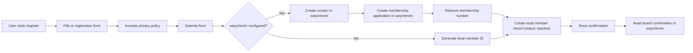

# 19 · Member Registration

## Overview

The member registration system lets new members sign up via a public web form at `/register`. The feature creates a membership application in easyVerein (if configured) that must be confirmed by the board, with a local fallback for offline scenarios. Membership fees are always collected monthly via SEPA direct debit.

## Features

- **Public registration form**: Accessible at `/register` without authentication
- **easyVerein integration**: Creates a membership application (`isApplication: true`) in easyVerein — the board must confirm the application before the member becomes active
- **Local fallback**: Creates local member records even when easyVerein is unavailable
- **Email validation**: Prevents duplicate registrations with the same email address
- **Privacy policy**: Requires acceptance of the privacy policy before submission
- **Monthly billing**: Fixed monthly payment interval (no choice)

## Configuration

Add these settings to `config/config.json`:

```json
{
  "easyverein_api_key": "YOUR_EASYVEREIN_API_KEY_HERE",
  "easyverein_org_id": "YOUR_ORG_ID_HERE",
  "easyverein_registration_mock": false,
  "easyverein_signup_redirect_url": "",
  "membership_groups": [
    {
      "label": "Regular (€30/month)",
      "ev_url": "",
      "amount": 30
    },
    {
      "label": "Reduced (€15/month)",
      "ev_url": "",
      "amount": 15
    }
  ]
}
```

### Configuration keys

| Key | Purpose |
|---|---|
| `easyverein_api_key` | API key for easyVerein integration (optional) |
| `easyverein_org_id` | Organisation ID in easyVerein (optional) |
| `easyverein_registration_mock` | Set to `true` to mock easyVerein calls for testing |
| `easyverein_signup_redirect_url` | External URL for signup redirect (optional) |
| `membership_groups` | Array of membership group configurations |

### Membership group configuration

Each entry in `membership_groups` supports:

| Field | Type | Description |
|---|---|---|
| `label` | string | Display label for the membership option |
| `ev_url` | string | easyVerein URL for this membership type (optional) |
| `amount` | number | Monthly payment amount in EUR |

## Registration flow



## API endpoints

### `GET /register`

Returns the public registration form.

**Response**: HTML page with registration form

### `POST /api/register`

Processes a new member registration submission.

**Request body**:
```json
{
  "first_name": "Max",
  "family_name": "Mustermann",
  "email": "max@example.com",
  "date_of_birth": "1990-01-01",
  "mobile_phone": "+491234567890",
  "private_phone": "+491234567891",
  "street": "Musterstraße 1",
  "zip_code": "12345",
  "city": "Musterstadt",
  "country": "Germany",
  "iban": "DE89370400440532013000",
  "bic": "COBADEFFXXX",
  "bank_account_owner": "Max Mustermann",
  "method_of_payment": 1,
  "membership_group_url": "",
  "payment_amount": 30.0,
  "payment_interval_months": 1,
  "salutation": "Herr",
  "privacy_accepted": true
}
```

**Response** (success):
```json
{
  "success": true,
  "message": "Application submitted successfully"
}
```

**Response** (with easyVerein warning):
```json
{
  "success": true,
  "message": "Application submitted successfully",
  "warning": "Application saved locally; easyVerein transfer failed"
}
```

**Error responses**:
- `400` - Privacy policy not accepted
- `422` - Missing required fields (name, email)
- `409` - Email already registered

## easyVerein integration

When `easyverein_api_key` is configured, the registration system performs the following steps:

1. Creates a contact record in easyVerein with personal details
2. Creates a **membership application** (`isApplication: true`) in easyVerein — the application appears under "open membership applications" and must be confirmed by the board
3. Retrieves the membership number from easyVerein
4. Uses the membership number as the local `member_id`
5. Sets the local status to "inactive" — updated to "active" at the next sync once the application is confirmed in easyVerein

### Rate limiting

The easyVerein integration uses conservative rate limiting to avoid API errors:
- Page size: 10 records per request
- Request delay: 5 seconds between requests
- Max retries: 3 with exponential backoff (15 s, 30 s, 45 s)

## Local fallback

When easyVerein is not configured or the API call fails, the system:

1. Generates a local member ID with a timestamp: `REG-{timestamp}`
2. Creates a local `Mitglied` record with status "inactive"
3. Stores payment details in the notes field
4. Returns a success response (with a warning if easyVerein failed)

## Member record structure

Created member records contain:

| Field | Source |
|---|---|
| `member_id` | easyVerein membership number or generated local ID |
| `name` | Combined first_name + family_name |
| `email` | From registration form (lowercased) |
| `phone` | mobile_phone or private_phone |
| `status` | Set to "inactive" (requires admin activation) |
| `joined_date` | null (set on activation) |
| `notes` | Registration method and payment details |

## Privacy and security

- **Email normalisation**: Email addresses are lowercased and trimmed before storage
- **Duplicate prevention**: The system checks for existing email addresses before registration
- **Privacy policy**: Registration requires explicit acceptance of the privacy policy
- **Data storage**: All registration data is stored locally in `members.db`
- **API security**: The easyVerein API key is stored in the config file (not in code)

## Admin workflow

After registration:

1. **easyVerein**: Review and confirm the membership application in easyVerein (under "open membership applications")
2. At the next sync the local status is automatically set to "active"
3. Assign an RFID card if required
4. `joined_date` is set automatically on confirmation

---

## easyVerein sync management

### Overview

The daily sync runs automatically at **03:00 UTC** via APScheduler. Admins can trigger a sync at any time and monitor its status via the following endpoints.

### Sync endpoints

#### `GET /api/mitglieder/sync-status`

Returns the status of the last sync run. Requires an authenticated session (admin not required).

**Example response** (after a successful sync):
```json
{
  "last_sync": "2026-06-03T03:00:42.123456+00:00",
  "success": true,
  "message": "Synced 2 new, 14 updated, 1 skipped, 0 errors",
  "created": 2,
  "updated": 14,
  "skipped": 1,
  "errors": 0
}
```

**Example response** (no sync has run yet — after a server restart):
```json
{
  "last_sync": null,
  "success": null,
  "message": "No sync performed yet",
  "created": 0,
  "updated": 0,
  "errors": 0
}
```

**Note**: Sync status is held in memory and resets after a server restart.

#### `POST /api/mitglieder/sync`

Triggers an immediate manual sync. Requires **admin verification** (`session["admin_verified"]` active).

**Response**: Same format as `sync-status` — returns the result of the sync that was just completed.

**Error responses**:
- `403` - Admin verification required

#### `GET /api/mitglieder/key-status`

Returns the expiry status of the currently configured easyVerein API key. Requires an authenticated session.

**Example response**:
```json
{
  "expires_at": "2026-12-31",
  "days_left": 211,
  "renew_url": "https://easyverein.com/app/YOUR_ORG_ID/setting/api-key"
}
```

- `expires_at`: ISO date (YYYY-MM-DD) from `config.json`, or `null` if not set
- `days_left`: Days remaining until expiry; `null` if `expires_at` is not set or invalid
- `renew_url`: Direct link to the API key page in easyVerein (requires `easyverein_org_id` in config)

#### `POST /api/mitglieder/update-api-key`

Updates the easyVerein API key and expiry date — both in `config/config.json` and in the running process. Requires **admin verification**.

**Request body**:
```json
{
  "api_key": "NEW_API_KEY_HERE",
  "expires_at": "2027-06-30"
}
```

**Response**:
```json
{
  "ok": true,
  "expires_at": "2027-06-30"
}
```

**Error responses**:
- `400` - API key is empty or date is in the wrong format (expected YYYY-MM-DD)
- `403` - Admin verification required

---

## What the sync does and does NOT overwrite

### Fields always synced from easyVerein

On every sync run the following fields are written from easyVerein (unless the record is locked):

| Field | Source in easyVerein |
|---|---|
| `name` | `firstName` + `familyName` from contactDetails |
| `email` | `privateEmail` / `email` from contactDetails |
| `phone` | `mobilePhone` / `phone` from contactDetails |
| `status` | Derived from `_isApplication`, `resignationDate`, `_isBlocked` |
| `joined_date` | `joinDate` from easyVerein (only set when present) |

### Fields the sync **never** overwrites

The following fields are never touched by the sync, even if easyVerein returns different values:

| Field | Reason |
|---|---|
| `nfc_uid` | Assigned locally; easyVerein has no knowledge of RFID UIDs |
| `login_username` | Local login credentials; set manually |
| `login_password_hash` | Local login credentials; set manually |
| `notes` | Free-text field; maintained locally |

### The `sync_locked` field

Whenever an admin edits a member record via `PUT /api/mitglieder/{id}`, the system automatically sets `sync_locked = true`. Records with `sync_locked = true` are **skipped entirely** during the sync — no fields are updated and the record is not deleted.

To re-enable sync for a locked record, set `sync_locked` explicitly to `false`:

```json
PUT /api/mitglieder/{id}
{ "sync_locked": false }
```

The sync counts skipped records in the `skipped` field of the sync-status response.

---

## Status transitions

### inactive → active

A member transitions from `inactive` to `active` when easyVerein confirms the membership application. The sync detects this because `_isApplication` is no longer set and no `resignationDate` is present. At this transition the sync also sets `joined_date` if easyVerein reports a `joinDate`.

**From the admin's perspective**: After the next sync (03:00 UTC or triggered manually), the member appears in the member list with status "active" and a populated join date.

### active → inactive

A member transitions back to `inactive` when easyVerein reports one of the following:

| Signal in easyVerein | Meaning |
|---|---|
| `resignationDate` set | Member has cancelled their membership |
| `_isBlocked: true` | Member has been blocked |
| `_isApplication: true` | Application was not confirmed (re-marked as application) |

**From the admin's perspective**: The member disappears from the active member list after the next sync. RFID tags are preserved and must be deactivated manually if required.

### Status display in the admin UI

The members page (`/mitglieder`) shows the current sync status as a banner above the table:
- Timestamp of the last sync and its result (created, updated, skipped, error counts)
- Days remaining until the API key expires, with a direct renewal link in easyVerein
- A "Sync now" button to trigger a manual sync (requires admin verification)

---

## Admin monitoring

### How to tell if a sync succeeded

Call `GET /api/mitglieder/sync-status` or check the banner on `/mitglieder`:

- `"success": true` + `"errors": 0` — everything is fine
- `"success": true` + `"errors": N` — sync completed but N individual records could not be processed (details in the server logs)
- `"success": false` — sync failed entirely; `message` contains the reason

### What to check if sync fails

**1. API key expired**

Check `GET /api/mitglieder/key-status`. If `days_left <= 0`:
1. Generate a new key in easyVerein under Settings → API key
2. Call `POST /api/mitglieder/update-api-key` with the new key and expiry date
3. Trigger a manual sync via `POST /api/mitglieder/sync`

The system sends an automatic warning email to the configured `smtp_from_email` address starting **7 days before expiry**.

**2. Network / connectivity errors**

The sync retries failed requests up to 3 times with exponential backoff (15 s, 30 s, 45 s). If the error persists:
- Check the server's internet connectivity
- Check the easyVerein service status (https://status.easyverein.com)
- Check the server logs for the exact error: `sudo journalctl -u groundcontrol -f`

**3. HTTP 429 (rate limited)**

The sync already uses conservative rate limiting (5 s between requests, page size 10). For persistent 429 errors, wait for the next scheduled sync at 03:00 UTC or reduce the page size in `backend/members/easyverein.py`.

**4. Individual records with errors**

`"errors": N > 0` means N records could not be processed (e.g. missing required fields in easyVerein). Details are in the server logs with the member ID. These members may need to be created manually.

---

## Testing

To test registration without easyVerein:

```json
{
  "easyverein_registration_mock": true
}
```

This simulates easyVerein calls without actually contacting the API.

## Troubleshooting

### easyVerein registration fails

Check:
- API key is valid and not expired
- Organisation ID is correct
- Internet connectivity from the server
- easyVerein API status

### Email already registered

The system prevents duplicate email addresses. If a user needs to register with a new email:
1. An admin should update the email of the existing record
2. Or delete the duplicate record if it was created by mistake

### Local member ID collision

The system uses timestamps to avoid ID collisions. In the unlikely event of a collision, the database record ID is appended to ensure uniqueness.

## Related documentation

- [Configuration Reference](./18-configuration-reference.en.md) — Full configuration options
- [Authentication](./14-authentication.en.md) — User authentication and access control
- [Member Area](./15-member-area.en.md) — Member self-service features
