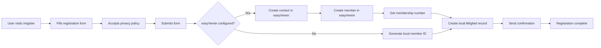

# Member Registration

## Overview

The member registration system allows new members to sign up through a public web form at `/register`. This feature integrates with easyVerein (if configured) to automatically create member records, with a local fallback for offline scenarios.

## Features

- **Public Registration Form**: Accessible at `/register` without authentication
- **easyVerein Integration**: Automatic member creation in easyVerein when API is configured
- **Local Fallback**: Creates local member records even if easyVerein is unavailable
- **Email Validation**: Prevents duplicate registrations with the same email
- **Privacy Policy**: Requires acceptance of privacy policy before submission
- **Configurable Membership Groups**: Support for different membership tiers and pricing

## Configuration

Add these settings to `config/config.json`:

```json
{
  "easyverein_api_key": "YOUR_EASYVEREIN_API_KEY_HERE",
  "easyverein_org_id": "YOUR_ORG_ID_HERE",
  "easyverein_registration_mock": false,
  "easyverein_signup_redirect_url": "",
  "membership_groups": [
    {
      "label": "Regulär (30 €/Monat)",
      "ev_url": "",
      "amount": 30
    },
    {
      "label": "Ermäßigt (15 €/Monat)",
      "ev_url": "",
      "amount": 15
    }
  ]
}
```

### Configuration Keys

| Key | Purpose |
|---|---|
| `easyverein_api_key` | API key for easyVerein integration (optional) |
| `easyverein_org_id` | Organization ID in easyVerein (optional) |
| `easyverein_registration_mock` | Set to `true` to mock easyVerein calls for testing |
| `easyverein_signup_redirect_url` | External URL for signup redirection (optional) |
| `membership_groups` | Array of membership group configurations |

### Membership Group Configuration

Each membership group in `membership_groups` supports:

| Field | Type | Description |
|---|---|---|
| `label` | string | Display label for the membership option |
| `ev_url` | string | easyVerein URL for this membership type (optional) |
| `amount` | number | Monthly payment amount in EUR |

## Registration Flow



## API Endpoints

### `GET /register`

Returns the public registration form page.

**Response**: HTML page with registration form

### `POST /api/register`

Processes a new member registration application.

**Request Body**:
```json
{
  "first_name": "Max",
  "family_name": "Mustermann",
  "email": "max@example.com",
  "date_of_birth": "1990-01-01",
  "mobile_phone": "+491234567890",
  "private_phone": "+491234567891",
  "street": "Musterstraße 1",
  "zip_code": "12345",
  "city": "Musterstadt",
  "country": "Germany",
  "iban": "DE89370400440532013000",
  "bic": "COBADEFFXXX",
  "bank_account_owner": "Max Mustermann",
  "method_of_payment": 1,
  "membership_group_url": "",
  "payment_amount": 30.0,
  "payment_interval_months": 1,
  "salutation": "Herr",
  "privacy_accepted": true
}
```

**Response** (Success):
```json
{
  "success": true,
  "message": "Antrag erfolgreich eingereicht"
}
```

**Response** (with easyVerein warning):
```json
{
  "success": true,
  "message": "Antrag erfolgreich eingereicht",
  "warning": "Antrag lokal gespeichert; easyVerein-Übertragung fehlgeschlagen"
}
```

**Error Responses**:
- `400` - Privacy policy not accepted
- `422` - Missing required fields (name, email)
- `409` - Email already registered

## easyVerein Integration

When `easyverein_api_key` is configured, the registration system:

1. Creates a contact record in easyVerein with personal details
2. Creates a member record linked to the contact
3. Retrieves the membership number from easyVerein
4. Uses the membership number as the local `member_id`

### Rate Limiting

The easyVerein integration uses conservative rate limiting to avoid API errors:
- Page size: 10 records per request
- Request delay: 5 seconds between requests
- Max retries: 3 with exponential backoff (15s, 30s, 45s)

## Local Fallback

If easyVerein is not configured or the API call fails, the system:

1. Generates a local member ID with timestamp: `REG-{timestamp}`
2. Creates a local `Mitglied` record with status "inactive"
3. Stores payment information in the notes field
4. Returns a success response (with warning if easyVerein failed)

## Member Record Structure

Created member records include:

| Field | Source |
|---|---|
| `member_id` | easyVerein membership number or generated local ID |
| `name` | Combined first_name + family_name |
| `email` | From registration form (lowercased) |
| `phone` | mobile_phone or private_phone |
| `status` | Set to "inactive" (requires admin activation) |
| `joined_date` | null (set when activated) |
| `notes` | Registration method and payment details |

## Privacy and Security

- **Email Validation**: Email addresses are normalized (lowercased, trimmed) before storage
- **Duplicate Prevention**: System checks for existing email addresses before registration
- **Privacy Policy**: Registration requires explicit acceptance of privacy policy
- **Data Storage**: All registration data is stored locally in `members.db`
- **API Security**: easyVerein API key is stored in config (not in code)

## Admin Workflow

After registration:

1. Review new registrations in the member list (status: "inactive")
2. Verify payment details in the notes field
3. Activate member by changing status to "active"
4. Assign RFID tag if needed
5. Set joined_date when activation is complete

## Testing

To test registration without easyVerein:

```json
{
  "easyverein_registration_mock": true
}
```

This will simulate easyVerein calls without actually contacting the API.

## Troubleshooting

### easyVerein Registration Fails

Check:
- API key is valid and not expired
- Organization ID is correct
- Internet connectivity from the server
- easyVerein API status

### Email Already Registered

The system prevents duplicate email addresses. If a user needs to register with a new email:
1. Admin should update the existing record's email
2. Or delete the duplicate record if it was created in error

### Local Member ID Collision

The system uses timestamps to avoid ID collisions. In the unlikely event of a collision, it appends the database record ID to ensure uniqueness.

## Related Documentation

- [Configuration Reference](./18-configuration-reference.md) - Full configuration options
- [Authentication](./14-authentication.md) - User authentication and access control
- [Member Area](./15-member-area.md) - Member self-service features