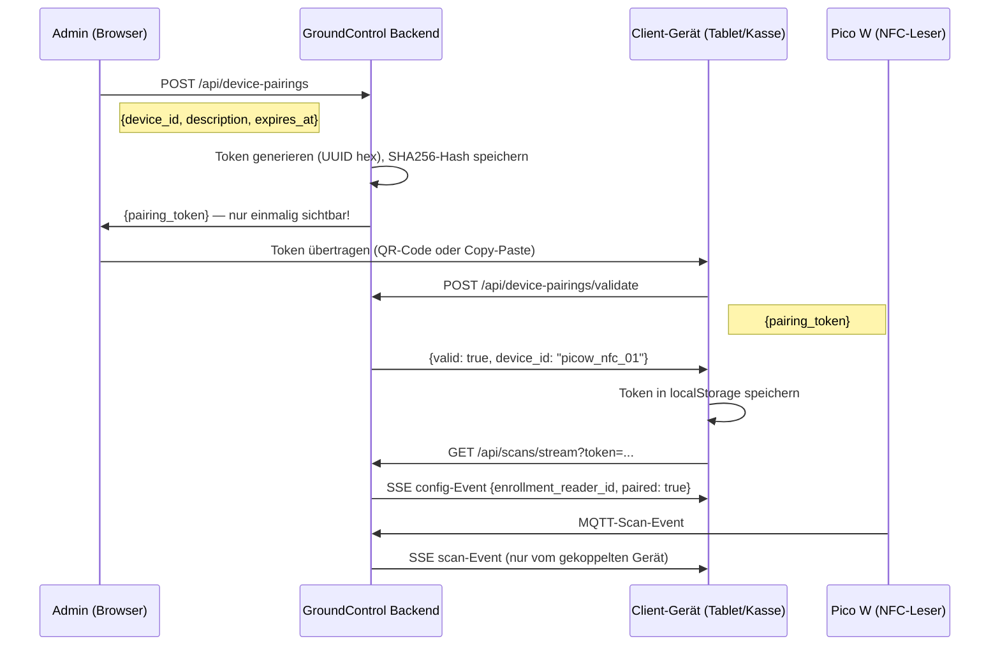

# 20 · Gerätekopplung

Diese Seite erklärt, warum NFC-Lesegeräte mit GroundControl gekoppelt werden müssen,
wie die drei Geräterollen konfiguriert werden und wie ein neues Pico W Schritt für Schritt
in Betrieb genommen wird.

## Warum Gerätekopplung?

GroundControl empfängt MQTT-Nachrichten von allen Pico-W-Geräten. Ohne Kopplung
können Scans von einem beliebigen Gerät eintreffen — das System weiß jedoch nicht,
welches Gerät als Einschreibungsleser, welches an der Kasse und welches als
Kartenschreiber verwendet werden soll.

Erst durch die Kopplung wird ein Gerät einer Rolle zugeordnet:

- **Einschreibungsleser** (`enrollment_reader_id`) — liest neue Karten beim Einschreiben
  von Mitgliedern ein (Mitglieder-UI, SSE-Endpunkt `/api/scans/stream`)
- **Kassenleser** (`payment_reader_id`) — identifiziert Mitglieder beim Bezahlen
  (SSE-Endpunkt `/api/scans/payment-stream`)
- **Kartenschreiber** (`card_writer_id`) — empfängt Schreibbefehle, um Mitgliedsdaten
  auf Mifare-Karten zu schreiben

Ohne eine gültige Rollenzuweisung werden Scans von einem Gerät zwar in `core.db`
gespeichert, aber nicht für Enrollment, Bezahlung oder Laufzettel-Erstellung ausgewertet.

## Geräterolle konfigurieren

Die drei Rollen werden in `config/config.json` gespeichert und können jederzeit über
die Admin-API geändert werden — ohne Neustart.

### Einschreibungsleser

```http
GET  /api/settings/enrollment-reader
PUT  /api/settings/enrollment-reader
```

PUT-Body:
```json
{ "enrollment_reader_id": "picow_nfc_01" }
```

Antwort:
```json
{ "enrollment_reader_id": "picow_nfc_01" }
```

### Kassenleser

```http
GET  /api/settings/payment-reader
PUT  /api/settings/payment-reader
```

PUT-Body:
```json
{ "payment_reader_id": "picow_nfc_02" }
```

### Kartenschreiber

```http
GET  /api/settings/card-writer
PUT  /api/settings/card-writer
```

PUT-Body:
```json
{ "card_writer_id": "picow_nfc_01" }
```

> **Hinweis:** Ein Gerät kann mehrere Rollen gleichzeitig übernehmen (z. B. Einschreibungsleser
> und Kartenschreiber auf demselben Pico W). Die Rollen sind unabhängig voneinander.

## Token-basierte Kopplung

Fur Browser- und PWA-Clients, die wissen mussen, von welchem Gerat Scan-Events kommen,
bietet GroundControl eine Token-basierte Kopplung. Der Token wird einmalig in
`localStorage` des Clients gespeichert und bei jedem SSE-Verbindungsaufbau mitgesendet.

### Ablaufdiagramm



### Kopplung erstellen (Admin)

Seite im Browser: **Admin > Gerätekopplung** (`/admin/device-pairings`)

Oder direkt per API:

```http
POST /api/device-pairings
```

Body:
```json
{
  "device_id": "picow_nfc_01",
  "description": "Kasse Tablet 1",
  "expires_at": "2026-12-31T23:59:59Z",
  "client_ip": null
}
```

Antwort (Token **nur einmalig** in dieser Antwort enthalten):
```json
{
  "id": 3,
  "device_id": "picow_nfc_01",
  "pairing_token": "3f8a2c...",
  "paired_by": "admin",
  "paired_at": "2026-06-01T10:00:00Z",
  "last_used": null,
  "expires_at": "2026-12-31T23:59:59Z",
  "description": "Kasse Tablet 1"
}
```

> **Sicherheitshinweis:** Der Klartext-Token wird nur in dieser einen Antwort
> zuruckgegeben. Das Backend speichert ausschliesslich den SHA256-Hash.
> Geht der Token verloren, muss eine neue Kopplung erstellt werden.

### Token validieren (Client)

```http
POST /api/device-pairings/validate
```

Body:
```json
{ "pairing_token": "3f8a2c..." }
```

Antwort bei gultigem Token:
```json
{
  "valid": true,
  "device_id": "picow_nfc_01",
  "expires_at": "2026-12-31T23:59:59Z"
}
```

Antwort bei ungultigem oder abgelaufenem Token:
```json
{ "valid": false, "error": "Token expired" }
```

## IP-basierte Automatikkopplung

Ist kein Token vorhanden, kann GroundControl ein Gerat anhand seiner IP-Adresse
automatisch zuordnen. Dies funktioniert browser- und gerateUbergreifend auf demselben
Netzwerkgerat (z. B. Kassen-Tablet mit mehreren Browsern oder einer PWA).

```http
GET /api/device-pairings/auto
```

Antwort, wenn eine aktive Kopplung fur die Client-IP vorliegt:
```json
{
  "paired": true,
  "device_id": "picow_nfc_01",
  "description": "Kasse Tablet 1",
  "expires_at": "2026-12-31T23:59:59Z"
}
```

Antwort ohne Treffer:
```json
{ "paired": false }
```

Die IP wird entweder beim Erstellen der Kopplung via `client_ip` im POST-Body
hinterlegt oder automatisch beim ersten `POST /api/device-pairings/validate`-Aufruf
aus dem Request gesetzt.

## Vollstandige API-Referenz

| Methode | Pfad | Auth | Parameter / Body | Beschreibung |
|---|---|---|---|---|
| `GET` | `/admin/device-pairings` | Admin | — | Verwaltungsseite (HTML) |
| `GET` | `/api/device-pairings` | Admin | — | Alle Kopplungen auflisten |
| `POST` | `/api/device-pairings` | Admin | `device_id`, `description`, `expires_at`, `client_ip` | Neue Kopplung erstellen, Token einmalig zuruckgeben |
| `DELETE` | `/api/device-pairings/{id}` | Admin | — | Kopplung widerrufen |
| `POST` | `/api/device-pairings/validate` | Keiner | `pairing_token` | Token validieren, `device_id` zuruckgeben |
| `GET` | `/api/device-pairings/auto` | Keiner | — | IP-basierte Automatikkopplung prufen |
| `GET` | `/api/devices/available-for-pairing` | Admin | — | Ungekoppelte Gerate auflisten |
| `GET` | `/api/settings/enrollment-reader` | Keiner | — | Aktuelle Enrollment-Reader-ID abrufen |
| `PUT` | `/api/settings/enrollment-reader` | Admin | `enrollment_reader_id` | Enrollment-Reader-ID setzen |
| `GET` | `/api/settings/payment-reader` | Keiner | — | Aktuelle Payment-Reader-ID abrufen |
| `PUT` | `/api/settings/payment-reader` | Admin | `payment_reader_id` | Payment-Reader-ID setzen |
| `GET` | `/api/settings/card-writer` | Keiner | — | Aktuelle Card-Writer-ID abrufen |
| `PUT` | `/api/settings/card-writer` | Admin | `card_writer_id` | Card-Writer-ID setzen |

> **Admin** = erfordert `is_admin_verified()` (aktive Admin-Session mit Passwortbestatigung).
> Weitere Details: [Authentifizierung](./14-authentication.md).

## Konfigurationsschlussel

| Schlussel in `config.json` | Env-Variable | Standard | Beschreibung |
|---|---|---|---|
| `enrollment_reader_id` | `ENROLLMENT_READER_ID` | `""` | Device-ID des Einschreibungslesers |
| `payment_reader_id` | `PAYMENT_READER_ID` | `""` | Device-ID des Kassenlesers |
| `card_writer_id` | `CARD_WRITER_ID` | `""` | Device-ID des Kartenschreibers |

Alle drei Werte werden durch `PUT /api/settings/...` sofort in `config/config.json`
persistiert und im laufenden Prozess aktualisiert — kein Neustart erforderlich.

Minimalbeispiel `config/config.json`:
```json
{
  "enrollment_reader_id": "picow_nfc_01",
  "payment_reader_id": "picow_nfc_02",
  "card_writer_id": "picow_nfc_01"
}
```

## Schritt fur Schritt: Neues Pico W einbinden

1. **Pico W flashen und mit WLAN verbinden.**
   Das Gerat verbindet sich zum MQTT-Broker und erscheint nach dem ersten
   Scan oder Heartbeat automatisch in der Gerateliste (`GET /api/devices`).

2. **Gerat identifizieren.**
   Im Admin-Dashboard unter *Gerate* die `device_id` des neuen Pico W ablesen
   (z. B. `picow_nfc_03`).

3. **Rolle zuweisen.**
   Uber das UI unter *Einstellungen > Geraterollen* oder per API:
   ```http
   PUT /api/settings/enrollment-reader
   { "enrollment_reader_id": "picow_nfc_03" }
   ```

4. **Kopplung fur Browser-Clients erstellen (optional, fur SSE-Filterung).**
   Im Admin-Panel unter *Geratekopplung > Neue Kopplung*:
   - `device_id`: `picow_nfc_03`
   - `description`: z. B. `"Einschreibungs-Terminal Raum 1"`
   - Ablaufdatum nach Bedarf setzen

   Den angezeigten Token notieren — er wird **nur einmalig** angezeigt.

5. **Token auf dem Client-Gerat eintragen.**
   Auf dem Ziel-Gerat (Tablet, Kiosk) die GroundControl-Seite offnen und den
   Token eingeben (oder per QR-Code ubertragen). Der Client ruft
   `POST /api/device-pairings/validate` auf und speichert den Token in `localStorage`.

6. **Verbindung testen.**
   Eine NFC-Karte an das Pico W halten. Im Dashboard unter *Scans* muss ein
   neuer Eintrag von `picow_nfc_03` erscheinen. Der gekoppelte SSE-Client
   empfangt das Scan-Event direkt, gefiltert auf dieses Gerat.

7. **(Optional) IP-Kopplung statt Token.**
   Beim `POST /api/device-pairings` die `client_ip` des Tablets angeben.
   Der Browser-Client ruft `GET /api/device-pairings/auto` auf und erhalt
   die `device_id` ohne Token-Verwaltung in `localStorage`.

## Sicherheit: Ablauf und Widerruf

**Token-Ablauf**
Beim Erstellen einer Kopplung kann `expires_at` (ISO 8601 UTC) gesetzt werden.
Nach Ablauf geben `POST /api/device-pairings/validate` und der SSE-Endpunkt
jeweils einen Fehler zuruck (`Token expired`). IP-basierte Kopplungen prufen
`expires_at` ebenfalls.

**Widerruf**
Eine Kopplung kann jederzeit durch einen Admin geloscht werden:
```http
DELETE /api/device-pairings/{id}
```
Ab diesem Moment werden alle Anfragen mit dem zugehorigen Token abgewiesen.
Browser-Clients erhalten beim nachsten SSE-Verbindungsaufbau ein `error`-Event
und konnen den Token aus `localStorage` entfernen.

**Token-Speicherung**
Das Backend speichert niemals den Klartext-Token — nur den SHA256-Hash (`token_hash`
in `DevicePairing`). Selbst bei vollem Datenbankzugriff kann kein guliger Token abgeleitet werden.

## Verwandte Seiten

- [Tags & Laufzettel](./03-tags-and-laufzettel.md) — wie ein RFID-Scan einen Laufzettel erzeugt
- [NFC-Tag-Sicherheit](./16-nfc-tag-security.md) — HMAC-Signaturen und Kartenklonschutz
- [Authentifizierung](./14-authentication.md) — Admin-Session und `is_admin_verified()`
- [MQTT-Datenfluss](./06-mqtt-data-flow.md) — wie Scan-Nachrichten vom Pico W eintreffen
