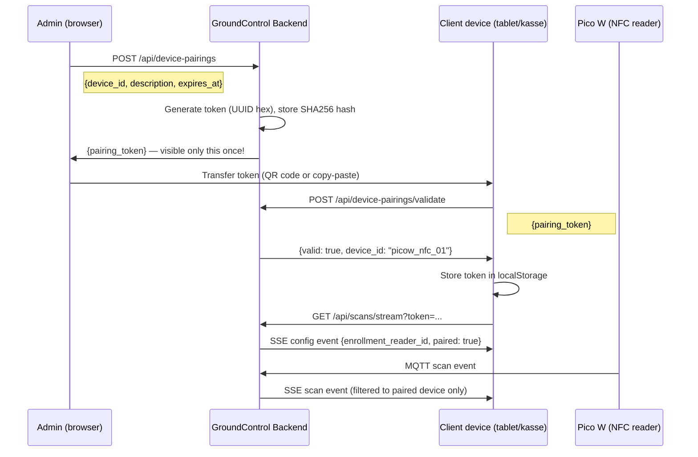

# 20 · Device Pairing

This page explains why NFC readers must be paired with GroundControl, how to configure
the three device roles, and how to bring a new Pico W online from scratch.

## Why device pairing?

GroundControl receives MQTT messages from all Pico W devices. Without pairing, scans
can arrive from any device — but the system has no way of knowing which device is the
enrollment reader, which one is at the cash register, and which one is the card writer.

Pairing assigns a device to a role:

- **Enrollment reader** (`enrollment_reader_id`) — reads cards during member card enrollment
  (Member UI, SSE endpoint `/api/scans/stream`)
- **Payment reader** (`payment_reader_id`) — identifies members at checkout
  (SSE endpoint `/api/scans/payment-stream`)
- **Card writer** (`card_writer_id`) — receives write commands to write member data
  onto Mifare cards

Without a role assignment, scans from a device are still stored in `core.db` but are
not acted upon for enrollment, payment, or Laufzettel creation.

## Configuring device roles

The three roles are stored in `config/config.json` and can be changed at any time via
the admin API — no restart required.

### Enrollment reader

```http
GET  /api/settings/enrollment-reader
PUT  /api/settings/enrollment-reader
```

PUT body:
```json
{ "enrollment_reader_id": "picow_nfc_01" }
```

Response:
```json
{ "enrollment_reader_id": "picow_nfc_01" }
```

### Payment reader

```http
GET  /api/settings/payment-reader
PUT  /api/settings/payment-reader
```

PUT body:
```json
{ "payment_reader_id": "picow_nfc_02" }
```

### Card writer

```http
GET  /api/settings/card-writer
PUT  /api/settings/card-writer
```

PUT body:
```json
{ "card_writer_id": "picow_nfc_01" }
```

> **Note:** A single device can hold multiple roles simultaneously (e.g. enrollment reader
> and card writer on the same Pico W). The roles are independent of one another.

## Token-based pairing

For browser and PWA clients that need to know which device their scan events come from,
GroundControl offers token-based pairing. The token is stored once in the client's
`localStorage` and sent with every SSE connection request.

### Flow diagram



### Creating a pairing (admin)

Browser page: **Admin > Device Pairings** (`/admin/device-pairings`)

Or directly via the API:

```http
POST /api/device-pairings
```

Body:
```json
{
  "device_id": "picow_nfc_01",
  "description": "Kasse Tablet 1",
  "expires_at": "2026-12-31T23:59:59Z",
  "client_ip": null
}
```

Response (token is included **only in this response**):
```json
{
  "id": 3,
  "device_id": "picow_nfc_01",
  "pairing_token": "3f8a2c...",
  "paired_by": "admin",
  "paired_at": "2026-06-01T10:00:00Z",
  "last_used": null,
  "expires_at": "2026-12-31T23:59:59Z",
  "description": "Kasse Tablet 1"
}
```

> **Security note:** The plaintext token is only returned in this response. The backend
> stores only the SHA256 hash. If the token is lost, delete the pairing and create a new one.

### Validating a token (client)

```http
POST /api/device-pairings/validate
```

Body:
```json
{ "pairing_token": "3f8a2c..." }
```

Response for a valid token:
```json
{
  "valid": true,
  "device_id": "picow_nfc_01",
  "expires_at": "2026-12-31T23:59:59Z"
}
```

Response for an invalid or expired token:
```json
{ "valid": false, "error": "Token expired" }
```

When validation succeeds, the backend records the client IP and updates `last_used`
on the `DevicePairing` record, enabling IP-based auto-pairing for that client going forward.

## IP-based auto-pairing

When no token is available, GroundControl can automatically match a client to a pairing
based on its IP address. This works across browsers and PWA instances on the same
network device (e.g. a kasse tablet with multiple browsers open).

```http
GET /api/device-pairings/auto
```

Response when an active pairing matches the client IP:
```json
{
  "paired": true,
  "device_id": "picow_nfc_01",
  "description": "Kasse Tablet 1",
  "expires_at": "2026-12-31T23:59:59Z"
}
```

Response when no match is found:
```json
{ "paired": false }
```

The IP is either set explicitly in the `client_ip` field when creating the pairing via
`POST /api/device-pairings`, or recorded automatically on the first successful
`POST /api/device-pairings/validate` call from that client.

## Full API reference

| Method | Path | Auth | Parameters / Body | Description |
|---|---|---|---|---|
| `GET` | `/admin/device-pairings` | Admin | — | Pairing management page (HTML) |
| `GET` | `/api/device-pairings` | Admin | — | List all pairings |
| `POST` | `/api/device-pairings` | Admin | `device_id`, `description`, `expires_at`, `client_ip` | Create pairing, return token once |
| `DELETE` | `/api/device-pairings/{id}` | Admin | — | Revoke a pairing |
| `POST` | `/api/device-pairings/validate` | None | `pairing_token` | Validate token, return `device_id` |
| `GET` | `/api/device-pairings/auto` | None | — | Check IP-based auto-pairing |
| `GET` | `/api/devices/available-for-pairing` | Admin | — | List devices without an active pairing |
| `GET` | `/api/settings/enrollment-reader` | None | — | Get current enrollment reader ID |
| `PUT` | `/api/settings/enrollment-reader` | Admin | `enrollment_reader_id` | Set enrollment reader ID |
| `GET` | `/api/settings/payment-reader` | None | — | Get current payment reader ID |
| `PUT` | `/api/settings/payment-reader` | Admin | `payment_reader_id` | Set payment reader ID |
| `GET` | `/api/settings/card-writer` | None | — | Get current card writer ID |
| `PUT` | `/api/settings/card-writer` | Admin | `card_writer_id` | Set card writer ID |

> **Admin** = requires `is_admin_verified()` (active admin session with password confirmation).
> See [Authentication](./14-authentication.en.md) for details.

## Configuration keys

| Key in `config.json` | Env variable | Default | Description |
|---|---|---|---|
| `enrollment_reader_id` | `ENROLLMENT_READER_ID` | `""` | Device ID of the enrollment reader |
| `payment_reader_id` | `PAYMENT_READER_ID` | `""` | Device ID of the payment reader |
| `card_writer_id` | `CARD_WRITER_ID` | `""` | Device ID of the card writer |

All three values are persisted to `config/config.json` immediately by the corresponding
`PUT /api/settings/...` call and updated in the running process — no restart needed.

Minimal `config/config.json` example:
```json
{
  "enrollment_reader_id": "picow_nfc_01",
  "payment_reader_id": "picow_nfc_02",
  "card_writer_id": "picow_nfc_01"
}
```

## Step by step: pairing a new Pico W

1. **Flash the Pico W and connect it to Wi-Fi.**
   The device connects to the MQTT broker. After the first scan or heartbeat it appears
   automatically in the device list (`GET /api/devices`).

2. **Identify the device.**
   In the admin dashboard under *Devices*, note the `device_id` of the new Pico W
   (e.g. `picow_nfc_03`).

3. **Assign a role.**
   Via the UI under *Settings > Device Roles*, or directly via the API:
   ```http
   PUT /api/settings/enrollment-reader
   { "enrollment_reader_id": "picow_nfc_03" }
   ```

4. **Create a pairing for browser clients (optional, for SSE event filtering).**
   In the admin panel under *Device Pairings > New Pairing*:
   - `device_id`: `picow_nfc_03`
   - `description`: e.g. `"Enrollment Terminal Room 1"`
   - Set an expiry date if desired

   Copy the displayed token — it is shown **only once**.

5. **Enter the token on the client device.**
   On the target device (tablet, kiosk), open the GroundControl page and enter the token
   (or transfer it via QR code). The client calls `POST /api/device-pairings/validate`
   and stores the token in `localStorage`.

6. **Test the connection.**
   Hold an NFC card to the Pico W. Under *Scans* in the admin dashboard, a new scan
   from `picow_nfc_03` should appear. The paired SSE client receives the scan event
   directly, filtered to this device only.

7. **(Optional) Use IP pairing instead of a token.**
   Provide the `client_ip` of the tablet in the `POST /api/device-pairings` body.
   The browser client then calls `GET /api/device-pairings/auto` and receives the
   `device_id` without any token management in `localStorage`.

## Security: expiry and revocation

**Token expiry**
When creating a pairing, `expires_at` can be set to an ISO 8601 UTC datetime.
After that time, `POST /api/device-pairings/validate` and the SSE endpoints return
an error (`Token expired`). IP-based pairings also check `expires_at`.

**Revocation**
Any pairing can be deleted by an admin at any time:
```http
DELETE /api/device-pairings/{id}
```
From that moment, all requests carrying the associated token are rejected. Browser
clients receive an `error` SSE event on their next connection attempt and can clear
the token from `localStorage`.

**Token storage**
The backend never stores the plaintext token — only the SHA256 hash (`token_hash`
column on `DevicePairing`). Full database read access does not allow an attacker to
derive a valid token.

## Related pages

- [Tags & Laufzettel](./03-tags-and-laufzettel.en.md) — how an RFID scan creates a Laufzettel
- [NFC Tag Security](./16-nfc-tag-security.en.md) — HMAC signatures and card cloning protection
- [Authentication](./14-authentication.en.md) — admin session and `is_admin_verified()`
- [MQTT Data Flow](./06-mqtt-data-flow.en.md) — how scan messages arrive from the Pico W
