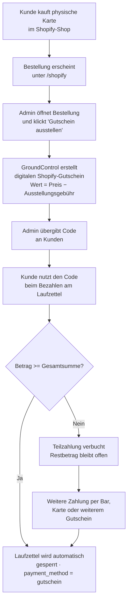
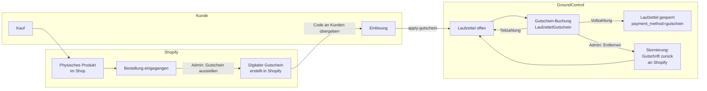

# 21 · Shopify-Gutscheine

Diese Seite beschreibt die zweigeteilte Shopify-Gutschein-Integration: die Verwaltungsoberfläche für physische Geschenkkarten-Bestellungen sowie die Gutschein-Zahlungsfunktion im Laufzettel.

## Übersicht

Die Integration besteht aus zwei unabhängigen, aber zusammenwirkenden Systemen:

| System | Seite / Endpunkt | Zweck |
|--------|-----------------|-------|
| **Shopify-Admin-UI** | `/shopify` | Physische Geschenkkarten-Bestellungen verwalten, digitale Gutscheine ausstellen, Guthaben & Transaktionen einsehen |
| **Gutschein-Zahlung** | `/api/laufzettel/{id}/apply-gutschein` | Shopify-Guthaben auf einen offenen Laufzettel anrechnen (Teil- oder Vollzahlung) |



---

## Konfiguration

In `config/config.json`:

```json
{
  "shopify_store": "dein-shop.myshopify.com",
  "shopify_access_token": "shpat_...",
  "shopify_client_id": "",
  "shopify_client_secret": "",
  "shopify_physical_product_id": "gid://shopify/Product/12345678901234",
  "shopify_gc_creation_fee": 5.0
}
```

Alle Werte können alternativ als Umgebungsvariablen gesetzt werden.

| Konfigurationsschlüssel | Umgebungsvariable | Pflicht | Standardwert | Beschreibung |
|------------------------|-------------------|---------|--------------|--------------|
| `shopify_store` | `SHOPIFY_STORE` | ja | — | Shop-Domain, z. B. `f83098-8d.myshopify.com` |
| `shopify_access_token` | `SHOPIFY_ACCESS_TOKEN` | bedingt | — | Statisches Admin-API-Token (legacy, Custom App) |
| `shopify_client_id` | `SHOPIFY_CLIENT_ID` | bedingt | — | OAuth-Client-ID (Dev-Dashboard-App) |
| `shopify_client_secret` | `SHOPIFY_CLIENT_SECRET` | bedingt | — | OAuth-Client-Secret (Dev-Dashboard-App) |
| `shopify_physical_product_id` | `SHOPIFY_PHYSICAL_PRODUCT_ID` | nein | — | Shopify-GID des physischen Geschenkkarten-Produkts |
| `shopify_gc_creation_fee` | `SHOPIFY_GC_CREATION_FEE` | nein | `5.0` | Ausstellungsgebühr in €, wird vom Kaufpreis abgezogen |

### Authentifizierung: statisches Token vs. OAuth

- **Statisches Token** (`shopify_access_token` gesetzt, `shopify_client_id` leer): Das Token wird direkt aus der Konfiguration verwendet. Geeignet für ältere Custom-Apps.
- **OAuth (client_credentials)** (`shopify_client_id` + `shopify_client_secret` gesetzt): Das Token wird automatisch per `client_credentials`-Grant abgerufen und intern gecacht (Refresh 5 Minuten vor Ablauf). Geeignet für Dev-Dashboard-Apps.

Die App-Konfigurationsseite zeigt einen `shopify_configured`-Status, der `false` ist, wenn weder Token noch Client-Credentials vollständig konfiguriert sind.

---

## Physische Geschenkkarten-Bestellungen (`/shopify`)

Die Seite `/shopify` ist nur für eingeloggte Admins zugänglich und zeigt alle Shopify-Bestellungen, die das konfigurierte physische Geschenkkarten-Produkt enthalten.

### Bestellungsliste

Die Tabelle zeigt:

- Bestellnummer (`#1234`), Datum, Kundename & E-Mail
- Variante (Gutscheinwert), Menge
- Zahlungs- und Fulfillment-Status aus Shopify

Bestellungen werden gefiltert: Es erscheinen nur Bestellungen, deren Positionstext `"physischer"` und `"geschenk"` enthält (Groß-/Kleinschreibung ignoriert).

### Bestellungsdetail

Ein Klick auf eine Bestellung öffnet das Detailpanel mit:

- Vollständigen Kundendaten und Lieferadresse
- Positionsdetails (Produkt, Variante, Einzelpreis, Menge)
- Shopify-Ereignis-Chronik (Events/Timeline)
- Notizfeld, das direkt bearbeitet und gespeichert werden kann
- Button **„Digitalen Gutschein ausstellen"**

### Digitalen Gutschein ausstellen

Der Ausstellungs-Button ruft `POST /api/shopify/physical-product/orders/{order_id}/issue-gift-card` auf.

**Berechnungslogik:**

```
Gutscheinwert = (Einzelpreis − shopify_gc_creation_fee) × Menge
```

Beispiel: Karte à 15,00 € gekauft, `shopify_gc_creation_fee = 5.0` → Gutschein über **10,00 €** wird ausgestellt.

Nach der Ausstellung:
1. Shopify erstellt den digitalen Gutschein und gibt den **vollen Code** einmalig zurück.
2. Der vollständige Code wird in der UI angezeigt — er muss sofort an den Kunden weitergegeben werden, da er danach nicht mehr abrufbar ist.
3. Die Bestellnotiz wird automatisch um eine Zeile ergänzt: `[GC-12345] Gutschein …ABCD über 10.00 € ausgestellt`.

> **Achtung:** Der vollständige Gutscheincode wird von Shopify nur einmalig bei der Erstellung zurückgegeben. Danach sind nur noch die letzten vier Zeichen sichtbar.

---

## Digitale Gutscheine verwalten

Der Tab **„Gutscheine"** auf der Shopify-Seite zeigt alle Shopify-Gutscheine des Shops.

### Gutscheinliste

- Gefiltert nach Status: `enabled` (Standard), `disabled`, oder alle
- Paginierung über den Shopify `Link`-Header (bis zu 250 pro Seite)
- Angezeigt: maskierter Code (`****ABCD`), Anfangswert, aktuelles Guthaben, Währung, Ablaufdatum, Notiz

### Zusammenfassung (Summary)

`GET /api/shopify/gift-cards/summary` liefert eine Aggregation über alle Gutscheine:

```json
{
  "total_cards": 42,
  "active_cards": 18,
  "total_issued_eur": 630.00,
  "total_outstanding_eur": 185.50,
  "total_redeemed_eur": 444.50
}
```

### Gutschein-Detail

Ein Klick auf einen Gutschein öffnet die Detailansicht (via GraphQL) mit:

- Guthaben, Anfangswert, Ablaufdatum
- Verknüpftem Kunden (Name, E-Mail)
- Vollständiger Transaktionshistorie (Belastungen und Gutschriften)

### Suche nach den letzten 4 Zeichen

`GET /api/shopify/gift-cards/lookup?last_chars=ABCD`

Sucht alle aktiven Gutscheine, deren letzten vier Zeichen mit dem angegebenen Wert übereinstimmen (Großschreibung wird automatisch normalisiert). Nützlich, um einen Gutschein anhand der aufgedruckten Kurzkennung zu identifizieren. Kunden- und Notizdaten werden mitgeliefert.

### Guthaben anpassen

`POST /api/shopify/gift-cards/{gift_card_id}/adjust`

```json
{ "amount": 5.00, "note": "Manuelle Korrekturbuchung" }
```

- Positiver Betrag → Gutschrift (`giftCardCredit`-Mutation)
- Negativer Betrag → Belastung (`giftCardDebit`-Mutation)
- Betrag = 0 → HTTP 400

### Gutschein aktivieren / deaktivieren

`POST /api/shopify/gift-cards/{gift_card_id}/toggle`

Prüft zunächst das Feld `disabledAt`: ist es gesetzt, wird der Gutschein reaktiviert (`giftCardUpdate`); ist es nicht gesetzt, wird er deaktiviert (`giftCardDeactivate`).

### Notiz aktualisieren

`PUT /api/shopify/gift-cards/{gift_card_id}/note`

```json
{ "note": "Neue Notiz" }
```

Leere Zeichenkette setzt die Notiz zurück (speichert `null`).

---

## Gutschein auf Laufzettel anrechnen

### Voraussetzung

- Laufzettel ist **nicht bezahlt** (`payment_method` ist `null`)
- Shopify ist konfiguriert und der Gutschein ist aktiv

### Gutschein anwenden

`POST /api/laufzettel/{laufzettel_id}/apply-gutschein`

**Request-Body:**

```json
{
  "shopify_gift_card_id": "987654321",
  "last_chars": "ABCD",
  "amount": 10.00,
  "note": "Optionale interne Notiz"
}
```

| Feld | Typ | Beschreibung |
|------|-----|--------------|
| `shopify_gift_card_id` | string | Numerische Shopify-ID des Gutscheins |
| `last_chars` | string | Letzte 4 Zeichen (zur Anzeige / Nachvollziehbarkeit) |
| `amount` | float | Betrag in €, der belastet werden soll |
| `note` | string | Optionale Notiz zur Buchung |

**Verhalten:**

1. Der angegebene Betrag darf den noch offenen Restbetrag des Laufzettels nicht überschreiten (Toleranz 0,005 €).
2. GroundControl ruft die Shopify-`giftCardDebit`-Mutation auf und belastet den Gutschein sofort.
3. Die Buchung wird als `LaufzettelGutschein`-Eintrag in `laufzettel.db` gespeichert.
4. Wenn der Restbetrag nach der Buchung ≤ 0,005 € beträgt, wird der Laufzettel automatisch gesperrt: `payment_method = "gutschein"`, `paid_at = jetzt`.
5. Bei einem Fehler beim DB-Commit wird ein Kompensations-Credit zurück auf den Shopify-Gutschein gebucht.

**Antwort (Laufzettel-Objekt, angereichert):**

```json
{
  "id": 42,
  "payment_method": "gutschein",
  "paid_at": "2026-06-03T14:30:00Z",
  "gutschein_credits": [
    {
      "id": 1,
      "shopify_gift_card_id": "987654321",
      "last_chars": "ABCD",
      "amount_debited": 10.00,
      "transaction_id": "gid://shopify/GiftCardTransaction/...",
      "applied_at": "2026-06-03T14:30:00Z",
      "applied_by": "admin",
      "note": ""
    }
  ],
  "total_credited": 10.00,
  "remaining_amount": 0.00
}
```

### Teilzahlung

Wenn `amount` kleiner als der offene Betrag ist, bleibt `payment_method` leer. Der Laufzettel kann mit weiteren Gutscheinen oder einer anderen Zahlungsmethode (Bar, Karte) abgeschlossen werden. Das Feld `remaining_amount` zeigt den verbleibenden Restbetrag.

### Vollständige Abdeckung durch Gutschein

Deckt die Summe aller angewendeten Gutscheine den Gesamtbetrag vollständig ab, werden automatisch ausgelöst:
- Laufzettel-Sperre (`payment_method = "gutschein"`)
- PDF-Generierung und Google-Drive-Upload (falls konfiguriert)
- Quittungs-E-Mail an den Kunden (falls konfiguriert)
- Buchhaltungseintrag
- Push-Benachrichtigung

---

## Gutschein-Buchung entfernen

`DELETE /api/laufzettel/{laufzettel_id}/gutschein/{gutschein_id}`

Nur für verifizierte Admins (`is_admin_verified`).

**Verhalten:**

1. Prüft, ob der Laufzettel nicht bereits per anderer Methode bezahlt wurde. (Entfernen ist nur möglich, wenn `payment_method` leer oder `"gutschein"` ist.)
2. Bucht den Betrag als Gutschrift zurück auf den Shopify-Gutschein (`giftCardCredit`, Notiz: `"Stornierung: Laufzettel #ID"`).
3. Löscht den `LaufzettelGutschein`-Eintrag aus der Datenbank.
4. Wenn der Laufzettel durch diesen Gutschein vollständig bezahlt war (`payment_method == "gutschein"`), wird die Sperre aufgehoben: `payment_method = null`, `paid_at = null`.

**Antwort:**

```json
{ "success": true, "refunded": 10.00 }
```

---

## Vollständiger Lebenszyklus



---

## API-Endpunkte

### Shopify-Seite & Gutschein-Verwaltung

| Methode | Endpunkt | Beschreibung |
|---------|----------|--------------|
| `GET` | `/shopify` | Shopify-Verwaltungsseite (HTML) |
| `GET` | `/api/shopify/gift-cards` | Gutscheinliste (`?status=enabled\|disabled\|all&limit=250`) |
| `GET` | `/api/shopify/gift-cards/summary` | Aggregierte Zusammenfassung (Gesamt, ausstehend, eingelöst) |
| `GET` | `/api/shopify/gift-cards/lookup` | Suche nach letzten Zeichen (`?last_chars=ABCD`) |
| `GET` | `/api/shopify/gift-cards/{id}` | Gutschein-Detail mit Transaktionshistorie (GraphQL) |
| `GET` | `/api/shopify/gift-cards/{id}/transactions` | Nur Transaktionen eines Gutscheins |
| `PUT` | `/api/shopify/gift-cards/{id}/note` | Notiz aktualisieren (Body: `{"note": "..."}`) |
| `POST` | `/api/shopify/gift-cards/{id}/adjust` | Guthaben anpassen (Body: `{"amount": ±x, "note": "..."}`) |
| `POST` | `/api/shopify/gift-cards/{id}/toggle` | Gutschein aktivieren / deaktivieren |

### Physische Geschenkkarten-Bestellungen

| Methode | Endpunkt | Beschreibung |
|---------|----------|--------------|
| `GET` | `/api/shopify/physical-product` | Produktdetail mit Varianten und Lagerbestand (GraphQL) |
| `GET` | `/api/shopify/physical-product/orders` | Bestellungen mit dem physischen Produkt (`?limit=50`) |
| `GET` | `/api/shopify/physical-product/orders/{order_id}` | Bestellungsdetail mit Events |
| `PUT` | `/api/shopify/physical-product/orders/{order_id}/note` | Bestellnotiz aktualisieren |
| `POST` | `/api/shopify/physical-product/orders/{order_id}/issue-gift-card` | Digitalen Gutschein für eine Bestellung ausstellen |

### Gutschein-Zahlung im Laufzettel

| Methode | Endpunkt | Beschreibung |
|---------|----------|--------------|
| `POST` | `/api/laufzettel/{id}/apply-gutschein` | Gutschein anrechnen (Teil- oder Vollzahlung) |
| `DELETE` | `/api/laufzettel/{id}/gutschein/{gutschein_id}` | Gutschein-Buchung stornieren und Betrag zurückbuchen |

---

## Fehlerfälle

| HTTP-Status | Ursache |
|-------------|---------|
| `400` | Berechneter Gutscheinwert ≤ 0 (Ausstellungsgebühr zu hoch), Betrag = 0, Betrag übersteigt Restbetrag |
| `403` | Entfernen einer Gutschein-Buchung ohne Admin-Verifikation |
| `404` | Bestellung, Gutschein oder Laufzettel nicht gefunden |
| `409` | Laufzettel bereits bezahlt (apply) oder per anderer Methode bezahlt (remove) |
| `500` | DB-Commit-Fehler nach erfolgreichem Shopify-Debit — Kompensations-Credit wird ausgelöst |
| `502` | Shopify-API nicht erreichbar |
| `503` | Shopify nicht konfiguriert |

---

## Sicherheit

- Der vollständige Gutscheincode wird von Shopify nur einmalig zurückgegeben und sollte sofort an den Kunden übergeben werden.
- Access-Token und Client-Secret gehören in `config/config.json` (gitignored) oder als Umgebungsvariablen — nie in Vorlagen oder Logs.
- Das Entfernen von Gutschein-Buchungen erfordert Admin-Verifikation (`is_admin_verified`).
- Shopify-API-Version: `2024-04`.
