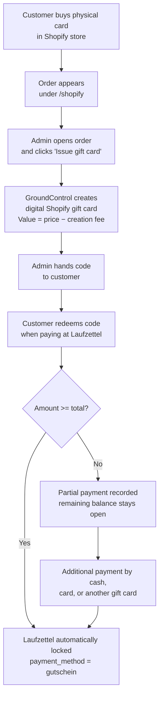
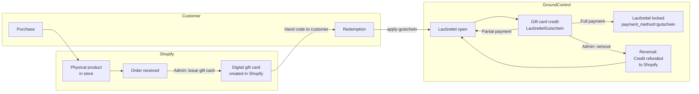

# 21 · Shopify Gift Cards

This page describes the two-part Shopify gift card integration: the admin UI for managing physical gift card orders, and the gift card payment feature inside the Laufzettel workflow.

## Overview

The integration consists of two independent but interrelated systems:

| System | Page / Endpoint | Purpose |
|--------|----------------|---------|
| **Shopify Admin UI** | `/shopify` | Manage physical gift card orders, issue digital gift cards, view balances and transaction history |
| **Gift card payment** | `/api/laufzettel/{id}/apply-gutschein` | Redeem Shopify gift card credit against an open Laufzettel (partial or full payment) |



---

## Configuration

In `config/config.json`:

```json
{
  "shopify_store": "your-shop.myshopify.com",
  "shopify_access_token": "shpat_...",
  "shopify_client_id": "",
  "shopify_client_secret": "",
  "shopify_physical_product_id": "gid://shopify/Product/12345678901234",
  "shopify_gc_creation_fee": 5.0
}
```

All values can alternatively be set as environment variables.

| Config key | Environment variable | Required | Default | Description |
|------------|---------------------|----------|---------|-------------|
| `shopify_store` | `SHOPIFY_STORE` | yes | — | Shop domain, e.g. `f83098-8d.myshopify.com` |
| `shopify_access_token` | `SHOPIFY_ACCESS_TOKEN` | conditional | — | Static Admin API token (legacy, custom app) |
| `shopify_client_id` | `SHOPIFY_CLIENT_ID` | conditional | — | OAuth client ID (Dev Dashboard app) |
| `shopify_client_secret` | `SHOPIFY_CLIENT_SECRET` | conditional | — | OAuth client secret (Dev Dashboard app) |
| `shopify_physical_product_id` | `SHOPIFY_PHYSICAL_PRODUCT_ID` | no | — | Shopify GID of the physical gift card product |
| `shopify_gc_creation_fee` | `SHOPIFY_GC_CREATION_FEE` | no | `5.0` | Fixed creation fee in €, subtracted from purchase price |

### Authentication: static token vs. OAuth

- **Static token** (`shopify_access_token` set, `shopify_client_id` empty): The token is used directly from config. Suitable for older custom apps.
- **OAuth (client_credentials)** (`shopify_client_id` + `shopify_client_secret` set): A token is fetched automatically via the `client_credentials` grant and cached in memory (refreshed 5 minutes before expiry). Suitable for Dev Dashboard apps.

The app shows a `shopify_configured` status that is `false` when neither a token nor complete client credentials are present.

---

## Physical Gift Card Orders (`/shopify`)

The `/shopify` page is accessible to logged-in admins only and lists all Shopify orders containing the configured physical gift card product.

### Order list

The table shows:

- Order number (`#1234`), date, customer name & email
- Variant (gift card value) and quantity
- Financial and fulfillment status from Shopify

Orders are filtered: only orders whose line item title contains both `"physischer"` and `"geschenk"` (case-insensitive) are shown.

### Order detail

Clicking an order opens the detail panel with:

- Full customer data and shipping address
- Line item details (product, variant, unit price, quantity)
- Shopify event timeline
- A note field that can be edited and saved directly
- The **"Issue digital gift card"** button

### Issuing a digital gift card

The issue button calls `POST /api/shopify/physical-product/orders/{order_id}/issue-gift-card`.

**Value calculation:**

```
gift card value = (unit price − shopify_gc_creation_fee) × quantity
```

Example: card sold for 15.00 €, `shopify_gc_creation_fee = 5.0` → gift card worth **10.00 €** is created.

After issuance:
1. Shopify creates the digital gift card and returns the **full code** once only.
2. The full code is shown in the UI — it must be handed to the customer immediately, as it cannot be retrieved afterwards.
3. The order note is automatically appended with: `[GC-12345] Gutschein …ABCD über 10.00 € ausgestellt`.

> **Important:** The full gift card code is returned by Shopify only at creation time. After that, only the last four characters remain visible.

---

## Managing Digital Gift Cards

The **"Gift cards"** tab on the Shopify page lists all gift cards in the shop.

### Gift card list

- Filtered by status: `enabled` (default), `disabled`, or all
- Paginated via the Shopify `Link` header (up to 250 per page)
- Displayed: masked code (`****ABCD`), initial value, current balance, currency, expiry date, note

### Summary

`GET /api/shopify/gift-cards/summary` returns an aggregation across all gift cards:

```json
{
  "total_cards": 42,
  "active_cards": 18,
  "total_issued_eur": 630.00,
  "total_outstanding_eur": 185.50,
  "total_redeemed_eur": 444.50
}
```

### Gift card detail

Clicking a gift card opens the detail view (via GraphQL) with:

- Current balance, initial value, expiry date
- Linked customer (name, email)
- Full transaction history (debits and credits)

### Lookup by last 4 characters

`GET /api/shopify/gift-cards/lookup?last_chars=ABCD`

Searches all active gift cards whose last four characters match the given value (normalised to uppercase automatically). Useful for identifying a card from the short code printed on the physical card. Customer and note data are included in the response.

### Adjusting the balance

`POST /api/shopify/gift-cards/{gift_card_id}/adjust`

```json
{ "amount": 5.00, "note": "Manual correction" }
```

- Positive amount → credit (`giftCardCredit` mutation)
- Negative amount → debit (`giftCardDebit` mutation)
- Amount = 0 → HTTP 400

### Enabling / disabling a gift card

`POST /api/shopify/gift-cards/{gift_card_id}/toggle`

First checks the `disabledAt` field: if set, the card is reactivated (`giftCardUpdate`); if not set, it is deactivated (`giftCardDeactivate`).

### Updating the note

`PUT /api/shopify/gift-cards/{gift_card_id}/note`

```json
{ "note": "New note" }
```

An empty string clears the note (stores `null`).

---

## Applying a Gift Card to a Laufzettel

### Prerequisites

- The Laufzettel is **not yet paid** (`payment_method` is `null`)
- Shopify is configured and the gift card is active

### Apply a gift card

`POST /api/laufzettel/{laufzettel_id}/apply-gutschein`

**Request body:**

```json
{
  "shopify_gift_card_id": "987654321",
  "last_chars": "ABCD",
  "amount": 10.00,
  "note": "Optional internal note"
}
```

| Field | Type | Description |
|-------|------|-------------|
| `shopify_gift_card_id` | string | Numeric Shopify ID of the gift card |
| `last_chars` | string | Last 4 characters (for display / audit trail) |
| `amount` | float | Amount in € to debit |
| `note` | string | Optional note for the transaction |

**Behaviour:**

1. The requested amount must not exceed the remaining open balance of the Laufzettel (tolerance 0.005 €).
2. GroundControl calls the Shopify `giftCardDebit` mutation and debits the card immediately.
3. The transaction is saved as a `LaufzettelGutschein` record in `laufzettel.db`.
4. If the remaining balance after the debit is ≤ 0.005 €, the Laufzettel is automatically locked: `payment_method = "gutschein"`, `paid_at = now`.
5. If the database commit fails, a compensating credit is posted back to the Shopify gift card.

**Response (enriched Laufzettel object):**

```json
{
  "id": 42,
  "payment_method": "gutschein",
  "paid_at": "2026-06-03T14:30:00Z",
  "gutschein_credits": [
    {
      "id": 1,
      "shopify_gift_card_id": "987654321",
      "last_chars": "ABCD",
      "amount_debited": 10.00,
      "transaction_id": "gid://shopify/GiftCardTransaction/...",
      "applied_at": "2026-06-03T14:30:00Z",
      "applied_by": "admin",
      "note": ""
    }
  ],
  "total_credited": 10.00,
  "remaining_amount": 0.00
}
```

### Partial payment

If `amount` is less than the open balance, `payment_method` remains empty. The Laufzettel can be finalised with further gift cards or another payment method (cash, card). The `remaining_amount` field reflects the outstanding balance.

### Full coverage by gift card

When the sum of all applied gift cards covers the total in full, the following are triggered automatically:
- Laufzettel lock (`payment_method = "gutschein"`)
- PDF generation and Google Drive upload (if configured)
- Receipt email to the customer (if configured)
- Accounting entry
- Push notification

---

## Removing an Applied Gift Card Credit

`DELETE /api/laufzettel/{laufzettel_id}/gutschein/{gutschein_id}`

Admin verification (`is_admin_verified`) is required.

**Behaviour:**

1. Checks that the Laufzettel was not already paid by a different method. (Removal is only possible when `payment_method` is empty or `"gutschein"`.)
2. Posts a compensating credit back to the Shopify gift card (`giftCardCredit`, note: `"Stornierung: Laufzettel #ID"`).
3. Deletes the `LaufzettelGutschein` record from the database.
4. If the Laufzettel was fully paid by this gift card (`payment_method == "gutschein"`), the lock is released: `payment_method = null`, `paid_at = null`.

**Response:**

```json
{ "success": true, "refunded": 10.00 }
```

---

## Full Gift Card Lifecycle



---

## API Endpoint Reference

### Shopify page and gift card management

| Method | Endpoint | Description |
|--------|----------|-------------|
| `GET` | `/shopify` | Shopify admin page (HTML) |
| `GET` | `/api/shopify/gift-cards` | Gift card list (`?status=enabled\|disabled\|all&limit=250`) |
| `GET` | `/api/shopify/gift-cards/summary` | Aggregated summary (total, outstanding, redeemed) |
| `GET` | `/api/shopify/gift-cards/lookup` | Search by last characters (`?last_chars=ABCD`) |
| `GET` | `/api/shopify/gift-cards/{id}` | Gift card detail with transaction history (GraphQL) |
| `GET` | `/api/shopify/gift-cards/{id}/transactions` | Transactions for a specific gift card only |
| `PUT` | `/api/shopify/gift-cards/{id}/note` | Update note (body: `{"note": "..."}`) |
| `POST` | `/api/shopify/gift-cards/{id}/adjust` | Adjust balance (body: `{"amount": ±x, "note": "..."}`) |
| `POST` | `/api/shopify/gift-cards/{id}/toggle` | Enable / disable gift card |

### Physical gift card orders

| Method | Endpoint | Description |
|--------|----------|-------------|
| `GET` | `/api/shopify/physical-product` | Product detail with variants and stock (GraphQL) |
| `GET` | `/api/shopify/physical-product/orders` | Orders containing the physical product (`?limit=50`) |
| `GET` | `/api/shopify/physical-product/orders/{order_id}` | Order detail with event timeline |
| `PUT` | `/api/shopify/physical-product/orders/{order_id}/note` | Update order note |
| `POST` | `/api/shopify/physical-product/orders/{order_id}/issue-gift-card` | Issue a digital gift card for an order |

### Gift card payment in Laufzettel

| Method | Endpoint | Description |
|--------|----------|-------------|
| `POST` | `/api/laufzettel/{id}/apply-gutschein` | Apply gift card credit (partial or full payment) |
| `DELETE` | `/api/laufzettel/{id}/gutschein/{gutschein_id}` | Reverse a gift card credit and refund to Shopify |

---

## Error Reference

| HTTP status | Cause |
|-------------|-------|
| `400` | Calculated gift card value ≤ 0 (creation fee too high), amount = 0, amount exceeds remaining balance |
| `403` | Removing a gift card credit without admin verification |
| `404` | Order, gift card, or Laufzettel not found |
| `409` | Laufzettel already paid (apply) or paid by a different method (remove) |
| `500` | DB commit failure after successful Shopify debit — compensating credit is attempted automatically |
| `502` | Shopify API unreachable |
| `503` | Shopify not configured |

---

## Security Notes

- The full gift card code is returned by Shopify only at creation time and should be handed to the customer immediately.
- Access tokens and client secrets belong in `config/config.json` (gitignored) or as environment variables — never in templates or logs.
- Removing gift card credits requires admin verification (`is_admin_verified`).
- Shopify API version in use: `2024-04`.
