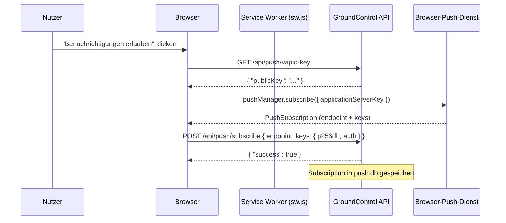
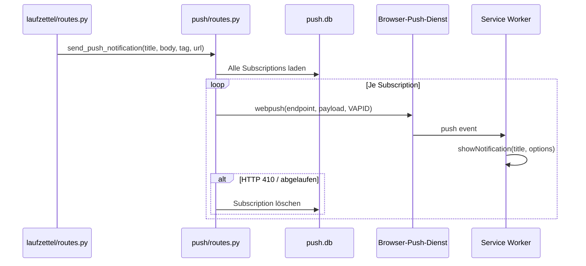

# 23 · Push-Benachrichtigungen

Push-Benachrichtigungen ermöglichen es, dass der Browser (auch bei geschlossenem Tab) eine Systemnachricht anzeigt, sobald im GroundControl ein relevantes Ereignis eintritt — z.B. eine eingegangene Zahlung.

---

## Überblick

GroundControl nutzt den **Web Push**-Standard (RFC 8030) mit VAPID-Authentifizierung. Der Service Worker (`/sw.js`) empfängt die verschlüsselten Push-Nachrichten vom Browser-Push-Dienst und zeigt sie als Systembenachrichtigung an. Ein Klick auf die Benachrichtigung öffnet direkt den zugehörigen Laufzettel.

Benachrichtigungen werden an **alle registrierten Geräte** gesendet — also alle Browser, die sich einmalig angemeldet haben.

---

## Einmalige VAPID-Schlüssel-Einrichtung

VAPID-Schlüssel identifizieren den Server gegenüber dem Browser-Push-Dienst. Sie müssen einmalig erzeugt werden.

### Option A — Automatische Generierung (Standard)

Wenn keine VAPID-Schlüssel in der Konfiguration vorhanden sind, generiert GroundControl beim Start automatisch ein Schlüsselpaar und speichert es unter:

```
config/vapid_private.pem
config/vapid_public.pem
```

Der Speicherpfad kann über `VAPID_KEY_DIR` angepasst werden (Standard: `config`).

### Option B — Manuelle Generierung

```bash
# py-vapid installieren (nur für die Schlüsselgenerierung nötig)
uv run python -c "
from py_vapid import Vapid
v = Vapid()
v.generate_keys()
v.save_key('config/vapid_private.pem')
v.save_public_key('config/vapid_public.pem')
print('Privat:', open('config/vapid_private.pem').read().strip())
print('Public:', open('config/vapid_public.pem').read().strip())
"
```

Die erzeugten Schlüssel können alternativ als Umgebungsvariablen oder in `config/config.json` hinterlegt werden (siehe [Konfigurationsschlüssel](#konfigurationsschlüssel) unten).

> **Wichtig:** Die Schlüsseldateien liegen im `config/`-Verzeichnis (gitignored). Nach einem Deploy auf den Pi bleiben sie erhalten, solange `config/` nicht gelöscht wird.

---

## Konfigurationsschlüssel

| Schlüssel | Typ | Beschreibung |
|---|---|---|
| `VAPID_PRIVATE_KEY` | Umgebungsvariable | PEM-kodierter privater VAPID-Schlüssel (mehrzeilig) |
| `VAPID_PUBLIC_KEY` | Umgebungsvariable | URL-safe-Base64-kodierter öffentlicher Schlüssel |
| `VAPID_KEY_DIR` | Umgebungsvariable | Verzeichnis für automatisch generierte Schlüsseldateien (Standard: `config`) |

In `config/config.json` sind diese Werte **nicht** als JSON-Felder vorgesehen — sie werden ausschließlich als Umgebungsvariablen oder über die automatisch generierten PEM-Dateien eingelesen.

Der VAPID-Claim `sub` ist fest auf `mailto:makerspace@h3cke.de` gesetzt (in `backend/push/routes.py`).

---

## Wie der Browser sich anmeldet

Der gesamte Anmelde-Flow läuft über `static/js/pwa.js` → `window.gcPushSubscribe()`.

### Flow



### API-Endpunkte

| Methode | Endpunkt | Body | Beschreibung |
|---|---|---|---|
| `GET` | `/api/push/vapid-key` | — | Liefert den öffentlichen VAPID-Schlüssel |
| `POST` | `/api/push/subscribe` | `{ "endpoint": "...", "keys": { "p256dh": "...", "auth": "..." } }` | Registriert eine neue Subscription (Upsert) |
| `POST` | `/api/push/unsubscribe` | `{ "endpoint": "..." }` | Löscht eine Subscription |

---

## Benachrichtigungsversand

### Wann werden Benachrichtigungen ausgelöst?

Benachrichtigungen werden in `backend/laufzettel/routes.py` nach jeder erfolgreichen Zahlung gesendet:

| Ereignis | Titel | Nachricht |
|---|---|---|
| Barzahlung erfasst | `Zahlung eingegangen` | `Laufzettel #ID — Barzahlung erfasst` |
| Kartenzahlung (SumUp Solo) | `Zahlung eingegangen` | `Laufzettel #ID — Kartenzahlung (SumUp)` |
| Kartenzahlung (Mock) | `Zahlung eingegangen` | `Laufzettel #ID — Kartenzahlung (Mock)` |
| SumUp Hosted Checkout | `Zahlung eingegangen` | `Laufzettel #ID — Kartenzahlung (Checkout)` |
| Gutschein-Zahlung | `Zahlung eingegangen` | `Laufzettel #ID — Gutschein-Zahlung` |
| Wero-Zahlung (Auto/Mock) | `Zahlung eingegangen` | `Laufzettel #ID — Wero-Zahlung (Auto/Mock)` |
| Wero-Zahlung (manuell bestätigt) | `Zahlung eingegangen` | `Laufzettel #ID – Wero-Zahlung` |

Jede Benachrichtigung enthält einen `tag` (`payment-{id}`) — dadurch ersetzt eine neue Benachrichtigung für denselben Laufzettel die vorherige, anstatt sie anzuhäufen.

Ein Klick auf die Benachrichtigung öffnet `/laufzettel/{id}`.

### Serverinterner Ablauf



Push-Fehler sind nicht-kritisch: Schlägt `send_push_notification()` fehl, wird die Zahlung trotzdem abgeschlossen.

---

## Abmelden

Um Benachrichtigungen im Browser zu deaktivieren:

```js
const reg = await navigator.serviceWorker.ready;
const sub = await reg.pushManager.getSubscription();
if (sub) {
    await fetch('/api/push/unsubscribe', {
        method: 'POST',
        headers: { 'Content-Type': 'application/json' },
        body: JSON.stringify({ endpoint: sub.endpoint }),
    });
    await sub.unsubscribe();
}
```

---

## Browser-Kompatibilität

| Browser | Unterstützung | Hinweis |
|---|---|---|
| Chrome / Edge (Desktop & Android) | Vollständig | Auch als PWA-Installation |
| Firefox (Desktop & Android) | Vollständig | — |
| Safari (macOS 13+, iOS 16.4+) | Vollständig | Erfordert PWA-Installation (zum Home-Bildschirm hinzufügen) auf iOS |
| Safari < macOS 13 / iOS < 16.4 | Nicht unterstützt | Kein Web Push |
| Samsung Internet | Vollständig | Chromium-basiert |

> Auf **iOS** sind Push-Benachrichtigungen nur verfügbar, wenn die App über „Zum Home-Bildschirm hinzufügen" als PWA installiert wurde.

---

## Fehlerbehebung

**Benachrichtigungen kommen nicht an**

1. **VAPID-Schlüssel fehlen** — Beim Start erscheint im Log: `[Push] Warning: Could not generate VAPID keys`. Prüfen, ob `config/` beschreibbar ist oder die Umgebungsvariablen gesetzt sind.
2. **Berechtigung verweigert** — Im Browser unter Einstellungen → Datenschutz / Benachrichtigungen die Berechtigung für die GroundControl-Domain prüfen und ggf. zurücksetzen.
3. **Service Worker nicht registriert** — In den Browser-DevTools (Application → Service Workers) prüfen, ob `/sw.js` aktiv ist. Bei Problemen „Unregister" klicken und die Seite neu laden.
4. **Subscription abgelaufen** — Push-Dienste invalidieren Subscriptions nach längerer Inaktivität. HTTP 410 im Log bedeutet, die Subscription wurde automatisch gelöscht. Der Browser muss sich erneut anmelden.
5. **Falscher öffentlicher Schlüssel** — Wenn `VAPID_PUBLIC_KEY` nach der ersten Subscription geändert wird, schlagen alle bestehenden Subscriptions fehl. Lösung: alle Einträge in `push_subscriptions` (Tabelle in `push.db`) löschen und Clients neu anmelden lassen.
6. **Push-Modul nicht installiert** — `pywebpush` und `py-vapid` müssen in der Umgebung vorhanden sein (`uv sync`).
