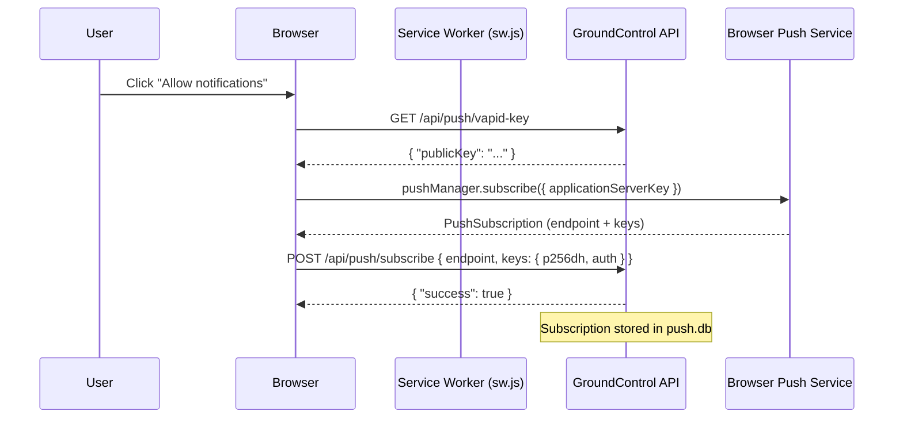
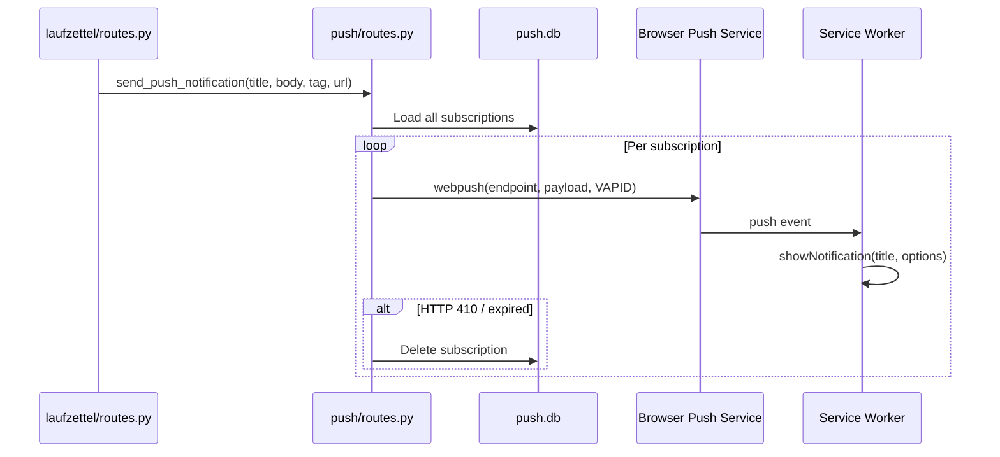

# 23 · Push Notifications

Push notifications let the browser display a system-level alert — even when the tab is closed — as soon as a relevant event occurs in GroundControl, such as a payment being confirmed.

---

## Overview

GroundControl uses the **Web Push** standard (RFC 8030) with VAPID authentication. The service worker (`/sw.js`) receives encrypted push messages from the browser's push service and displays them as system notifications. Clicking a notification navigates directly to the relevant Laufzettel.

Notifications are sent to **all registered devices** — every browser that has subscribed at least once.

---

## One-time VAPID Key Setup

VAPID keys identify the server to the browser's push service. They only need to be generated once.

### Option A — Automatic Generation (Default)

If no VAPID keys are present in the configuration, GroundControl automatically generates a key pair on startup and stores it at:

```
config/vapid_private.pem
config/vapid_public.pem
```

The storage path can be changed via `VAPID_KEY_DIR` (default: `config`).

### Option B — Manual Generation

```bash
# Install py-vapid (only needed for key generation)
uv run python -c "
from py_vapid import Vapid
v = Vapid()
v.generate_keys()
v.save_key('config/vapid_private.pem')
v.save_public_key('config/vapid_public.pem')
print('Private:', open('config/vapid_private.pem').read().strip())
print('Public:', open('config/vapid_public.pem').read().strip())
"
```

The generated keys can alternatively be supplied as environment variables or placed in `config/config.json` (see [Config Keys](#config-keys) below).

> **Important:** The key files live in the `config/` directory (gitignored). They persist across deployments to the Pi as long as `config/` is not deleted.

---

## Config Keys

| Key | Type | Description |
|---|---|---|
| `VAPID_PRIVATE_KEY` | Environment variable | PEM-encoded private VAPID key (multi-line) |
| `VAPID_PUBLIC_KEY` | Environment variable | URL-safe Base64-encoded public key |
| `VAPID_KEY_DIR` | Environment variable | Directory for auto-generated key files (default: `config`) |

These values are **not** defined as fields in `config/config.json` — they are read exclusively from environment variables or from the auto-generated PEM files.

The VAPID `sub` claim is hardcoded to `mailto:makerspace@h3cke.de` in `backend/push/routes.py`.

---

## How the Browser Subscribes

The entire subscribe flow runs through `static/js/pwa.js` → `window.gcPushSubscribe()`.

### Flow



### API Endpoints

| Method | Endpoint | Body | Description |
|---|---|---|---|
| `GET` | `/api/push/vapid-key` | — | Returns the public VAPID key |
| `POST` | `/api/push/subscribe` | `{ "endpoint": "...", "keys": { "p256dh": "...", "auth": "..." } }` | Registers a new subscription (upsert) |
| `POST` | `/api/push/unsubscribe` | `{ "endpoint": "..." }` | Removes a subscription |

---

## Notification Delivery

### When Are Notifications Triggered?

Notifications are fired in `backend/laufzettel/routes.py` after every successful payment:

| Event | Title | Body |
|---|---|---|
| Cash payment recorded | `Zahlung eingegangen` | `Laufzettel #ID — Barzahlung erfasst` |
| Card payment (SumUp Solo) | `Zahlung eingegangen` | `Laufzettel #ID — Kartenzahlung (SumUp)` |
| Card payment (Mock) | `Zahlung eingegangen` | `Laufzettel #ID — Kartenzahlung (Mock)` |
| SumUp Hosted Checkout | `Zahlung eingegangen` | `Laufzettel #ID — Kartenzahlung (Checkout)` |
| Gift card payment | `Zahlung eingegangen` | `Laufzettel #ID — Gutschein-Zahlung` |
| Wero payment (auto/mock) | `Zahlung eingegangen` | `Laufzettel #ID — Wero-Zahlung (Auto/Mock)` |
| Wero payment (manually confirmed) | `Zahlung eingegangen` | `Laufzettel #ID – Wero-Zahlung` |

Each notification carries a `tag` (`payment-{id}`) — this means a new notification for the same Laufzettel replaces the previous one instead of stacking.

Clicking a notification opens `/laufzettel/{id}`.

### Server-Side Flow



Push errors are non-critical: if `send_push_notification()` raises an exception, the payment is still completed successfully.

---

## Unsubscribing

To stop receiving notifications in a browser:

```js
const reg = await navigator.serviceWorker.ready;
const sub = await reg.pushManager.getSubscription();
if (sub) {
    await fetch('/api/push/unsubscribe', {
        method: 'POST',
        headers: { 'Content-Type': 'application/json' },
        body: JSON.stringify({ endpoint: sub.endpoint }),
    });
    await sub.unsubscribe();
}
```

---

## Browser Compatibility

| Browser | Support | Notes |
|---|---|---|
| Chrome / Edge (Desktop & Android) | Full | Including PWA installation |
| Firefox (Desktop & Android) | Full | — |
| Safari (macOS 13+, iOS 16.4+) | Full | iOS requires PWA installation (Add to Home Screen) |
| Safari < macOS 13 / iOS < 16.4 | Not supported | No Web Push API |
| Samsung Internet | Full | Chromium-based |

> On **iOS**, push notifications are only available when the app has been installed as a PWA via "Add to Home Screen".

---

## Troubleshooting

**Notifications are not arriving**

1. **VAPID keys missing** — The log shows `[Push] Warning: Could not generate VAPID keys` on startup. Check that `config/` is writable or that the environment variables are set.
2. **Permission denied** — In the browser's settings (Privacy / Notifications), check and reset the notification permission for the GroundControl domain.
3. **Service worker not registered** — In the browser DevTools (Application → Service Workers), confirm `/sw.js` is active. If not, click "Unregister" and reload the page.
4. **Subscription expired** — Push services invalidate subscriptions after prolonged inactivity. An HTTP 410 in the log means the subscription has been automatically removed. The browser needs to re-subscribe.
5. **Wrong public key** — If `VAPID_PUBLIC_KEY` is changed after the first subscription was created, all existing subscriptions will fail. Fix: delete all rows in the `push_subscriptions` table in `push.db` and have clients re-subscribe.
6. **Push module not installed** — `pywebpush` and `py-vapid` must be present in the environment (`uv sync`).
