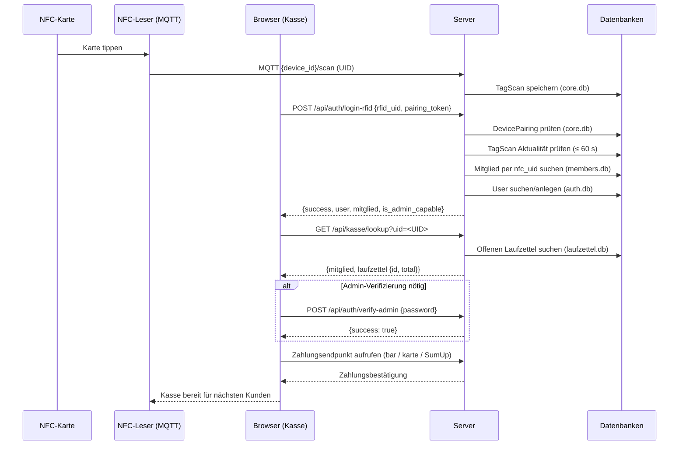

# 24 · Kasse & RFID-Login

Diese Seite beschreibt die Kassenseite — einen eigenständigen Zahlungs-Kiosk, der ohne vollständiges Browser-Login auskommt — sowie den RFID-basierten Login-Mechanismus und die zugehörigen API-Endpunkte.

## Übersicht

Die Kassenseite (`/kasse`) ist ein schlankes Terminal-Interface, das für den Einsatz auf einem Tablet oder einem fest installierten Kassenrechner entworfen wurde. Es gelten folgende Besonderheiten:

- **Kein vollständiges Browser-Login erforderlich** — die Seite ist öffentlich erreichbar.
- Mitglieder authentifizieren sich durch einen **NFC-Kartentipp**.
- Die Kasse liest den offenen Laufzettel des Mitglieds und leitet den Zahlungsvorgang ein.
- Ein **Admin-Karten-Tap** schaltet die Verwaltungsberechtigungen für die laufende Session frei.
- Für die Kartenzahlung wird das per `payment_reader_id` konfigurierte SumUp-Terminal angesprochen.

---

## RFID-Login-Ablauf

### Voraussetzungen

1. Der NFC-Leser muss als **Gerät** in GroundControl registriert und **gekoppelt** sein (→ Dok. [20 · Gerätekopplung](./20-device-pairing)).
2. Der Browser, auf dem die Kasse läuft, muss einen gültigen **Pairing-Token** besitzen oder sich innerhalb einer gekoppelten IP befinden.
3. Die NFC-Karte des Mitglieds muss in `members.db` unter `nfc_uid` hinterlegt sein.

### Ablauf Schritt für Schritt

| Schritt | Was passiert |
|---------|-------------|
| 1 | Mitglied hält Karte an den Leser |
| 2 | MQTT-Nachricht landet in `core.db` als `TagScan` |
| 3 | Kasse ruft `POST /api/auth/login-rfid` mit `rfid_uid` + `pairing_token` auf |
| 4 | Server prüft Pairing-Token (SHA-256-Hash gegen `DevicePairing`) |
| 5 | Server prüft, ob ein `TagScan` für diese (UID, Gerät)-Kombination in den letzten **60 Sekunden** existiert |
| 6 | Mitglied wird in `members.db` per `nfc_uid` gesucht (Fallback: `RFIDTag.member_id`) |
| 7 | User-Eintrag in `auth.db` wird gesucht oder neu angelegt |
| 8 | Session wird gesetzt; `login_method = "rfid"`, `admin_verified = False` |
| 9 | Antwort enthält `is_admin_capable` — wenn `true`, kann Admin-Modus aktiviert werden |

### Automatische User-Erstellung

Wenn für das Mitglied noch kein `User`-Eintrag in `auth.db` existiert, wird er **automatisch angelegt**:

- `username` = echter Name des Mitglieds (oder `member_<id>` bei Namenskollision)
- `role` = `"admin"` wenn `RFIDTag.is_admin = true`, sonst `"member"`
- `hashed_password` = leer (kein Passwort-Login über diesen User)

### Admin-Karte

Ist die Karte in der `rfid_tags`-Tabelle mit `is_admin = true` markiert:

- `is_admin_capable` wird in der Session auf `true` gesetzt.
- Die Session startet dennoch mit `admin_verified = False` — Admin-Modus muss explizit aktiviert werden (Passwort-Eingabe oder Admin-Karten-Verify-Endpunkt).

---

## Vollständiger Kassen-Ablauf (Sequenzdiagramm)



---

## API-Endpunkte

### Gesamtübersicht

| Methode | Pfad | Beschreibung |
|---------|------|--------------|
| `GET` | `/kasse` | Kassenseite (HTML, kein Login erforderlich) |
| `POST` | `/api/auth/login-rfid` | Mitglied per NFC-Karte einloggen |
| `GET` | `/api/kasse/lookup` | Offenen Laufzettel per UID abrufen |
| `POST` | `/api/kasse/verify-admin-card` | Admin-Session per NFC-Karte erzeugen |
| `POST` | `/api/auth/verify-admin` | Admin-Modus per Passwort eskalieren |
| `POST` | `/api/auth/verify-admin-auto` | Admin-Modus ohne Passwort (nur `login_method=password`) |
| `POST` | `/api/auth/logout-admin` | Admin-Modus beenden, zurück zur Mitgliederansicht |

---

### `POST /api/auth/login-rfid`

Login eines Mitglieds über NFC-Karte. Erfordert ein gekoppeltes Gerät.

**Request-Body (JSON):**

| Feld | Typ | Pflicht | Beschreibung |
|------|-----|---------|--------------|
| `rfid_uid` | `string` | ja | Karten-UID (wird intern uppercased) |
| `pairing_token` | `string` | empfohlen | Pairing-Token des Lesers. Fallback: IP-basiertes Auto-Pairing |

**Erfolgsantwort `200`:**

```json
{
  "success": true,
  "user": {
    "id": 42,
    "username": "Max Mustermann",
    "role": "member",
    "mitglied_id": 7
  },
  "mitglied": { "id": 7, "name": "Max Mustermann", "member_id": "M-042", "..." },
  "is_admin_capable": false,
  "redirect": "/member",
  "stale_laufzettel": "closed"
}
```

**Fehler-Codes:**

| HTTP | `error` | Ursache |
|------|---------|---------|
| `403` | `Ungültiger Pairing-Token` | Token unbekannt |
| `403` | `Pairing-Token abgelaufen` | Token überschritten Ablaufdatum |
| `403` | `Gerät nicht verbunden — bitte zuerst koppeln` | Kein Token, keine IP-Kopplung |
| `403` | `Pairing abgelaufen` | IP-Kopplung abgelaufen |
| `403` | `Kein Scan vom gekoppelten Leser erkannt — bitte erneut scannen` | Kein TagScan in DB |
| `403` | `Scan zu alt — bitte erneut scannen` | Letzter Scan älter als 60 Sekunden |
| `404` | `Unknown RFID card` | UID in keiner Tabelle gefunden |
| `404` | `No member associated with this card` | Tag bekannt, aber kein Mitglied verknüpft |

---

### `GET /api/kasse/lookup`

Sucht den offenen (unbezahlten) Laufzettel eines Mitglieds anhand der NFC-UID.

**Query-Parameter:**

| Parameter | Typ | Beschreibung |
|-----------|-----|--------------|
| `uid` | `string` | NFC-UID des Mitglieds (wird uppercased) |

**Erfolgsantwort `200`:**

```json
{
  "mitglied": {
    "id": 7,
    "name": "Max Mustermann",
    "member_id": "M-042"
  },
  "laufzettel": {
    "id": 123,
    "date": "2026-06-03",
    "material_count": 5,
    "total": 12.80
  }
}
```

**Fehler-Codes:**

| HTTP | `error` | Ursache |
|------|---------|---------|
| `404` | `Unbekannte Karte` | UID keinem Mitglied zugeordnet |
| `404` | `Kein offener Laufzettel gefunden` | Mitglied gefunden, aber kein offener Laufzettel |

> Die Antwort enthält im 404-Fall `"mitglied": "<Name>"` wenn das Mitglied gefunden wurde.

---

### `POST /api/kasse/verify-admin-card`

Erzeugt eine Admin-Session durch Tippen einer Admin-NFC-Karte. Nützlich, wenn ein Admin-Mitarbeiter Zahlungen freigeben möchte, ohne sich am Browser einzuloggen.

**Request-Body (JSON):**

| Feld | Typ | Pflicht | Beschreibung |
|------|-----|---------|--------------|
| `rfid_uid` | `string` | ja | UID der Admin-Karte |

**Prüflogik:**

1. `RFIDTag.is_admin = true` und `RFIDTag.active = 1` → Admin
2. Fallback: `Mitglied.nfc_uid` → `User.role = "admin"` → Admin

**Erfolgsantwort `200`:**

```json
{ "success": true }
```

Die Session wird gesetzt mit `admin_verified = true`, `admin_verified_at = <jetzt>`.

**Fehler-Codes:**

| HTTP | `error` | Ursache |
|------|---------|---------|
| `400` | `Keine UID` | Leeres `rfid_uid`-Feld |
| `403` | `Keine Admin-Berechtigung` | Karte nicht als Admin markiert |

---

### `POST /api/auth/verify-admin`

Eskaliert die laufende Session auf Admin-Modus durch Passwort-Eingabe. Gültig für **10 Minuten Inaktivität**.

**Form-Daten:**

| Feld | Beschreibung |
|------|--------------|
| `password` | Admin-Passwort |

**Erfolgsantwort `200`:** `{ "success": true }`

**Fehler `403`:** `{ "success": false, "error": "Invalid password or not admin" }`

---

### `POST /api/auth/verify-admin-auto`

Eskaliert auf Admin-Modus **ohne Passwort**, aber nur wenn `login_method = "password"` (Passwort-Login, nicht RFID). Wird z. B. verwendet, wenn ein Admin-User sich gerade per Passwort eingeloggt hat.

**Fehler-Codes:**

| HTTP | `error` | Ursache |
|------|---------|---------|
| `403` | `Not admin capable` | Session hat keine Admin-Berechtigung |
| `403` | `requires_password` | `login_method` ist nicht `"password"` |

---

### `POST /api/auth/logout-admin`

Beendet den Admin-Modus der aktuellen Session (setzt `admin_verified = false`). Die reguläre Mitglieder-Session bleibt bestehen. Leitet auf `/member` weiter.

---

## Hardware-Einrichtung

Die Kassenseite benötigt einen dedizierten NFC-Leser, der als **Payment-Reader** konfiguriert ist.

### Konfiguration in `config/config.json`

```json
{
  "payment_reader_id": "<device_id des NFC-Lesers>"
}
```

| Schlüssel | Env-Variable | Beschreibung |
|-----------|-------------|--------------|
| `payment_reader_id` | `PAYMENT_READER_ID` | Geräte-ID des NFC-Lesers an der Kasse |
| `enrollment_reader_id` | `ENROLLMENT_READER_ID` | Geräte-ID des Einschreibe-Lesers (separat) |

### Schritte

1. NFC-Leser am Raspberry Pi anschließen und einschalten.
2. Gerät taucht automatisch in der Geräteliste (`/database`) auf, sobald die erste MQTT-Nachricht eintrifft.
3. Gerät koppeln — Anleitung in Dok. [20 · Gerätekopplung](./20-device-pairing).
4. `payment_reader_id` in `config/config.json` auf die Geräte-ID setzen.
5. App neu starten oder `update_config()` verwenden.

---

## Troubleshooting

### "Scan zu alt — bitte erneut scannen"

Der Browser hat `POST /api/auth/login-rfid` mehr als 60 Sekunden nach dem tatsächlichen Karten-Tap aufgerufen. Ursachen:

- Langsame Netzwerkverbindung zwischen MQTT-Broker und Server
- Kasse hat den Tap nicht sofort an die API weitergegeben
- Zeitdrift zwischen NFC-Leser und Pi → NTP prüfen

### "Gerät nicht verbunden — bitte zuerst koppeln"

Der Browser sendet keinen `pairing_token` und die Client-IP ist keiner Kopplung zugeordnet. Gerät koppeln (→ Dok. [20 · Gerätekopplung](./20-device-pairing)) oder Token im Kassen-Frontend hinterlegen.

### Admin-Modus wird nicht aktiviert

- Karte in der Admin-RFID-Tabelle überprüfen (`is_admin = true`, `active = 1`)
- Alternativ: `User.role = "admin"` in `auth.db` prüfen
- Bei Passwort-Eingabe: 10-Minuten-Timeout beachten (`is_admin_verified()`)
