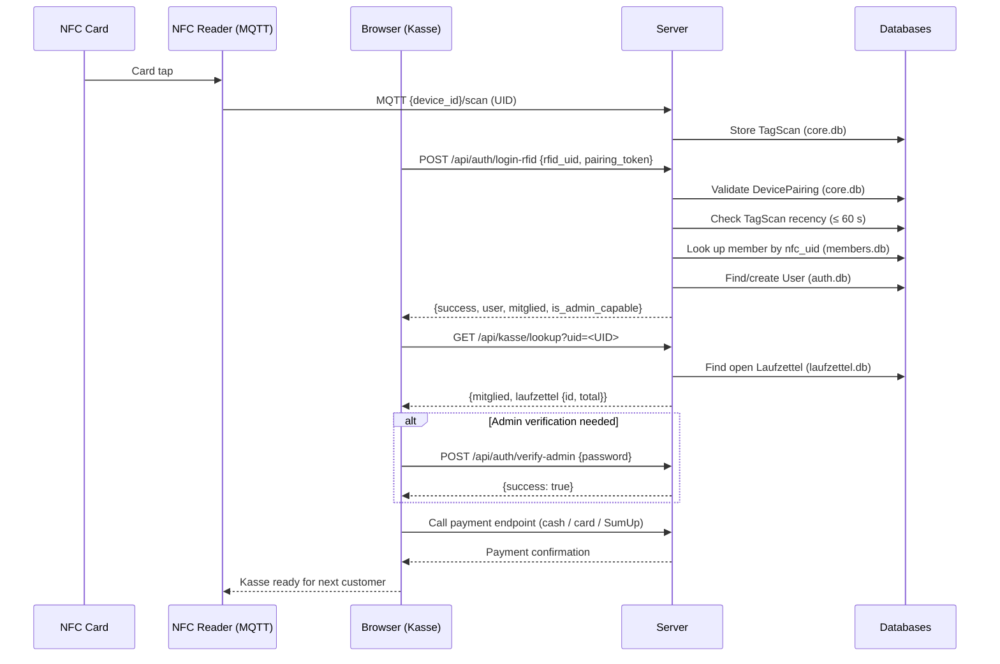

# 24 · Kasse & RFID Login

This page describes the Kasse (cashier/payment kiosk) page — a standalone checkout terminal that requires no full browser login — as well as the RFID-based login mechanism and all related API endpoints.

## Overview

The Kasse page (`/kasse`) is a lightweight terminal interface designed for use on a tablet or a fixed point-of-sale device. Key characteristics:

- **No full browser login required** — the page is publicly accessible.
- Members authenticate by **tapping their NFC card**.
- The Kasse fetches the member's open Laufzettel and initiates the payment flow.
- An **admin card tap** grants elevated permissions for the current session.
- Card payments are processed through the SumUp terminal configured via `payment_reader_id`.

---

## RFID Login Flow

### Prerequisites

1. The NFC reader must be registered as a **device** in GroundControl and **paired** (→ doc [20 · Device Pairing](./20-device-pairing)).
2. The browser running the Kasse must hold a valid **pairing token** or be on a paired IP address.
3. The member's NFC card UID must be stored in `members.db` under `nfc_uid`.

### Step by Step

| Step | What happens |
|------|-------------|
| 1 | Member holds card to the reader |
| 2 | MQTT message arrives in `core.db` as a `TagScan` |
| 3 | Kasse calls `POST /api/auth/login-rfid` with `rfid_uid` + `pairing_token` |
| 4 | Server validates the pairing token (SHA-256 hash against `DevicePairing`) |
| 5 | Server checks that a `TagScan` exists for this (UID, device) pair within the last **60 seconds** |
| 6 | Member is looked up in `members.db` by `nfc_uid` (fallback: `RFIDTag.member_id`) |
| 7 | `User` record in `auth.db` is found or created automatically |
| 8 | Session is set: `login_method = "rfid"`, `admin_verified = False` |
| 9 | Response contains `is_admin_capable` — if `true`, admin mode can be escalated |

### Automatic User Creation

If no `User` record exists yet for the member in `auth.db`, one is **created automatically**:

- `username` = member's real name (or `member_<id>` on name collision)
- `role` = `"admin"` if `RFIDTag.is_admin = true`, otherwise `"member"`
- `hashed_password` = empty (no password login via this user)

### Admin Card

If the card is marked `is_admin = true` in the `rfid_tags` table:

- `is_admin_capable` is set to `true` in the session.
- The session still starts with `admin_verified = False` — admin mode must be explicitly activated (password entry or admin-card verify endpoint).

---

## Full Kasse Workflow (Sequence Diagram)



---

## API Endpoints

### Overview

| Method | Path | Description |
|--------|------|-------------|
| `GET` | `/kasse` | Kasse page (HTML, no login required) |
| `POST` | `/api/auth/login-rfid` | Log in a member via NFC card |
| `GET` | `/api/kasse/lookup` | Fetch open Laufzettel by NFC UID |
| `POST` | `/api/kasse/verify-admin-card` | Create admin session via NFC card |
| `POST` | `/api/auth/verify-admin` | Escalate to admin mode via password |
| `POST` | `/api/auth/verify-admin-auto` | Escalate without password (only if `login_method=password`) |
| `POST` | `/api/auth/logout-admin` | Drop admin mode, return to member view |

---

### `POST /api/auth/login-rfid`

Logs in a member via NFC card tap. Requires a paired device.

**Request body (JSON):**

| Field | Type | Required | Description |
|-------|------|----------|-------------|
| `rfid_uid` | `string` | yes | Card UID (uppercased internally) |
| `pairing_token` | `string` | recommended | Reader's pairing token. Fallback: IP-based auto-pairing |

**Success response `200`:**

```json
{
  "success": true,
  "user": {
    "id": 42,
    "username": "Max Mustermann",
    "role": "member",
    "mitglied_id": 7
  },
  "mitglied": { "id": 7, "name": "Max Mustermann", "member_id": "M-042", "..." },
  "is_admin_capable": false,
  "redirect": "/member",
  "stale_laufzettel": "closed"
}
```

**Error codes:**

| HTTP | `error` | Cause |
|------|---------|-------|
| `403` | `Ungültiger Pairing-Token` | Token unknown |
| `403` | `Pairing-Token abgelaufen` | Token past expiry |
| `403` | `Gerät nicht verbunden — bitte zuerst koppeln` | No token and no IP pairing found |
| `403` | `Pairing abgelaufen` | IP-based pairing expired |
| `403` | `Kein Scan vom gekoppelten Leser erkannt — bitte erneut scannen` | No TagScan record found |
| `403` | `Scan zu alt — bitte erneut scannen` | Most recent scan is older than 60 seconds |
| `404` | `Unknown RFID card` | UID not found in any table |
| `404` | `No member associated with this card` | Tag known but no member linked |

---

### `GET /api/kasse/lookup`

Returns the open (unpaid) Laufzettel for a member identified by NFC UID.

**Query parameters:**

| Parameter | Type | Description |
|-----------|------|-------------|
| `uid` | `string` | Member's NFC UID (uppercased internally) |

**Success response `200`:**

```json
{
  "mitglied": {
    "id": 7,
    "name": "Max Mustermann",
    "member_id": "M-042"
  },
  "laufzettel": {
    "id": 123,
    "date": "2026-06-03",
    "material_count": 5,
    "total": 12.80
  }
}
```

**Error codes:**

| HTTP | `error` | Cause |
|------|---------|-------|
| `404` | `Unbekannte Karte` | UID not associated with any member |
| `404` | `Kein offener Laufzettel gefunden` | Member found but no open Laufzettel exists |

> In the 404 case where the member was found, the response also includes `"mitglied": "<name>"`.

---

### `POST /api/kasse/verify-admin-card`

Creates an admin session by tapping an admin NFC card. Useful when a staff member needs to authorise payments without typing a password in the browser.

**Request body (JSON):**

| Field | Type | Required | Description |
|-------|------|----------|-------------|
| `rfid_uid` | `string` | yes | UID of the admin card |

**Validation logic:**

1. `RFIDTag.is_admin = true` and `RFIDTag.active = 1` → admin
2. Fallback: `Mitglied.nfc_uid` → `User.role = "admin"` → admin

**Success response `200`:**

```json
{ "success": true }
```

Session is set with `admin_verified = true`, `admin_verified_at = <now>`.

**Error codes:**

| HTTP | `error` | Cause |
|------|---------|-------|
| `400` | `Keine UID` | Empty `rfid_uid` field |
| `403` | `Keine Admin-Berechtigung` | Card not flagged as admin |

---

### `POST /api/auth/verify-admin`

Escalates the current session to admin mode via password entry. Valid for **10 minutes of inactivity**.

**Form data:**

| Field | Description |
|-------|-------------|
| `password` | Admin password |

**Success response `200`:** `{ "success": true }`

**Error `403`:** `{ "success": false, "error": "Invalid password or not admin" }`

---

### `POST /api/auth/verify-admin-auto`

Escalates to admin mode **without a password**, but only when `login_method = "password"` (i.e. the user just signed in with a password, not via RFID). Used e.g. when an admin user has already authenticated in the same browser session.

**Error codes:**

| HTTP | `error` | Cause |
|------|---------|-------|
| `403` | `Not admin capable` | Session has no admin capability |
| `403` | `requires_password` | `login_method` is not `"password"` |

---

### `POST /api/auth/logout-admin`

Drops admin mode for the current session (sets `admin_verified = false`). The regular member session remains intact. Redirects to `/member`.

---

## Hardware Setup

The Kasse page requires a dedicated NFC reader configured as the **payment reader**.

### Configuration in `config/config.json`

```json
{
  "payment_reader_id": "<device_id of the NFC reader>"
}
```

| Key | Env variable | Description |
|-----|-------------|-------------|
| `payment_reader_id` | `PAYMENT_READER_ID` | Device ID of the NFC reader at the Kasse |
| `enrollment_reader_id` | `ENROLLMENT_READER_ID` | Device ID of the enrolment reader (separate) |

### Steps

1. Connect and power on the NFC reader on the Raspberry Pi.
2. The device will appear automatically in the device list (`/database`) once the first MQTT message arrives.
3. Pair the device — see doc [20 · Device Pairing](./20-device-pairing).
4. Set `payment_reader_id` in `config/config.json` to the device's ID.
5. Restart the app or call `update_config()`.

---

## Troubleshooting

### "Scan zu alt — bitte erneut scannen" (Scan too old)

The browser sent `POST /api/auth/login-rfid` more than 60 seconds after the actual card tap. Possible causes:

- Slow network between MQTT broker and server
- Kasse frontend did not forward the tap immediately
- Clock drift between the NFC reader and the Pi → check NTP

### "Gerät nicht verbunden — bitte zuerst koppeln" (Device not paired)

The browser sent no `pairing_token` and the client IP has no pairing record. Pair the device (→ doc [20 · Device Pairing](./20-device-pairing)) or store the token in the Kasse frontend.

### Admin mode does not activate

- Check the admin RFID entry in the database (`is_admin = true`, `active = 1`)
- Alternatively, verify `User.role = "admin"` in `auth.db`
- For password entry: note the 10-minute inactivity timeout (`is_admin_verified()`)
